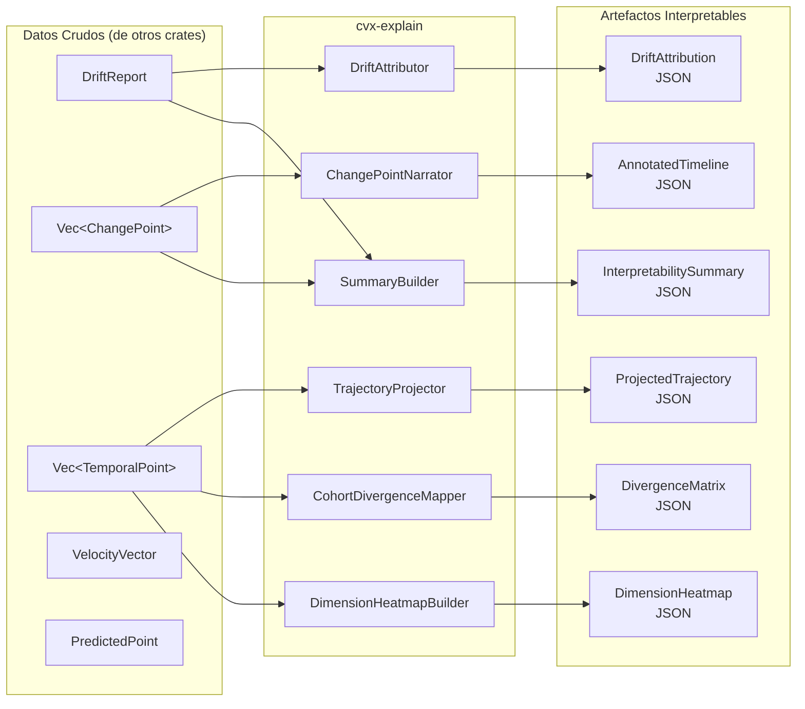

# ChronosVector — Interpretability & Visualization Layer Specification

**Version:** 1.0
**Author:** Manuel Couto Pintos
**Date:** March 2026
**Status:** Draft
**Dependencies:** Architecture Doc §10 (Analytics), PRD §2.1 (FR-05 through FR-10), Roadmap Layer 7-8

---

## 1. Motivation

ChronosVector produce una riqueza de señales temporales — velocidad, aceleración, change points, drift, trayectorias, predicciones — pero estas señales son datos crudos. Un ML Engineer que monitoriza drift no quiere un vector de 768 dimensiones de velocidad; quiere saber *qué dimensiones cambiaron, por qué esas dimensiones importan, y qué acción tomar*. Un investigador NLP que estudia evolución semántica quiere *ver* la trayectoria de un concepto en 2D, no leer una lista de floats.

La capa de interpretabilidad transforma los outputs analíticos de CVX en **artefactos consumibles por humanos**: atribuciones dimensionales, proyecciones visualizables, narrativas temporales y mapas de calor. No es un dashboard — es un subsistema que produce **datos estructurados para interpretación**, consumibles tanto por frontends web como por notebooks de análisis.

### 1.1 Principio de Diseño

> **"Datos para interpretar, no gráficos."** `cvx-explain` no renderiza SVGs ni HTMLs. Produce JSON/protobuf estructurado que cualquier frontend puede renderizar: Grafana, Jupyter, React, Streamlit. La responsabilidad de CVX termina al producir los datos; la renderización es del consumidor.

### 1.2 Target Users

| Persona | Necesidad de Interpretabilidad | Artefacto CVX |
|---------|-------------------------------|---------------|
| **ML Engineer** | "¿Por qué mi modelo está derivando? ¿Qué features cambiaron?" | Drift Attribution Report |
| **NLP Researcher** | "¿Cómo evolucionó 'machine learning' de 2018 a 2024?" | Trajectory Projection + Change Point Narrative |
| **Data Scientist** | "¿Qué conceptos divergieron entre sí y cuándo?" | Cohort Divergence Map |
| **Product Manager** | "Muéstrame un resumen visual del drift este mes" | Dimension Heatmap + Summary Stats |
| **MLOps / Oncall** | "¿Hay algo anómalo ahora mismo?" | Real-time Drift Dashboard Data |

---

## 2. Architecture

### 2.1 Nuevo Crate: `cvx-explain`

`cvx-explain` es un crate de librería que transforma outputs de `cvx-analytics` y `cvx-query` en artefactos interpretables.

**Posición en el grafo de dependencias:**

```
cvx-explain → cvx-core, cvx-analytics, cvx-query, cvx-storage
cvx-api     → cvx-explain (nuevo: para exponer endpoints /explain/*)
```

**Principio de acoplamiento:** `cvx-explain` no accede directamente al índice. Consume resultados de `cvx-query` (trayectorias, drift reports, change points) y los transforma. Esto mantiene la separación entre cómputo y presentación.

### 2.2 Diagrama de Flujo



---

## 3. Functional Specification

### 3.1 FR-EXP-01: Drift Attribution

**Objetivo:** Dado un drift entre t1 y t2, identificar *qué dimensiones* contribuyeron más y cuantificar su contribución.

| Attribute | Specification |
|-----------|---------------|
| **Input** | `DriftReport { magnitude, direction_cosines, affected_dimensions }` + entity trajectory |
| **Output** | `DriftAttribution` (ver §4.1) |
| **Algorithm** | 1. Compute per-dimension absolute delta: `|v[t2][d] - v[t1][d]|` for each dimension d. 2. Rank dimensions by contribution to total drift. 3. Compute cumulative contribution (Pareto). 4. Optionally group dimensions by semantic cluster (if dimension labels provided). |
| **Complexity** | O(D) where D = dimensionality |

**Interpretive Value:** "El 80% del drift se concentra en 23 de 768 dimensiones. Las dimensiones [42, 157, 384] son las mayores contribuyentes."

### 3.2 FR-EXP-02: Trajectory Projection

**Objetivo:** Proyectar una trayectoria de alta dimensionalidad a 2D/3D para visualización.

| Attribute | Specification |
|-----------|---------------|
| **Input** | `Vec<TemporalPoint>` (trajectory), `ProjectionConfig { method, target_dims, perplexity }` |
| **Output** | `ProjectedTrajectory` (ver §4.2) |
| **Methods** | `PCA` (deterministic, fast, linear), `UMAP` (non-linear, preserves local structure) |
| **Constraints** | PCA: eigendecomposition on trajectory covariance matrix. UMAP: via `linfa-reduction` or custom implementation. |
| **Temporal Encoding** | Each projected point retains its timestamp, enabling animated trajectory rendering. |
| **Context Points** | Optionally include kNN neighbors at each timestamp to show the trajectory's neighborhood evolving. |

**Interpretive Value:** "Puedes ver cómo 'machine learning' se movió de la zona de 'estadística' hacia la zona de 'deep learning' entre 2015 y 2020."

### 3.3 FR-EXP-03: Change Point Narrative

**Objetivo:** Transformar una lista de change points crudos en una timeline anotada con contexto interpretable.

| Attribute | Specification |
|-----------|---------------|
| **Input** | `Vec<ChangePoint>`, entity trajectory, optional dimension labels |
| **Output** | `AnnotatedTimeline` (ver §4.3) |
| **Annotations per change point** | - Timestamp + severity score<br>- Drift vector at change point<br>- Top-K dimensions that changed<br>- Drift direction (which semantic region the entity moved toward)<br>- Magnitude relative to entity's historical volatility (z-score)<br>- Nearest neighbors before/after (what was similar before vs after) |
| **Segmentation** | Periods between change points as "stable segments" with summary statistics (mean drift rate, volatility). |

**Interpretive Value:** "El concepto 'corona' tuvo un cambio brusco en marzo 2020 (severidad: 0.92). Las dimensiones [health, pandemic, virus] aumentaron drásticamente. Antes del cambio, sus vecinos eran [cerveza, royal, solar]. Después: [COVID, pandemic, virus]."

### 3.4 FR-EXP-04: Cohort Divergence Map

**Objetivo:** Para un conjunto de entidades, calcular y visualizar cuándo y cuánto divergieron entre sí.

| Attribute | Specification |
|-----------|---------------|
| **Input** | `Vec<entity_id>`, time range, distance metric |
| **Output** | `CohortDivergenceMap` (ver §4.4) |
| **Algorithm** | 1. For each pair (i,j), compute distance time series. 2. Apply PELT to each distance series → detect divergence/convergence points. 3. Build pairwise divergence matrix at each detected transition. |
| **Optimizations** | For large cohorts (>100 entities): sample pairs or compute representative entities per cluster first. |

**Interpretive Value:** "Los conceptos 'ML' y 'AI' estuvieron convergiendo hasta 2022, luego divergieron significativamente. 'Deep Learning' y 'Neural Networks' se mantienen estables."

### 3.5 FR-EXP-05: Dimension Heatmap

**Objetivo:** Producir una matriz (tiempo × dimensión) que muestre la intensidad de cambio por dimensión a lo largo del tiempo.

| Attribute | Specification |
|-----------|---------------|
| **Input** | Entity trajectory, time granularity (e.g., 1h, 1d, 1w), optional dimension subset |
| **Output** | `DimensionHeatmap` (ver §4.5) |
| **Algorithm** | 1. Bin trajectory by time granularity. 2. For each bin, compute per-dimension delta from previous bin. 3. Normalize across dimensions (z-score or min-max). 4. Output as matrix with axis labels. |
| **Variants** | - Absolute change (magnitude of delta per dimension)<br>- Relative change (delta / historical std of that dimension)<br>- Cumulative change (running sum of absolute deltas) |

**Interpretive Value:** Heatmap visual donde las "bandas calientes" revelan qué aspectos del embedding están activos en cada período.

### 3.6 FR-EXP-06: Prediction Explanation

**Objetivo:** Hacer interpretable el output del Neural ODE.

| Attribute | Specification |
|-----------|---------------|
| **Input** | `PredictedPoint { vector, confidence_interval, uncertainty_per_dimension }` + historical trajectory |
| **Output** | `PredictionExplanation` (ver §4.6) |
| **Content** | - Fan chart data: historical trajectory + prediction cone (confidence intervals expanding over time)<br>- Dimension-level uncertainty ranking: which dimensions are most/least certain<br>- Extrapolation distance: how far in time the prediction reaches vs training data<br>- Baseline comparison: Neural ODE prediction vs linear extrapolation vs historical mean<br>- Trajectory curvature at prediction point: is the entity accelerating, decelerating, or stable? |

**Interpretive Value:** "La predicción para 'transformer' en 2027 tiene alta confianza en dimensiones sintácticas (±0.02) pero baja confianza en dimensiones de aplicación (±0.15). La trayectoria muestra desaceleración — el concepto se está estabilizando."

---

## 4. Data Types

### 4.1 DriftAttribution

```rust
pub struct DriftAttribution {
    pub entity_id: u64,
    pub from_timestamp: i64,
    pub to_timestamp: i64,
    pub total_magnitude: f64,
    pub metric: String,
    /// Dimensions ranked by contribution (descending).
    pub dimension_contributions: Vec<DimensionContribution>,
    /// How many dimensions account for 80% of drift.
    pub pareto_80_count: usize,
    /// Optional: grouped by semantic cluster if labels available.
    pub cluster_contributions: Option<Vec<ClusterContribution>>,
}

pub struct DimensionContribution {
    pub dimension_index: usize,
    pub label: Option<String>,
    pub absolute_delta: f64,
    /// Fraction of total drift magnitude attributed to this dimension.
    pub contribution_fraction: f64,
    pub cumulative_fraction: f64,
    pub direction: f64, // positive = increased, negative = decreased
}

pub struct ClusterContribution {
    pub cluster_name: String,
    pub dimension_indices: Vec<usize>,
    pub aggregate_contribution: f64,
}
```

### 4.2 ProjectedTrajectory

```rust
pub struct ProjectedTrajectory {
    pub entity_id: u64,
    pub projection_method: ProjectionMethod,
    pub target_dims: u8, // 2 or 3
    pub points: Vec<ProjectedPoint>,
    /// Variance explained (PCA only).
    pub variance_explained: Option<Vec<f64>>,
    /// Optional: projected neighbor positions at each timestamp.
    pub neighbor_context: Option<Vec<NeighborFrame>>,
}

pub struct ProjectedPoint {
    pub timestamp: i64,
    pub coords: Vec<f64>, // [x, y] or [x, y, z]
}

pub enum ProjectionMethod {
    Pca,
    Umap { n_neighbors: usize, min_dist: f64 },
}

pub struct NeighborFrame {
    pub timestamp: i64,
    pub neighbors: Vec<ProjectedNeighbor>,
}

pub struct ProjectedNeighbor {
    pub entity_id: u64,
    pub coords: Vec<f64>,
    pub distance: f64,
}
```

### 4.3 AnnotatedTimeline

```rust
pub struct AnnotatedTimeline {
    pub entity_id: u64,
    pub time_range: (i64, i64),
    pub change_points: Vec<AnnotatedChangePoint>,
    pub stable_segments: Vec<StableSegment>,
}

pub struct AnnotatedChangePoint {
    pub timestamp: i64,
    pub severity: f64,
    /// Severity relative to entity's historical volatility.
    pub z_score: f64,
    pub method: String, // "pelt" or "bocpd"
    pub top_dimensions: Vec<DimensionContribution>,
    /// kNN neighbors immediately before the change point.
    pub neighbors_before: Vec<NeighborSummary>,
    /// kNN neighbors immediately after the change point.
    pub neighbors_after: Vec<NeighborSummary>,
    /// Human-readable summary (optional, if dimension labels provided).
    pub narrative: Option<String>,
}

pub struct StableSegment {
    pub from_timestamp: i64,
    pub to_timestamp: i64,
    pub mean_drift_rate: f64,
    pub volatility: f64, // std dev of per-step drift within segment
    pub dominant_dimensions: Vec<usize>, // most active dims even in "stable" period
}

pub struct NeighborSummary {
    pub entity_id: u64,
    pub label: Option<String>,
    pub distance: f64,
}
```

### 4.4 CohortDivergenceMap

```rust
pub struct CohortDivergenceMap {
    pub entity_ids: Vec<u64>,
    pub time_range: (i64, i64),
    pub metric: String,
    /// Pairwise distance time series (flattened upper triangle).
    pub pairwise_series: Vec<PairwiseDistanceSeries>,
    /// Detected divergence/convergence events.
    pub events: Vec<CohortEvent>,
}

pub struct PairwiseDistanceSeries {
    pub entity_a: u64,
    pub entity_b: u64,
    pub timestamps: Vec<i64>,
    pub distances: Vec<f64>,
}

pub struct CohortEvent {
    pub entity_a: u64,
    pub entity_b: u64,
    pub timestamp: i64,
    pub event_type: CohortEventType,
    pub magnitude: f64,
}

pub enum CohortEventType {
    Divergence,
    Convergence,
    StableDistance,
}
```

### 4.5 DimensionHeatmap

```rust
pub struct DimensionHeatmap {
    pub entity_id: u64,
    pub variant: HeatmapVariant,
    /// Time axis labels.
    pub time_bins: Vec<i64>,
    /// Dimension axis labels (indices or semantic labels).
    pub dimension_labels: Vec<String>,
    /// Row-major matrix: heatmap[time_bin_idx][dimension_idx].
    pub values: Vec<Vec<f64>>,
    pub normalization: NormalizationMethod,
}

pub enum HeatmapVariant {
    AbsoluteChange,
    RelativeChange,
    CumulativeChange,
}

pub enum NormalizationMethod {
    ZScore,
    MinMax,
    Raw,
}
```

### 4.6 PredictionExplanation

```rust
pub struct PredictionExplanation {
    pub entity_id: u64,
    pub target_timestamp: i64,
    /// Fan chart: historical + prediction with expanding confidence.
    pub fan_chart: FanChart,
    /// Dimensions ranked by prediction uncertainty (most uncertain first).
    pub dimension_uncertainty_ranking: Vec<DimensionUncertainty>,
    /// How far the prediction extrapolates beyond training data.
    pub extrapolation_ratio: f64, // prediction_horizon / training_window
    /// Comparison with simpler baselines.
    pub baseline_comparison: BaselineComparison,
    /// Trajectory dynamics at prediction point.
    pub dynamics: TrajectoryDynamics,
}

pub struct FanChart {
    pub historical_points: Vec<ProjectedPoint>,
    pub prediction_points: Vec<FanChartPoint>,
}

pub struct FanChartPoint {
    pub timestamp: i64,
    pub center: Vec<f64>,     // predicted vector (projected to 2D/3D)
    pub ci_lower: Vec<f64>,   // lower confidence bound
    pub ci_upper: Vec<f64>,   // upper confidence bound
    pub confidence_level: f64, // e.g. 0.95
}

pub struct DimensionUncertainty {
    pub dimension_index: usize,
    pub label: Option<String>,
    pub uncertainty: f64,
    pub confidence_interval_width: f64,
}

pub struct BaselineComparison {
    pub neural_ode_error: Option<f64>,
    pub linear_extrapolation_error: Option<f64>,
    pub historical_mean_error: Option<f64>,
}

pub struct TrajectoryDynamics {
    pub velocity_magnitude: f64,
    pub acceleration_magnitude: f64,
    /// "accelerating", "decelerating", "stable", "oscillating"
    pub regime: String,
}
```

---

## 5. API Endpoints

### 5.1 REST Endpoints

Todos bajo el prefijo `/v1/explain/`.

#### `GET /v1/explain/entities/{id}/drift-attribution`

Atribución dimensional del drift.

| Parameter | Type | Required | Default | Description |
|-----------|------|----------|---------|-------------|
| `from` | `i64` | Yes | — | Start timestamp |
| `to` | `i64` | Yes | — | End timestamp |
| `metric` | `string` | No | `"cosine"` | Distance metric |
| `top_k` | `usize` | No | `20` | Number of top dimensions to return |
| `cluster_labels` | `bool` | No | `false` | Include semantic cluster grouping |

**Response:** `DriftAttribution` (JSON)

#### `GET /v1/explain/entities/{id}/trajectory-projection`

Proyección de trayectoria a baja dimensionalidad.

| Parameter | Type | Required | Default | Description |
|-----------|------|----------|---------|-------------|
| `from` | `i64` | No | entity first_seen | Start timestamp |
| `to` | `i64` | No | entity last_seen | End timestamp |
| `method` | `string` | No | `"pca"` | `"pca"` or `"umap"` |
| `dims` | `u8` | No | `2` | Target dimensions (2 or 3) |
| `include_neighbors` | `bool` | No | `false` | Include kNN context at each timestamp |
| `k_neighbors` | `usize` | No | `5` | Number of neighbors per timestamp |

**Response:** `ProjectedTrajectory` (JSON)

#### `GET /v1/explain/entities/{id}/changepoint-narrative`

Timeline anotada con contexto interpretable.

| Parameter | Type | Required | Default | Description |
|-----------|------|----------|---------|-------------|
| `from` | `i64` | No | entity first_seen | Start timestamp |
| `to` | `i64` | No | entity last_seen | End timestamp |
| `method` | `string` | No | `"pelt"` | `"pelt"` or `"bocpd"` |
| `top_k_dims` | `usize` | No | `10` | Dimensions per change point |
| `k_neighbors` | `usize` | No | `5` | Neighbors before/after |

**Response:** `AnnotatedTimeline` (JSON)

#### `GET /v1/explain/entities/{id}/dimension-heatmap`

Mapa de calor dimensional.

| Parameter | Type | Required | Default | Description |
|-----------|------|----------|---------|-------------|
| `from` | `i64` | No | entity first_seen | Start timestamp |
| `to` | `i64` | No | entity last_seen | End timestamp |
| `granularity` | `string` | No | `"1d"` | Time bin size: `"1h"`, `"1d"`, `"1w"` |
| `variant` | `string` | No | `"absolute"` | `"absolute"`, `"relative"`, `"cumulative"` |
| `normalization` | `string` | No | `"zscore"` | `"zscore"`, `"minmax"`, `"raw"` |
| `dimensions` | `string` | No | all | Comma-separated dimension indices |

**Response:** `DimensionHeatmap` (JSON)

#### `POST /v1/explain/cohort-divergence`

Mapa de divergencia de cohorte.

**Request Body:**
```json
{
  "entity_ids": [101, 102, 103, 104],
  "from": 1640000000,
  "to": 1700000000,
  "metric": "cosine",
  "granularity": "1d"
}
```

**Response:** `CohortDivergenceMap` (JSON)

#### `GET /v1/explain/entities/{id}/prediction`

Explicación de predicción Neural ODE.

| Parameter | Type | Required | Default | Description |
|-----------|------|----------|---------|-------------|
| `target_timestamp` | `i64` | Yes | — | Prediction target |
| `confidence` | `f64` | No | `0.95` | Confidence level |
| `projection` | `string` | No | `"pca"` | Projection method for fan chart |

**Response:** `PredictionExplanation` (JSON)

### 5.2 gRPC Extensions

```protobuf
service ExplainService {
  // Real-time drift attribution as events are detected.
  rpc WatchDriftExplained(WatchExplainedRequest)
    returns (stream ExplainedDriftEvent);

  // Batch cohort analysis.
  rpc AnalyzeCohort(CohortRequest)
    returns (CohortDivergenceMap);
}

message WatchExplainedRequest {
  repeated uint64 entity_ids = 1;
  double min_severity = 2;
  uint32 top_k_dimensions = 3;
  uint32 k_neighbors = 4;
}

message ExplainedDriftEvent {
  uint64 entity_id = 1;
  int64 timestamp = 2;
  double severity = 3;
  repeated DimensionContribution top_dimensions = 4;
  repeated NeighborSummary neighbors_before = 5;
  repeated NeighborSummary neighbors_after = 6;
}
```

---

## 6. Module Structure

```
crates/cvx-explain/
├── Cargo.toml
└── src/
    ├── lib.rs
    ├── attribution.rs      // DriftAttributor: per-dimension drift analysis
    ├── projection.rs       // TrajectoryProjector: PCA, UMAP dimensionality reduction
    ├── narrative.rs        // ChangePointNarrator: annotated timeline generation
    ├── cohort.rs           // CohortDivergenceMapper: pairwise divergence analysis
    ├── heatmap.rs          // DimensionHeatmapBuilder: time × dimension matrix
    ├── prediction.rs       // PredictionExplainer: Neural ODE output interpretation
    ├── summary.rs          // SummaryBuilder: aggregate interpretability summary
    └── types.rs            // All public types (§4)
```

---

## 7. Integration with Existing Layers

### 7.1 Roadmap Position

`cvx-explain` se introduce como **Layer 7.5**, entre Vector Calculus (L7) y Change Point Detection (L8), ya que depende de drift reports pero puede implementarse antes de CPD (con CPD como optional enhancement).

| Layer | What it adds to Explain |
|-------|------------------------|
| **L7 (Vector Calculus)** | `DriftAttribution`, `DimensionHeatmap` disponibles |
| **L7.5 (Explain core)** | `cvx-explain` crate con attribution, projection, heatmap |
| **L8 (PELT + BOCPD)** | `ChangePointNarrative`, `CohortDivergenceMap` disponibles |
| **L10 (Neural ODE)** | `PredictionExplanation` disponible |

### 7.2 Dependency on Dimension Labels

Varios artefactos se enriquecen con **dimension labels** opcionales — nombres semánticos para cada dimensión del embedding (e.g., dim[42] = "medical", dim[157] = "technology"). Estos labels:

- Son opcionales. Sin ellos, los outputs usan índices numéricos.
- Se proporcionan via configuración o al crear el entity schema.
- Se almacenan en la column family `metadata` de RocksDB.
- Permiten narrativas como "Las dimensiones médicas aumentaron un 340%" en vez de "dim[42] increased 0.34".

---

## 8. Non-Functional Requirements

| Requirement | Target |
|-------------|--------|
| **Drift Attribution latency** | < 5ms (D=768) |
| **PCA Projection latency** | < 50ms (1000 points, D=768) |
| **UMAP Projection latency** | < 2s (1000 points, D=768) |
| **Heatmap generation** | < 100ms (365 days, daily granularity, D=768) |
| **Cohort divergence** | < 1s (10 entities, 365 days, daily granularity) |
| **Prediction explanation** | < 10ms (after Neural ODE inference completes) |
| **Memory overhead** | Explain layer adds < 5% to baseline query memory |

---

## 9. Future Extensions

| Extension | Description | When |
|-----------|-------------|------|
| **Dimension Clustering** | Auto-discover semantic dimension groups via correlation analysis | Post-L12 |
| **Causal Attribution** | Use Granger causality to identify which entities *caused* drift in others | Post-L12 |
| **Natural Language Narratives** | LLM-generated explanations from structured explain data | Post-L12 |
| **Interactive Exploration Protocol** | WebSocket-based protocol for interactive drill-down | Post-L12 |
| **Export Formats** | Direct export to Grafana dashboard JSON, Jupyter widget spec | Post-L12 |

---

## 10. Open Questions

1. **¿PCA o UMAP por defecto?** PCA es determinista y rápido pero pierde estructura no-lineal. UMAP preserva vecindarios pero es estocástico y más lento. Recomendación: PCA por defecto, UMAP opcional.
2. **¿Debería `cvx-explain` cachear proyecciones?** Las proyecciones UMAP son costosas. Un cache LRU por (entity_id, time_range, method) podría ser valioso. Decisión diferida a implementación.
3. **¿Granularidad adaptativa en heatmaps?** Para trayectorias largas (años), granularidad fija puede producir matrices enormes. ¿Auto-adaptación o paginación? Recomendación: paginación con cursor.
