# ChronosVector (CVX) — System Architecture Document

**Project:** High-Performance Temporal Vector Data Platform in Rust  
**Author:** Manuel Couto Pintos  
**Version:** 1.0  
**Date:** March 2026  
**Status:** Design Phase  
**Companion Document:** `ChronosVector_Enriched_Design.md` (Literature Review & Research Foundations)

---

## Table of Contents

1. [System Overview](#1-system-overview)
2. [Architecture Principles](#2-architecture-principles)
3. [High-Level System Architecture](#3-high-level-system-architecture)
4. [Subsystem Decomposition](#4-subsystem-decomposition)
5. [Data Model](#5-data-model)
6. [Ingestion Pipeline](#6-ingestion-pipeline)
7. [Temporal Index Engine (ST-HNSW)](#7-temporal-index-engine-st-hnsw)
8. [Tiered Storage Architecture](#8-tiered-storage-architecture)
9. [Query Engine](#9-query-engine)
10. [Analytics Engine (Neural & Statistical)](#10-analytics-engine)
11. [API Gateway](#11-api-gateway)
12. [Concurrency Model](#12-concurrency-model)
13. [Data Flow: End-to-End Scenarios](#13-data-flow-end-to-end-scenarios)
14. [Crate Structure & Module Layout](#14-crate-structure--module-layout)
15. [Error Handling Strategy](#15-error-handling-strategy)
16. [Configuration & Feature Flags](#16-configuration--feature-flags)
17. [Observability](#17-observability)
18. [Deployment Topologies](#18-deployment-topologies)
19. [Key Trait & Type Hierarchy](#19-key-trait--type-hierarchy)
20. [Cross-Cutting Concerns](#20-cross-cutting-concerns)

---

## 1. System Overview

ChronosVector es una plataforma de datos vectoriales donde el tiempo es un ciudadano de primera clase. El sistema recibe streams de embeddings con marca temporal, los indexa en una estructura espacio-temporal, los almacena en capas de temperatura variable, y expone un motor de queries que permite desde búsquedas kNN clásicas hasta predicción de trayectorias futuras y detección de drift semántico.

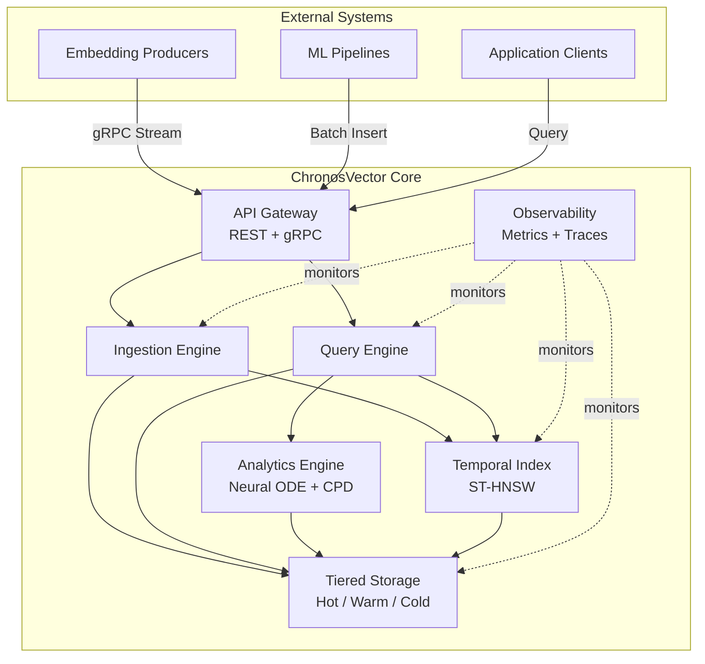
```mermaid
graph TB
    subgraph External["External Systems"]
        P1[Embedding Producers]
        P2[ML Pipelines]
        P3[Application Clients]
    end

    subgraph CVX["ChronosVector Core"]
        API[API Gateway<br/>REST + gRPC]
        IE[Ingestion Engine]
        QE[Query Engine]
        TI[Temporal Index<br/>ST-HNSW]
        TS[Tiered Storage<br/>Hot / Warm / Cold]
        AE[Analytics Engine<br/>Neural ODE + CPD]
        OBS[Observability<br/>Metrics + Traces]
    end

    P1 -->|gRPC Stream| API
    P2 -->|Batch Insert| API
    P3 -->|Query| API

    API --> IE
    API --> QE
    IE --> TI
    IE --> TS
    QE --> TI
    QE --> TS
    QE --> AE
    AE --> TS
    TI --> TS

    OBS -.->|monitors| IE
    OBS -.->|monitors| QE
    OBS -.->|monitors| TI
    OBS -.->|monitors| TS
```

---

## 2. Architecture Principles

| Principio | Descripción | Impacto en Diseño |
|---|---|---|
| **Time as Geometry** | El tiempo no es un filtro; es una dimensión del espacio de búsqueda | El índice combina distancia semántica y temporal nativamente |
| **Zero-Copy Pipeline** | Los datos atraviesan el sistema con cero copias innecesarias | `rkyv` para serialización zero-copy, `bytes::Bytes` para buffers compartidos |
| **Tiered by Temperature** | Los datos migran automáticamente según su "calor" (recency de acceso) | Hot (RAM+LSM), Warm (Parquet), Cold (Object Store + PQ) |
| **Compute Near Data** | Las operaciones analíticas se ejecutan donde residen los datos | SIMD en hot path, polars en warm, chunked reads en cold |
| **Separation of Index & Storage** | El índice (grafo) y los vectores viven en subsistemas independientes | Permite reindexar sin mover datos y viceversa |
| **Pluggable Metrics** | La métrica de distancia es un trait, no hardcoded | Soporta coseno, L2, dot product, Poincaré hiperbólico |
| **Fail Loud, Recover Gracefully** | Los errores se propagan explícitamente; la recuperación es automática | `Result<T, CvxError>` en todas las interfaces internas |

---

## 3. High-Level System Architecture

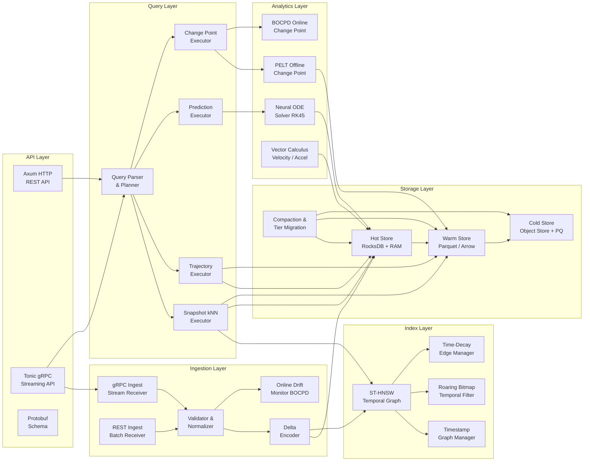
```mermaid
graph LR
    subgraph Ingest["Ingestion Layer"]
        direction TB
        GW_IN[gRPC Ingest<br/>Stream Receiver]
        REST_IN[REST Ingest<br/>Batch Receiver]
        VAL[Validator &<br/>Normalizer]
        DELTA[Delta<br/>Encoder]
        DRIFT_IN[Online Drift<br/>Monitor BOCPD]
    end

    subgraph Index["Index Layer"]
        direction TB
        STHNSW[ST-HNSW<br/>Temporal Graph]
        TSGRAPH[Timestamp<br/>Graph Manager]
        BITMAP[Roaring Bitmap<br/>Temporal Filter]
        DECAY[Time-Decay<br/>Edge Manager]
    end

    subgraph Storage["Storage Layer"]
        direction TB
        HOT[Hot Store<br/>RocksDB + RAM]
        WARM[Warm Store<br/>Parquet / Arrow]
        COLD[Cold Store<br/>Object Store + PQ]
        COMPACT[Compaction &<br/>Tier Migration]
    end

    subgraph Query["Query Layer"]
        direction TB
        PARSER[Query Parser<br/>& Planner]
        SNAP[Snapshot kNN<br/>Executor]
        TRAJ[Trajectory<br/>Executor]
        PRED[Prediction<br/>Executor]
        CPD[Change Point<br/>Executor]
    end

    subgraph Analytics["Analytics Layer"]
        direction TB
        ODE[Neural ODE<br/>Solver RK45]
        PELT[PELT Offline<br/>Change Point]
        BOCPD[BOCPD Online<br/>Change Point]
        DERIV[Vector Calculus<br/>Velocity / Accel]
    end

    subgraph API_Layer["API Layer"]
        direction TB
        AXUM[Axum HTTP<br/>REST API]
        TONIC[Tonic gRPC<br/>Streaming API]
        PROTO[Protobuf<br/>Schema]
    end

    AXUM --> PARSER
    TONIC --> GW_IN
    TONIC --> PARSER
    REST_IN --> VAL
    GW_IN --> VAL
    VAL --> DELTA
    DELTA --> HOT
    DELTA --> STHNSW
    VAL --> DRIFT_IN

    PARSER --> SNAP
    PARSER --> TRAJ
    PARSER --> PRED
    PARSER --> CPD

    SNAP --> STHNSW
    SNAP --> HOT
    SNAP --> WARM
    TRAJ --> HOT
    TRAJ --> WARM
    PRED --> ODE
    CPD --> PELT
    CPD --> BOCPD

    STHNSW --> TSGRAPH
    STHNSW --> BITMAP
    STHNSW --> DECAY

    HOT --> WARM
    WARM --> COLD
    COMPACT --> HOT
    COMPACT --> WARM
    COMPACT --> COLD

    ODE --> HOT
    PELT --> WARM
    DERIV --> HOT
```

---

## 4. Subsystem Decomposition

ChronosVector se descompone en 6 subsistemas principales, cada uno con responsabilidades claras y contratos de interfaz definidos.

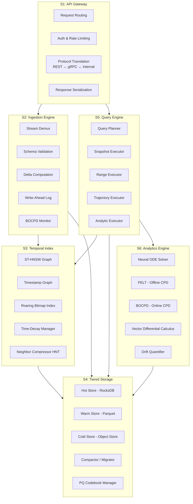
```mermaid
graph TB
    subgraph S1["S1: API Gateway"]
        S1A[Request Routing]
        S1B[Auth & Rate Limiting]
        S1C[Protocol Translation<br/>REST ↔ gRPC ↔ Internal]
        S1D[Response Serialization]
    end

    subgraph S2["S2: Ingestion Engine"]
        S2A[Stream Demux]
        S2B[Schema Validation]
        S2C[Delta Computation]
        S2D[Write-Ahead Log]
        S2E[BOCPD Monitor]
    end

    subgraph S3["S3: Temporal Index"]
        S3A[ST-HNSW Graph]
        S3B[Timestamp Graph]
        S3C[Roaring Bitmap Index]
        S3D[Time-Decay Manager]
        S3E[Neighbor Compressor HNT]
    end

    subgraph S4["S4: Tiered Storage"]
        S4A[Hot Store - RocksDB]
        S4B[Warm Store - Parquet]
        S4C[Cold Store - Object Store]
        S4D[Compactor / Migrator]
        S4E[PQ Codebook Manager]
    end

    subgraph S5["S5: Query Engine"]
        S5A[Query Planner]
        S5B[Snapshot Executor]
        S5C[Range Executor]
        S5D[Trajectory Executor]
        S5E[Analytic Executor]
    end

    subgraph S6["S6: Analytics Engine"]
        S6A[Neural ODE Solver]
        S6B[PELT - Offline CPD]
        S6C[BOCPD - Online CPD]
        S6D[Vector Differential Calculus]
        S6E[Drift Quantifier]
    end

    S1 --> S2
    S1 --> S5
    S2 --> S3
    S2 --> S4
    S5 --> S3
    S5 --> S4
    S5 --> S6
    S6 --> S4
    S3 --> S4
```

### Responsabilidades por Subsistema

| Subsistema | Responsabilidad Principal | Interfaces Expuestas |
|---|---|---|
| **S1: API Gateway** | Punto de entrada único. Traduce protocolos externos a comandos internos | `IngestCommand`, `QueryRequest`, `AdminCommand` |
| **S2: Ingestion Engine** | Valida, normaliza, computa deltas, persiste y actualiza el índice de forma atómica | `ingest(batch)` → `WriteReceipt` |
| **S3: Temporal Index** | Estructura de indexación espacio-temporal. Resuelve kNN con constraints temporales | `search(query, temporal_filter)` → `Vec<ScoredResult>` |
| **S4: Tiered Storage** | Almacenamiento multi-temperatura. Gestiona ciclo de vida de datos | `get(id, t)`, `put(id, t, vec)`, `range(id, t1..t2)` |
| **S5: Query Engine** | Planifica y ejecuta queries complejas componiendo operaciones de S3, S4 y S6 | `execute(QueryPlan)` → `QueryResult` |
| **S6: Analytics Engine** | Operaciones analíticas: predicción, CPD, cálculo diferencial vectorial | `predict(id, t_future)`, `detect_changes(id, window)` |

---

## 5. Data Model

### 5.1 Core Entities

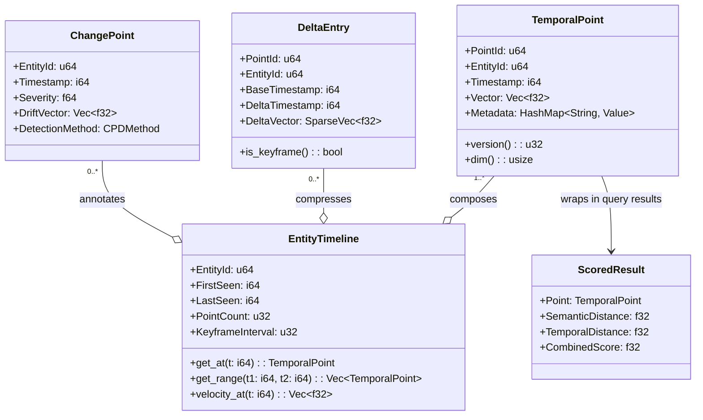
```mermaid
classDiagram
    class TemporalPoint {
        +PointId: u64
        +EntityId: u64
        +Timestamp: i64
        +Vector: Vec~f32~
        +Metadata: HashMap~String, Value~
        +version(): u32
        +dim(): usize
    }

    class DeltaEntry {
        +PointId: u64
        +EntityId: u64
        +BaseTimestamp: i64
        +DeltaTimestamp: i64
        +DeltaVector: SparseVec~f32~
        +is_keyframe(): bool
    }

    class EntityTimeline {
        +EntityId: u64
        +FirstSeen: i64
        +LastSeen: i64
        +PointCount: u32
        +KeyframeInterval: u32
        +get_at(t: i64): TemporalPoint
        +get_range(t1: i64, t2: i64): Vec~TemporalPoint~
        +velocity_at(t: i64): Vec~f32~
    }

    class ChangePoint {
        +EntityId: u64
        +Timestamp: i64
        +Severity: f64
        +DriftVector: Vec~f32~
        +DetectionMethod: CPDMethod
    }

    class ScoredResult {
        +Point: TemporalPoint
        +SemanticDistance: f32
        +TemporalDistance: f32
        +CombinedScore: f32
    }

    TemporalPoint "1..*" --o EntityTimeline : composes
    DeltaEntry "0..*" --o EntityTimeline : compresses
    ChangePoint "0..*" --o EntityTimeline : annotates
    TemporalPoint --> ScoredResult : wraps in query results
```

### 5.2 Key Schema

Las claves en RocksDB siguen un esquema compuesto que permite range scans eficientes:

```
Column Family: vectors
  Key:   [entity_id: u64][timestamp: i64 BE]
  Value: [vector_data: [f32; D]] (rkyv serialized)

Column Family: deltas
  Key:   [entity_id: u64][delta_timestamp: i64 BE]
  Value: [base_timestamp: i64][sparse_indices: Vec<u32>][sparse_values: Vec<f32>]

Column Family: metadata
  Key:   [entity_id: u64][timestamp: i64 BE]
  Value: [metadata_map: HashMap<String, Value>] (rkyv serialized)

Column Family: timelines
  Key:   [entity_id: u64]
  Value: [first_seen: i64][last_seen: i64][point_count: u32][keyframe_interval: u32]

Column Family: changepoints
  Key:   [entity_id: u64][timestamp: i64 BE]
  Value: [severity: f64][drift_vector: Vec<f32>][method: u8]
```

Las claves usan Big-Endian para timestamps para que el orden lexicográfico de bytes coincida con el orden temporal (crucial para range scans eficientes en RocksDB).

### 5.3 Quantized Representations

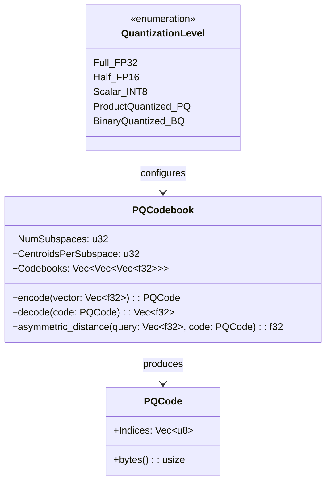
```mermaid
classDiagram
    class QuantizationLevel {
        <<enumeration>>
        Full_FP32
        Half_FP16
        Scalar_INT8
        ProductQuantized_PQ
        BinaryQuantized_BQ
    }

    class PQCodebook {
        +NumSubspaces: u32
        +CentroidsPerSubspace: u32
        +Codebooks: Vec~Vec~Vec~f32~~~
        +encode(vector: Vec~f32~): PQCode
        +decode(code: PQCode): Vec~f32~
        +asymmetric_distance(query: Vec~f32~, code: PQCode): f32
    }

    class PQCode {
        +Indices: Vec~u8~
        +bytes(): usize
    }

    PQCodebook --> PQCode : produces
    QuantizationLevel --> PQCodebook : configures
```

---

## 6. Ingestion Pipeline

### 6.1 Pipeline Flow

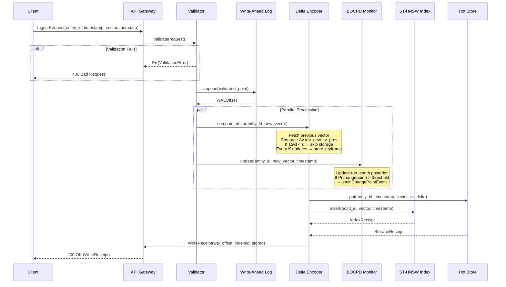
```mermaid
sequenceDiagram
    participant Client
    participant API as API Gateway
    participant VAL as Validator
    participant WAL as Write-Ahead Log
    participant DELTA as Delta Encoder
    participant BOCPD as BOCPD Monitor
    participant IDX as ST-HNSW Index
    participant STORE as Hot Store

    Client->>API: IngestRequest(entity_id, timestamp, vector, metadata)
    API->>VAL: validate(request)
    
    alt Validation Fails
        VAL-->>API: Err(ValidationError)
        API-->>Client: 400 Bad Request
    end

    VAL->>WAL: append(validated_point)
    WAL-->>VAL: WALOffset

    par Parallel Processing
        VAL->>DELTA: compute_delta(entity_id, new_vector)
        Note over DELTA: Fetch previous vector<br/>Compute Δv = v_new - v_prev<br/>If ‖Δv‖ < ε → skip storage<br/>Every K updates → store keyframe
        
        VAL->>BOCPD: update(entity_id, new_vector, timestamp)
        Note over BOCPD: Update run-length posterior<br/>If P(changepoint) > threshold<br/>→ emit ChangePointEvent
    end

    DELTA->>STORE: put(entity_id, timestamp, vector_or_delta)
    DELTA->>IDX: insert(point_id, vector, timestamp)
    
    IDX-->>DELTA: IndexReceipt
    STORE-->>DELTA: StorageReceipt

    DELTA-->>API: WriteReceipt(wal_offset, indexed, stored)
    API-->>Client: 200 OK (WriteReceipt)
```

### 6.2 Delta Encoding Strategy

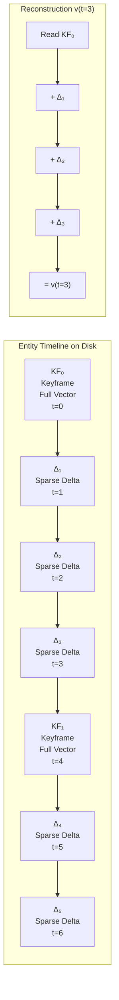
```mermaid
graph LR
    subgraph Timeline["Entity Timeline on Disk"]
        KF0["KF₀<br/>Keyframe<br/>Full Vector<br/>t=0"]
        D1["Δ₁<br/>Sparse Delta<br/>t=1"]
        D2["Δ₂<br/>Sparse Delta<br/>t=2"]
        D3["Δ₃<br/>Sparse Delta<br/>t=3"]
        KF1["KF₁<br/>Keyframe<br/>Full Vector<br/>t=4"]
        D4["Δ₄<br/>Sparse Delta<br/>t=5"]
        D5["Δ₅<br/>Sparse Delta<br/>t=6"]
    end

    KF0 --> D1 --> D2 --> D3 --> KF1 --> D4 --> D5

    subgraph Reconstruction["Reconstruction v(t=3)"]
        R1["Read KF₀"]
        R2["+ Δ₁"]
        R3["+ Δ₂"]  
        R4["+ Δ₃"]
        R5["= v(t=3)"]
    end

    R1 --> R2 --> R3 --> R4 --> R5
```

**Reglas del Delta Encoder:**

1. **Threshold ε:** Si `‖Δv‖ < ε`, el punto se descarta (el concepto no ha cambiado significativamente). Configurable por entity o globalmente.
2. **Keyframe Interval K:** Cada K deltas, se almacena el vector completo. Limita la cadena de reconstrucción a máximo K lecturas.
3. **Sparse Encoding:** Los deltas se almacenan como `(indices[], values[])` — solo las dimensiones que cambiaron por encima de un micro-threshold.
4. **Content Hash:** Cada delta se hashea (xxhash) para deduplicación. Si dos entidades producen el mismo delta, se almacena una sola vez.

### 6.3 Write-Ahead Log (WAL)

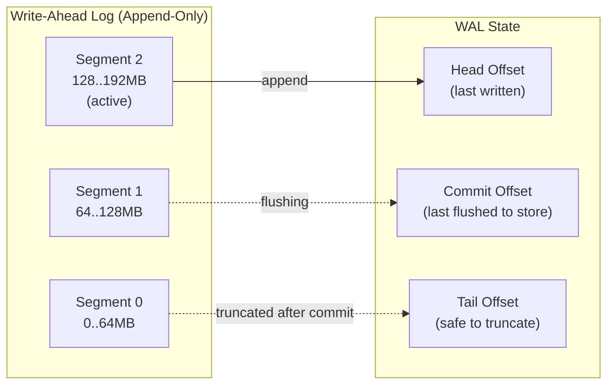
```mermaid
graph LR
    subgraph WAL["Write-Ahead Log (Append-Only)"]
        SEG1["Segment 0<br/>0..64MB"]
        SEG2["Segment 1<br/>64..128MB"]
        SEG3["Segment 2<br/>128..192MB<br/>(active)"]
    end

    subgraph State["WAL State"]
        HEAD["Head Offset<br/>(last written)"]
        COMMIT["Commit Offset<br/>(last flushed to store)"]
        TAIL["Tail Offset<br/>(safe to truncate)"]
    end

    SEG1 -.->|truncated after commit| TAIL
    SEG3 -->|append| HEAD
    SEG2 -.->|flushing| COMMIT
```

El WAL garantiza durabilidad: si el proceso se cae entre la escritura al WAL y la actualización del índice/store, el recovery re-aplica las entradas pendientes desde `COMMIT` hasta `HEAD`.

---

## 7. Temporal Index Engine (ST-HNSW)

### 7.1 Index Architecture

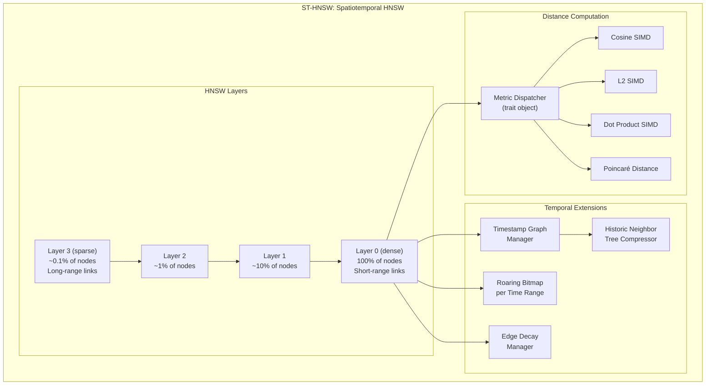
```mermaid
graph TB
    subgraph STHNSW["ST-HNSW: Spatiotemporal HNSW"]
        subgraph Layers["HNSW Layers"]
            L3["Layer 3 (sparse)<br/>~0.1% of nodes<br/>Long-range links"]
            L2["Layer 2<br/>~1% of nodes"]
            L1["Layer 1<br/>~10% of nodes"]
            L0["Layer 0 (dense)<br/>100% of nodes<br/>Short-range links"]
        end

        subgraph Temporal["Temporal Extensions"]
            TSGM["Timestamp Graph<br/>Manager"]
            BITMAP_IDX["Roaring Bitmap<br/>per Time Range"]
            DECAY_MGR["Edge Decay<br/>Manager"]
            HNT["Historic Neighbor<br/>Tree Compressor"]
        end

        subgraph Distance["Distance Computation"]
            METRIC["Metric Dispatcher<br/>(trait object)"]
            COSINE["Cosine SIMD"]
            L2D["L2 SIMD"]
            DOT["Dot Product SIMD"]
            POINCARE["Poincaré Distance"]
        end
    end

    L3 --> L2 --> L1 --> L0
    L0 --> TSGM
    L0 --> BITMAP_IDX
    L0 --> DECAY_MGR
    TSGM --> HNT

    L0 --> METRIC
    METRIC --> COSINE
    METRIC --> L2D
    METRIC --> DOT
    METRIC --> POINCARE
```

### 7.2 Search Algorithm

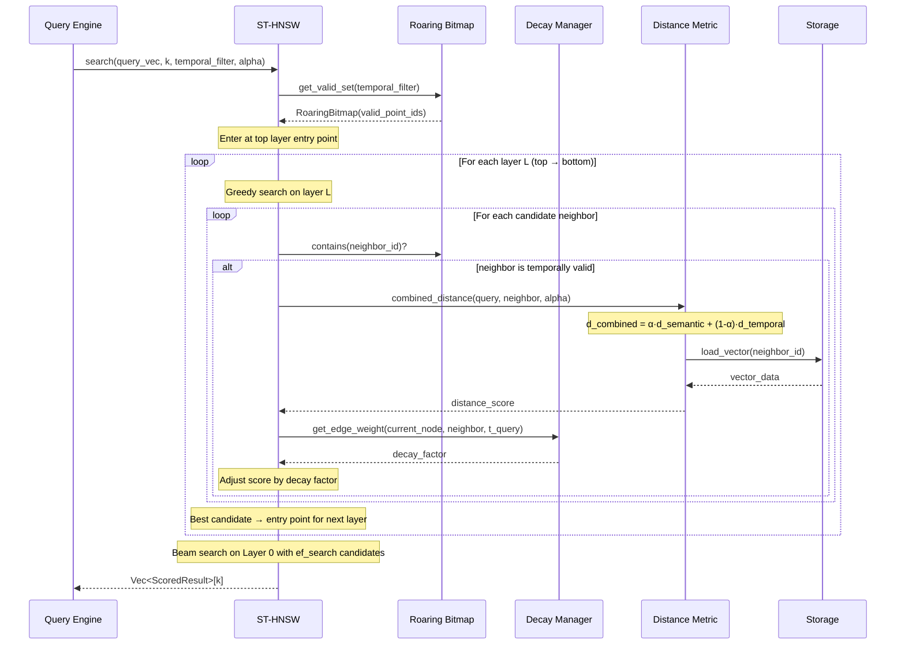
```mermaid
sequenceDiagram
    participant QE as Query Engine
    participant HNSW as ST-HNSW
    participant BM as Roaring Bitmap
    participant DECAY as Decay Manager
    participant METRIC as Distance Metric
    participant STORE as Storage

    QE->>HNSW: search(query_vec, k, temporal_filter, alpha)
    
    HNSW->>BM: get_valid_set(temporal_filter)
    BM-->>HNSW: RoaringBitmap(valid_point_ids)

    Note over HNSW: Enter at top layer entry point

    loop For each layer L (top → bottom)
        Note over HNSW: Greedy search on layer L
        loop For each candidate neighbor
            HNSW->>BM: contains(neighbor_id)?
            alt neighbor is temporally valid
                HNSW->>METRIC: combined_distance(query, neighbor, alpha)
                Note over METRIC: d_combined = α·d_semantic + (1-α)·d_temporal
                METRIC->>STORE: load_vector(neighbor_id)
                STORE-->>METRIC: vector_data
                METRIC-->>HNSW: distance_score
                HNSW->>DECAY: get_edge_weight(current_node, neighbor, t_query)
                DECAY-->>HNSW: decay_factor
                Note over HNSW: Adjust score by decay factor
            end
        end
        Note over HNSW: Best candidate → entry point for next layer
    end

    Note over HNSW: Beam search on Layer 0 with ef_search candidates
    HNSW-->>QE: Vec<ScoredResult>[k]
```

### 7.3 Combined Distance Function

La distancia combinada es el corazón de ST-HNSW:

```
d_ST(query, candidate) = α · d_semantic(q.vector, c.vector)
                       + (1 - α) · d_temporal(q.timestamp, c.timestamp)
                       × decay(c.age)
```

Donde:
- `α ∈ [0, 1]` — peso relativo semántico vs temporal (configurable por query)
- `d_semantic` — coseno, L2, dot product o Poincaré según configuración
- `d_temporal` — `|q.timestamp - c.timestamp| / temporal_scale`
- `decay(age) = e^(-λ · age)` — penaliza conexiones antiguas

### 7.4 Timestamp Graph (TANNS Integration)

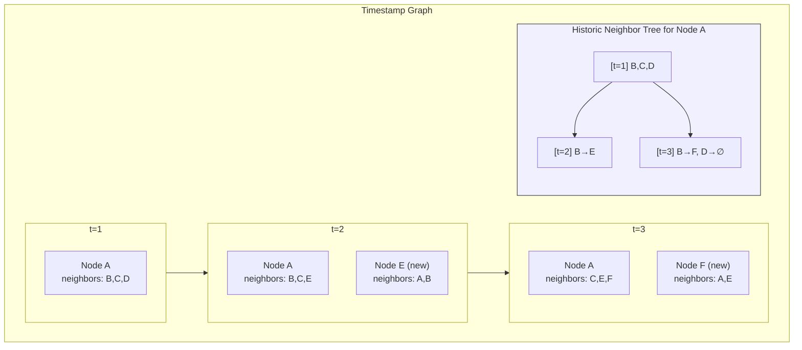
```mermaid
graph TB
    subgraph TSGraph["Timestamp Graph"]
        subgraph T1["t=1"]
            N1_1["Node A<br/>neighbors: B,C,D"]
        end
        subgraph T2["t=2"]
            N2_1["Node A<br/>neighbors: B,C,E"]
            N2_2["Node E (new)<br/>neighbors: A,B"]
        end
        subgraph T3["t=3"]
            N3_1["Node A<br/>neighbors: C,E,F"]
            N3_3["Node F (new)<br/>neighbors: A,E"]
        end

        subgraph HNT_Detail["Historic Neighbor Tree for Node A"]
            ROOT["[t=1] B,C,D"]
            L_CHILD["[t=2] B→E"]
            R_CHILD["[t=3] B→F, D→∅"]
        end
    end

    T1 --> T2 --> T3
    ROOT --> L_CHILD
    ROOT --> R_CHILD

    style HNT_Detail fill:#f0f0ff,stroke:#333
```

El HNT almacena los cambios en las listas de vecinos como un árbol binario de diffs, evitando duplicación de vecinos estables.

---

## 8. Tiered Storage Architecture

### 8.1 Storage Tiers Overview

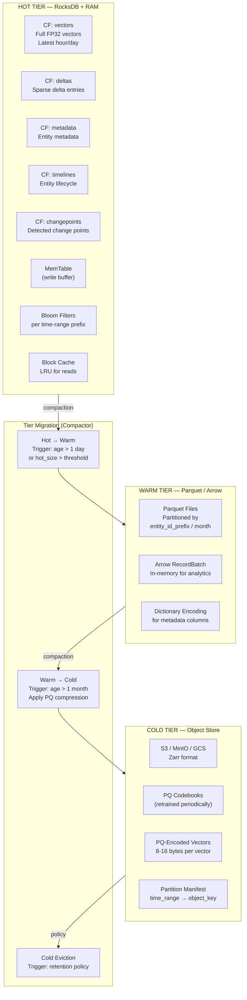
```mermaid
graph TB
    subgraph Hot["HOT TIER — RocksDB + RAM"]
        direction LR
        CF_VEC["CF: vectors<br/>Full FP32 vectors<br/>Latest hour/day"]
        CF_DELTA["CF: deltas<br/>Sparse delta entries"]
        CF_META["CF: metadata<br/>Entity metadata"]
        CF_TL["CF: timelines<br/>Entity lifecycle"]
        CF_CP["CF: changepoints<br/>Detected change points"]
        MEMTABLE["MemTable<br/>(write buffer)"]
        BLOOM["Bloom Filters<br/>per time-range prefix"]
        BLOCK_CACHE["Block Cache<br/>LRU for reads"]
    end

    subgraph Warm["WARM TIER — Parquet / Arrow"]
        direction LR
        PQ_FILES["Parquet Files<br/>Partitioned by<br/>entity_id_prefix / month"]
        ARROW_BUF["Arrow RecordBatch<br/>In-memory for analytics"]
        DICT_ENC["Dictionary Encoding<br/>for metadata columns"]
    end

    subgraph Cold["COLD TIER — Object Store"]
        direction LR
        OBJ_STORE["S3 / MinIO / GCS<br/>Zarr format"]
        PQ_CODEBOOK["PQ Codebooks<br/>(retrained periodically)"]
        PQ_ENCODED["PQ-Encoded Vectors<br/>8-16 bytes per vector"]
        MANIFEST["Partition Manifest<br/>time_range → object_key"]
    end

    subgraph Migration["Tier Migration (Compactor)"]
        direction LR
        HOT_WARM["Hot → Warm<br/>Trigger: age > 1 day<br/>or hot_size > threshold"]
        WARM_COLD["Warm → Cold<br/>Trigger: age > 1 month<br/>Apply PQ compression"]
        COLD_EVICT["Cold Eviction<br/>Trigger: retention policy"]
    end

    Hot -->|compaction| HOT_WARM
    HOT_WARM --> Warm
    Warm -->|compaction| WARM_COLD
    WARM_COLD --> Cold
    Cold -->|policy| COLD_EVICT
```

### 8.2 Storage Access Patterns

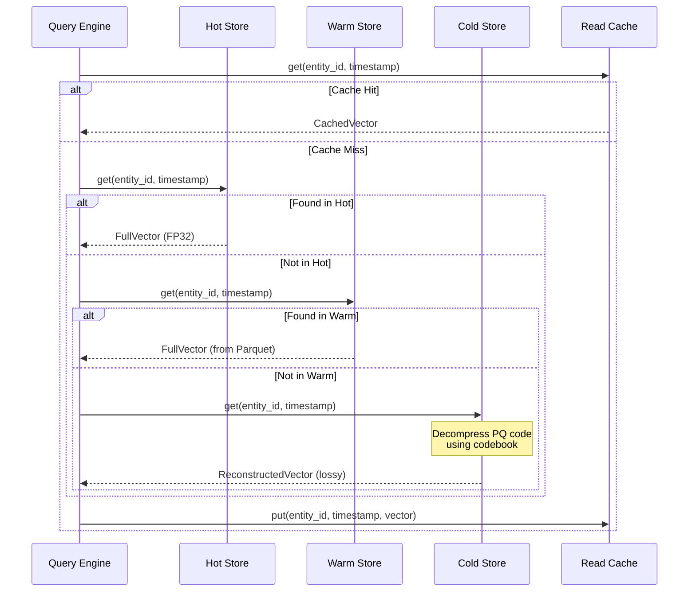
```mermaid
sequenceDiagram
    participant QE as Query Engine
    participant HOT as Hot Store
    participant WARM as Warm Store
    participant COLD as Cold Store
    participant CACHE as Read Cache

    QE->>CACHE: get(entity_id, timestamp)
    
    alt Cache Hit
        CACHE-->>QE: CachedVector
    else Cache Miss
        QE->>HOT: get(entity_id, timestamp)
        alt Found in Hot
            HOT-->>QE: FullVector (FP32)
        else Not in Hot
            QE->>WARM: get(entity_id, timestamp)
            alt Found in Warm
                WARM-->>QE: FullVector (from Parquet)
            else Not in Warm
                QE->>COLD: get(entity_id, timestamp)
                Note over COLD: Decompress PQ code<br/>using codebook
                COLD-->>QE: ReconstructedVector (lossy)
            end
        end
        QE->>CACHE: put(entity_id, timestamp, vector)
    end
```

### 8.3 Compaction & Tier Migration

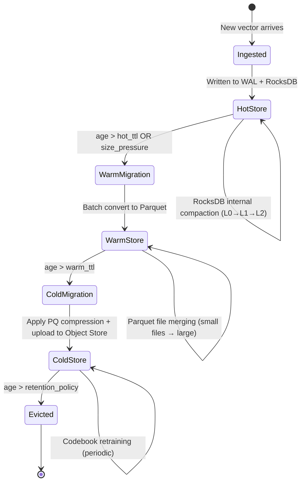
```mermaid
stateDiagram-v2
    [*] --> Ingested: New vector arrives
    Ingested --> HotStore: Written to WAL + RocksDB

    HotStore --> WarmMigration: age > hot_ttl OR size_pressure
    WarmMigration --> WarmStore: Batch convert to Parquet

    WarmStore --> ColdMigration: age > warm_ttl
    ColdMigration --> ColdStore: Apply PQ compression + upload to Object Store

    ColdStore --> Evicted: age > retention_policy
    Evicted --> [*]

    HotStore --> HotStore: RocksDB internal compaction (L0→L1→L2)
    WarmStore --> WarmStore: Parquet file merging (small files → large)
    ColdStore --> ColdStore: Codebook retraining (periodic)
```

---

## 9. Query Engine

### 9.1 Query Types & Routing

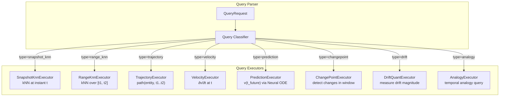
```mermaid
graph TB
    subgraph QueryParser["Query Parser"]
        INPUT["QueryRequest"]
        CLASSIFY["Query Classifier"]
    end

    subgraph Executors["Query Executors"]
        SNAP_EX["SnapshotKnnExecutor<br/>kNN at instant t"]
        RANGE_EX["RangeKnnExecutor<br/>kNN over [t1, t2]"]
        TRAJ_EX["TrajectoryExecutor<br/>path(entity, t1..t2)"]
        VEL_EX["VelocityExecutor<br/>∂v/∂t at t"]
        PRED_EX["PredictionExecutor<br/>v(t_future) via Neural ODE"]
        CPD_EX["ChangePointExecutor<br/>detect changes in window"]
        DRIFT_EX["DriftQuantExecutor<br/>measure drift magnitude"]
        ANALOG_EX["AnalogyExecutor<br/>temporal analogy query"]
    end

    INPUT --> CLASSIFY
    CLASSIFY -->|"type=snapshot_knn"| SNAP_EX
    CLASSIFY -->|"type=range_knn"| RANGE_EX
    CLASSIFY -->|"type=trajectory"| TRAJ_EX
    CLASSIFY -->|"type=velocity"| VEL_EX
    CLASSIFY -->|"type=prediction"| PRED_EX
    CLASSIFY -->|"type=changepoint"| CPD_EX
    CLASSIFY -->|"type=drift"| DRIFT_EX
    CLASSIFY -->|"type=analogy"| ANALOG_EX
```

### 9.2 Query Plan Execution

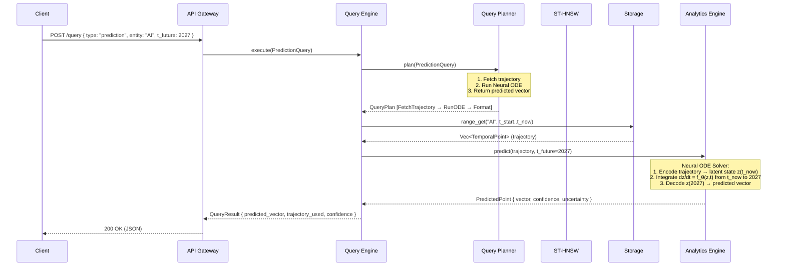
```mermaid
sequenceDiagram
    participant Client
    participant API as API Gateway
    participant QE as Query Engine
    participant PLAN as Query Planner
    participant IDX as ST-HNSW
    participant STORE as Storage
    participant AE as Analytics Engine

    Client->>API: POST /query { type: "prediction", entity: "AI", t_future: 2027 }
    API->>QE: execute(PredictionQuery)
    
    QE->>PLAN: plan(PredictionQuery)
    Note over PLAN: 1. Fetch trajectory<br/>2. Run Neural ODE<br/>3. Return predicted vector
    PLAN-->>QE: QueryPlan [FetchTrajectory → RunODE → Format]

    QE->>STORE: range_get("AI", t_start..t_now)
    STORE-->>QE: Vec<TemporalPoint> (trajectory)

    QE->>AE: predict(trajectory, t_future=2027)
    Note over AE: Neural ODE Solver:<br/>1. Encode trajectory → latent state z(t_now)<br/>2. Integrate dz/dt = f_θ(z,t) from t_now to 2027<br/>3. Decode z(2027) → predicted vector
    AE-->>QE: PredictedPoint { vector, confidence, uncertainty }

    QE-->>API: QueryResult { predicted_vector, trajectory_used, confidence }
    API-->>Client: 200 OK (JSON)
```

### 9.3 Query Composition for Complex Queries

Las queries complejas se componen como grafos de operaciones:

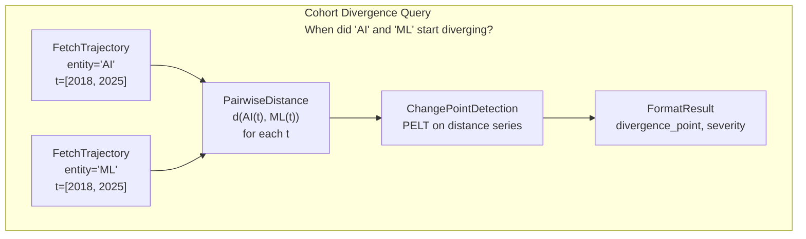
```mermaid
graph TB
    subgraph CohortDivergence["Cohort Divergence Query<br/>When did 'AI' and 'ML' start diverging?"]
        FETCH_A["FetchTrajectory<br/>entity='AI'<br/>t=[2018, 2025]"]
        FETCH_B["FetchTrajectory<br/>entity='ML'<br/>t=[2018, 2025]"]
        PAIRWISE["PairwiseDistance<br/>d(AI(t), ML(t))<br/>for each t"]
        CPD_ANAL["ChangePointDetection<br/>PELT on distance series"]
        FORMAT["FormatResult<br/>divergence_point, severity"]
    end

    FETCH_A --> PAIRWISE
    FETCH_B --> PAIRWISE
    PAIRWISE --> CPD_ANAL
    CPD_ANAL --> FORMAT
```

---

## 10. Analytics Engine

### 10.1 Component Overview

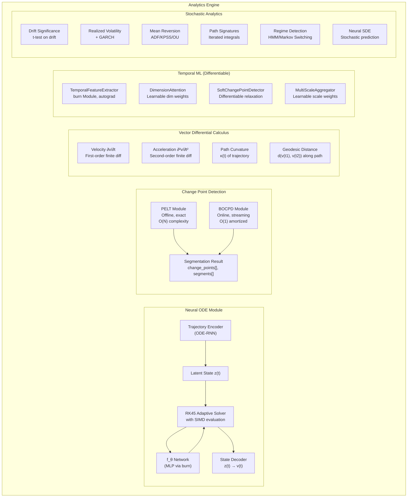
```mermaid
graph TB
    subgraph AnalyticsEngine["Analytics Engine"]
        subgraph NeuralODE["Neural ODE Module"]
            ENCODER["Trajectory Encoder<br/>(ODE-RNN)"]
            LATENT["Latent State z(t)"]
            SOLVER["RK45 Adaptive Solver<br/>with SIMD evaluation"]
            DECODER["State Decoder<br/>z(t) → v(t)"]
            FTHETA["f_θ Network<br/>(MLP via burn)"]
        end

        subgraph CPD["Change Point Detection"]
            PELT_MOD["PELT Module<br/>Offline, exact<br/>O(N) complexity"]
            BOCPD_MOD["BOCPD Module<br/>Online, streaming<br/>O(1) amortized"]
            SEG["Segmentation Result<br/>change_points[], segments[]"]
        end

        subgraph VectorCalc["Vector Differential Calculus"]
            VELOCITY["Velocity ∂v/∂t<br/>First-order finite diff"]
            ACCEL["Acceleration ∂²v/∂t²<br/>Second-order finite diff"]
            CURVATURE["Path Curvature<br/>κ(t) of trajectory"]
            GEODESIC["Geodesic Distance<br/>d(v(t1), v(t2)) along path"]
        end

        subgraph TemporalML["Temporal ML (Differentiable)"]
            FEAT_EXT["TemporalFeatureExtractor<br/>burn Module, autograd"]
            DIM_ATT["DimensionAttention<br/>Learnable dim weights"]
            SOFT_CPD["SoftChangePointDetector<br/>Differentiable relaxation"]
            SCALE_AGG["MultiScaleAggregator<br/>Learnable scale weights"]
        end

        subgraph Stochastic["Stochastic Analytics"]
            DRIFT_TEST["Drift Significance<br/>t-test on drift"]
            VOL["Realized Volatility<br/>+ GARCH"]
            MEAN_REV["Mean Reversion<br/>ADF/KPSS/OU"]
            PATH_SIG["Path Signatures<br/>Iterated integrals"]
            REGIME["Regime Detection<br/>HMM/Markov Switching"]
            NSDE["Neural SDE<br/>Stochastic prediction"]
        end
    end

    ENCODER --> LATENT
    LATENT --> SOLVER
    SOLVER --> FTHETA
    FTHETA --> SOLVER
    SOLVER --> DECODER

    PELT_MOD --> SEG
    BOCPD_MOD --> SEG
```

### 10.2 Neural ODE Prediction Flow

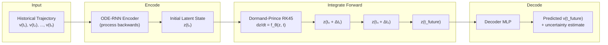
```mermaid
graph LR
    subgraph Input["Input"]
        TRAJ["Historical Trajectory<br/>v(t₁), v(t₂), ..., v(tₙ)"]
    end

    subgraph Encode["Encode"]
        ODE_RNN["ODE-RNN Encoder<br/>(process backwards)"]
        Z0["Initial Latent State<br/>z(tₙ)"]
    end

    subgraph Integrate["Integrate Forward"]
        RK45["Dormand-Prince RK45<br/>dz/dt = f_θ(z, t)"]
        STEP1["z(tₙ + Δt₁)"]
        STEP2["z(tₙ + Δt₂)"]
        STEPN["z(t_future)"]
    end

    subgraph Decode["Decode"]
        DEC["Decoder MLP"]
        PRED["Predicted v(t_future)<br/>+ uncertainty estimate"]
    end

    TRAJ --> ODE_RNN --> Z0 --> RK45
    RK45 --> STEP1 --> STEP2 --> STEPN
    STEPN --> DEC --> PRED
```

### 10.3 BOCPD Online Monitor

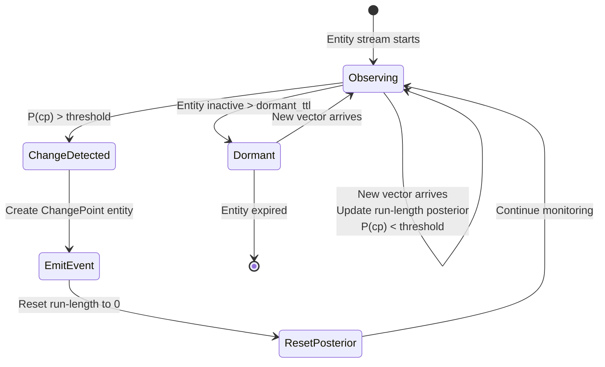
```mermaid
stateDiagram-v2
    [*] --> Observing: Entity stream starts

    Observing --> Observing: New vector arrives<br/>Update run-length posterior<br/>P(cp) < threshold

    Observing --> ChangeDetected: P(cp) > threshold

    ChangeDetected --> EmitEvent: Create ChangePoint entity
    EmitEvent --> ResetPosterior: Reset run-length to 0
    ResetPosterior --> Observing: Continue monitoring

    Observing --> Dormant: Entity inactive > dormant_ttl
    Dormant --> Observing: New vector arrives
    Dormant --> [*]: Entity expired
```

Cada entidad monitorizada mantiene su propio estado BOCPD con complejidad O(run_length) por actualización, truncada a un máximo configurable de la ventana de run-length.

---

## 11. API Gateway

### 11.1 API Endpoints

```mermaid
graph TB
    subgraph REST["REST API (Axum)"]
        direction TB
        POST_INGEST["POST /v1/ingest<br/>Batch insert vectors"]
        POST_QUERY["POST /v1/query<br/>Execute query"]
        GET_ENTITY["GET /v1/entities/:id<br/>Entity timeline info"]
        GET_TRAJ["GET /v1/entities/:id/trajectory?t1=&t2=<br/>Fetch trajectory"]
        GET_HEALTH["GET /v1/health<br/>Health check"]
        POST_ADMIN["POST /v1/admin/compact<br/>Trigger compaction"]
    end

    subgraph GRPC["gRPC API (Tonic)"]
        direction TB
        INGEST_STREAM["IngestStream (bidirectional)<br/>Stream vectors → receipts"]
        QUERY_STREAM["QueryStream (server-stream)<br/>Request → stream of results"]
        WATCH_DRIFT["WatchDrift (server-stream)<br/>Subscribe to drift events"]
    end

    subgraph Proto["Protobuf Definitions"]
        direction TB
        POINT_PROTO["TemporalPoint message"]
        QUERY_PROTO["QueryRequest message"]
        RESULT_PROTO["QueryResult message"]
        EVENT_PROTO["DriftEvent message"]
    end

    REST --> Proto
    GRPC --> Proto
```

### 11.2 Protobuf Schema (Simplified)

```protobuf
// cvx_api.proto

service ChronosVector {
  // Ingestion
  rpc IngestBatch (IngestRequest) returns (IngestResponse);
  rpc IngestStream (stream TemporalPoint) returns (stream WriteReceipt);

  // Queries
  rpc Query (QueryRequest) returns (QueryResponse);
  rpc QueryStream (QueryRequest) returns (stream ScoredResult);

  // Monitoring
  rpc WatchDrift (WatchRequest) returns (stream DriftEvent);
}

message TemporalPoint {
  uint64 entity_id = 1;
  int64  timestamp  = 2;
  repeated float vector = 3;
  map<string, string> metadata = 4;
}

message QueryRequest {
  QueryType type = 1;
  repeated float query_vector = 2;
  TemporalFilter temporal = 3;
  uint32 k = 4;
  float  alpha = 5;           // semantic vs temporal weight
  string metric = 6;          // "cosine" | "l2" | "dot" | "poincare"
  PredictionParams prediction = 7;
}

message TemporalFilter {
  oneof filter {
    int64 at_timestamp = 1;           // snapshot
    TimeRange range = 2;              // range query
    int64 predict_to = 3;             // extrapolation target
  }
}
```

---

## 12. Concurrency Model

### 12.1 Thread Architecture

```mermaid
graph TB
    subgraph TokioRuntime["Tokio Runtime (async)"]
        subgraph IO["I/O Threads"]
            NET1["Network I/O<br/>Accept connections"]
            NET2["Network I/O<br/>Accept connections"]
            DISK_IO["Disk I/O Pool<br/>RocksDB / Parquet reads"]
        end

        subgraph Workers["Worker Threads"]
            W1["Query Worker 1"]
            W2["Query Worker 2"]
            W3["Query Worker N"]
        end

        subgraph Background["Background Tasks"]
            COMPACTOR["Compaction Task<br/>(periodic)"]
            DRIFT_MON["Drift Monitor Task<br/>(per-entity BOCPD)"]
            METRIC_FLUSH["Metrics Flush<br/>(periodic)"]
            CODEBOOK["Codebook Retrain<br/>(periodic)"]
        end
    end

    subgraph Dedicated["Dedicated Threads (non-Tokio)"]
        INGEST_BATCH["Ingest Batch Processor<br/>(CPU-bound: delta encoding)"]
        INDEX_WRITER["Index Writer<br/>(single writer, RwLock)"]
        ODE_COMPUTE["ODE Compute Pool<br/>(CPU-bound: SIMD math)"]
    end

    NET1 --> W1
    NET2 --> W2
    W1 -->|spawn_blocking| INGEST_BATCH
    W2 -->|spawn_blocking| ODE_COMPUTE
    INGEST_BATCH --> INDEX_WRITER
```

### 12.2 Index Concurrency

El índice ST-HNSW usa un esquema de **concurrent readers, single writer**:

```mermaid
graph TB
    subgraph Readers["Concurrent Readers (N threads)"]
        R1["Search Thread 1<br/>RwLock::read()"]
        R2["Search Thread 2<br/>RwLock::read()"]
        R3["Search Thread N<br/>RwLock::read()"]
    end

    subgraph Writer["Single Writer"]
        IW["Index Writer Thread<br/>RwLock::write()"]
    end

    subgraph Index["ST-HNSW Graph"]
        NODES["Node Array<br/>(append-only Vec)"]
        EDGES["Edge Lists<br/>(per-node RwLock)"]
        ENTRY["Entry Point<br/>(AtomicU64)"]
    end

    R1 -->|read lock| EDGES
    R2 -->|read lock| EDGES
    R3 -->|read lock| EDGES
    IW -->|write lock on single node| EDGES
    IW -->|CAS| ENTRY
    IW -->|push| NODES
```

**Estrategia:** Las inserciones adquieren write lock solo en las listas de vecinos de los nodos afectados (no del grafo completo), permitiendo que las búsquedas continúen en paralelo sobre el resto del grafo. El entry point se actualiza atómicamente vía CAS (Compare-and-Swap).

### 12.3 Implementation: Tokio + Rayon Dual Pool

See `CVX_Implementation_Decisions.md` IDR-001 and IDR-002 for full rationale.

**Architecture:**
- **Tokio runtime**: I/O-bound work (HTTP/gRPC, RocksDB, S3, channels)
- **Rayon pool**: CPU-bound work (SIMD distances, graph traversal, PELT, delta encoding)
- **Bridge**: `tokio::task::spawn_blocking()` → Rayon `install()`
- **Index concurrency**: `parking_lot::RwLock` (reader-biased, no poisoning)
- **Ingestion pipeline**: `tokio::sync::mpsc` channels between stages
- **Event bus**: `tokio::sync::broadcast` for drift events

**SIMD Strategy:** `pulp` crate for safe, portable SIMD with automatic runtime dispatch (AVX2/AVX-512/NEON). See IDR-005.

---

## 13. Data Flow: End-to-End Scenarios

### 13.1 Scenario: Ingest + Automatic Drift Detection

```mermaid
sequenceDiagram
    participant ML as ML Pipeline
    participant API
    participant IE as Ingestion Engine
    participant WAL
    participant DELTA as Delta Encoder
    participant BOCPD as BOCPD Monitor
    participant IDX as ST-HNSW
    participant HOT as Hot Store
    participant EVENT as Event Bus

    ML->>API: IngestStream([point1, point2, ..., pointN])
    
    loop For each point in stream
        API->>IE: process(point)
        IE->>WAL: append(point)
        
        par
            IE->>DELTA: encode(point)
            DELTA->>HOT: store(vector_or_delta)
            DELTA->>IDX: insert(point)
        and
            IE->>BOCPD: update(entity_id, vector, timestamp)
            
            alt Drift Detected
                BOCPD->>HOT: store(ChangePoint)
                BOCPD->>EVENT: emit(DriftEvent)
                Note over EVENT: Subscribers notified:<br/>- Dashboard<br/>- Alert system<br/>- WatchDrift gRPC clients
            end
        end

        IE-->>API: WriteReceipt
    end

    API-->>ML: Stream of WriteReceipts
```

### 13.2 Scenario: Temporal Analogy Query

```mermaid
sequenceDiagram
    participant Client
    participant QE as Query Engine
    participant STORE as Storage
    participant IDX as ST-HNSW

    Client->>QE: "What in 2020 played the role that 'transformer' plays in 2024?"

    Note over QE: Parse as TemporalAnalogyQuery:<br/>reference = "transformer"<br/>t_reference = 2024<br/>t_target = 2020

    QE->>STORE: get("transformer", t=2024)
    STORE-->>QE: v_transformer_2024

    QE->>STORE: get("transformer", t=2020)
    STORE-->>QE: v_transformer_2020

    Note over QE: Compute displacement:<br/>Δ = v_transformer_2024 - v_transformer_2020<br/>Query vector = v_transformer_2024 - Δ<br/>(i.e., project back to 2020 semantic space)

    QE->>IDX: search(query_vec, k=5, at_timestamp=2020)
    IDX-->>QE: [("LSTM", 0.87), ("RNN", 0.82), ("seq2seq", 0.79), ...]

    QE-->>Client: "In 2020, the concepts closest to transformer's 2024 role were: LSTM, RNN, seq2seq..."
```

---

## 14. Crate Structure & Module Layout

```mermaid
graph TB
    subgraph Workspace["CVX Workspace (Cargo.toml)"]
        subgraph Core["cvx-core"]
            TYPES["types/<br/>TemporalPoint, DeltaEntry,<br/>EntityTimeline, ChangePoint"]
            TRAITS["traits/<br/>DistanceMetric, VectorSpace,<br/>TemporalFilter, Storage"]
            CONFIG["config/<br/>CvxConfig, TierConfig,<br/>IndexConfig"]
            ERROR["error/<br/>CvxError, CvxResult"]
        end

        subgraph Index_Crate["cvx-index"]
            HNSW_MOD["hnsw/<br/>ST-HNSW implementation"]
            TSGRAPH_MOD["timestamp_graph/<br/>TANNS structures"]
            BITMAP_MOD["bitmap/<br/>Roaring temporal index"]
            DECAY_MOD["decay/<br/>Edge decay manager"]
            METRICS_MOD["metrics/<br/>SIMD distance kernels"]
        end

        subgraph Storage_Crate["cvx-storage"]
            HOT_MOD["hot/<br/>RocksDB wrapper"]
            WARM_MOD["warm/<br/>Parquet read/write"]
            COLD_MOD["cold/<br/>Object store + PQ"]
            COMPACT_MOD["compactor/<br/>Tier migration logic"]
            WAL_MOD["wal/<br/>Write-ahead log"]
        end

        subgraph Ingest_Crate["cvx-ingest"]
            PIPELINE_MOD["pipeline/<br/>Ingestion orchestrator"]
            DELTA_MOD["delta/<br/>Delta encoder/decoder"]
            VALIDATE_MOD["validate/<br/>Schema validation"]
        end

        subgraph Analytics_Crate["cvx-analytics"]
            ODE_MOD["ode/<br/>Neural ODE solver + f_θ"]
            PELT_MOD2["pelt/<br/>PELT implementation"]
            BOCPD_MOD2["bocpd/<br/>BOCPD implementation"]
            DIFFCALC["diffcalc/<br/>Vector velocity, acceleration"]
            TEMPORAL_ML["temporal_ml/<br/>Differentiable features<br/>(burn + tch-rs backends)"]
        end

        subgraph Query_Crate["cvx-query"]
            PLANNER_MOD["planner/<br/>Query planning & optimization"]
            EXECUTORS["executors/<br/>Snapshot, Range, Trajectory,<br/>Prediction, CPD, Analogy"]
        end

        subgraph API_Crate["cvx-api"]
            REST_MOD["rest/<br/>Axum handlers"]
            GRPC_MOD["grpc/<br/>Tonic service impl"]
            PROTO_MOD["proto/<br/>Generated protobuf code"]
        end

        subgraph Server["cvx-server (binary)"]
            MAIN["main.rs<br/>Bootstrap, config loading,<br/>dependency injection"]
        end
    end

    Server --> API_Crate
    API_Crate --> Query_Crate
    API_Crate --> Ingest_Crate
    Query_Crate --> Index_Crate
    Query_Crate --> Storage_Crate
    Query_Crate --> Analytics_Crate
    Ingest_Crate --> Index_Crate
    Ingest_Crate --> Storage_Crate
    Analytics_Crate --> Storage_Crate
    Index_Crate --> Core
    Storage_Crate --> Core
    Ingest_Crate --> Core
    Analytics_Crate --> Core
    Query_Crate --> Core
    API_Crate --> Core
```

### Additional Crate: `cvx-explain` (Interpretability Layer)

See `CVX_Explain_Interpretability_Spec.md` for full specification.

```
cvx-explain: Transforms raw analytics outputs into interpretable artifacts
├── attribution.rs      — Per-dimension drift attribution (Pareto analysis)
├── projection.rs       — Trajectory projection (PCA, UMAP) to 2D/3D
├── narrative.rs        — Annotated change point timelines with context
├── cohort.rs           — Pairwise cohort divergence maps
├── heatmap.rs          — Time × dimension change intensity matrices
├── prediction.rs       — Neural ODE prediction explanation (fan charts, uncertainty)
└── summary.rs          — Aggregate interpretability summaries
```

### Additional Modules: Multi-Space Alignment & Multi-Scale Analysis

See `CVX_MultiScale_Alignment_Spec.md` for full specification.

Modules added to existing crates:

```
cvx-core/src/
├── spaces.rs           — EmbeddingSpace, TemporalFrequency, Normalization types
└── alignment.rs        — AlignmentFunction trait, AlignmentResult

cvx-analytics/src/
├── alignment/          — Cross-space alignment methods
│   ├── structural.rs   — Jaccard kNN neighborhood comparison
│   ├── behavioral.rs   — Drift correlation across spaces
│   ├── procrustes.rs   — Geometric alignment via orthogonal Procrustes
│   └── cca.rs          — Canonical Correlation Analysis
└── multiscale/         — Multi-scale temporal analysis
    ├── resample.rs     — Temporal resampling (LastValue, Linear, Slerp)
    ├── scale_drift.rs  — Per-scale drift analysis
    └── coherence.rs    — Cross-scale coherence (robust change points)
```

### Dependency Flow Rule

Las dependencias son **estrictamente acíclicas y unidireccionales**:

```
cvx-server → cvx-api → cvx-query → cvx-index
                      ↘ cvx-ingest → cvx-index
                      ↘ cvx-explain → cvx-analytics
                        cvx-query → cvx-analytics → cvx-storage
                        cvx-query → cvx-storage
                        cvx-explain → cvx-query
                        cvx-explain → cvx-storage
                                     cvx-index → cvx-core
                                     cvx-storage → cvx-core
                                     cvx-ingest → cvx-core
                                     cvx-analytics → cvx-core
                                     cvx-explain → cvx-core
```

`cvx-core` no depende de ningún otro crate del workspace. Todos los demás dependen de `cvx-core`.

---

## 15. Error Handling Strategy

```mermaid
graph TB
    subgraph Errors["CvxError Hierarchy"]
        ROOT["CvxError"]
        STORAGE_ERR["StorageError<br/>- RocksDbError<br/>- ParquetError<br/>- ObjectStoreError<br/>- WalCorrupted"]
        INDEX_ERR["IndexError<br/>- GraphCorrupted<br/>- NodeNotFound<br/>- InsertFailed<br/>- DimensionMismatch"]
        QUERY_ERR["QueryError<br/>- InvalidFilter<br/>- EntityNotFound<br/>- TimeoutExceeded<br/>- PlanningFailed"]
        ANALYTICS_ERR["AnalyticsError<br/>- SolverDiverged<br/>- InsufficientData<br/>- ModelNotLoaded"]
        INGEST_ERR["IngestError<br/>- ValidationFailed<br/>- WalFull<br/>- BackpressureExceeded"]
        API_ERR["ApiError<br/>- Unauthorized<br/>- RateLimited<br/>- InvalidRequest"]
    end

    ROOT --> STORAGE_ERR
    ROOT --> INDEX_ERR
    ROOT --> QUERY_ERR
    ROOT --> ANALYTICS_ERR
    ROOT --> INGEST_ERR
    ROOT --> API_ERR
```

**Principios:**

- `CvxError` implementa `std::error::Error` + `Display` + `Send + Sync + 'static`.
- Cada crate define su propio tipo de error (e.g., `StorageError`) que implementa `Into<CvxError>`.
- En la API, los errores se mapean a códigos HTTP/gRPC apropiados.
- Los errores internos incluyen context (via `thiserror`) pero nunca se exponen al cliente (se logean y se devuelve un error genérico).

### Implementation Details

- Library crates: `thiserror` with typed error enums (`StorageError`, `IndexError`, etc.)
- Binary (`cvx-server`): `anyhow` for startup/shutdown error chains
- API layer: pattern matches `CvxError` → HTTP status codes. Internal errors logged, generic message returned to client.
- See `CVX_Implementation_Decisions.md` IDR-007 for full error hierarchy and mapping.

---

## 16. Configuration & Feature Flags

```mermaid
graph TB
    subgraph Config["CvxConfig (TOML)"]
        GENERAL["[general]<br/>node_id, data_dir, log_level"]
        
        INDEX_CFG["[index]<br/>hnsw_m = 16<br/>hnsw_ef_construction = 200<br/>hnsw_ef_search = 100<br/>decay_lambda = 0.01<br/>temporal_scale = 86400"]
        
        STORAGE_CFG["[storage]<br/>hot_ttl = '24h'<br/>warm_ttl = '30d'<br/>retention = '365d'<br/>keyframe_interval = 10<br/>delta_threshold = 0.01"]

        STORAGE_HOT["[storage.hot]<br/>rocksdb_path, block_cache_mb,<br/>write_buffer_mb, bloom_bits"]

        STORAGE_WARM["[storage.warm]<br/>parquet_dir, row_group_size,<br/>compression = 'zstd'"]

        STORAGE_COLD["[storage.cold]<br/>object_store_url, bucket,<br/>pq_subspaces = 8, pq_centroids = 256"]

        API_CFG["[api]<br/>http_port = 8080<br/>grpc_port = 50051<br/>max_batch_size = 10000"]

        ANALYTICS_CFG["[analytics]<br/>ode_solver = 'rk45'<br/>ode_rtol = 1e-5<br/>bocpd_hazard = 250<br/>pelt_penalty = 'bic'"]

        METRICS_CFG["[metrics]<br/>default_metric = 'cosine'<br/>simd_dispatch = 'auto'"]
    end
```

### Compile-Time Feature Flags (Cargo features)

```toml
[features]
default = ["rest-api", "grpc-api", "hot-storage", "simd-auto"]

# API
rest-api = ["axum", "tower-http"]
grpc-api = ["tonic", "prost"]

# Storage tiers
hot-storage = ["rocksdb"]
warm-storage = ["parquet", "arrow"]
cold-storage = ["object_store"]

# Compute
simd-auto = []           # Auto-vectorization only
simd-explicit = ["pulp"] # Explicit SIMD via pulp
gpu-compute = ["burn/cuda"]

# Analytics
neural-ode = ["burn"]
pelt = []
bocpd = []

# Differentiable temporal ML (see CVX_Temporal_ML_Spec.md)
temporal-ml-burn = ["burn"]        # Pure Rust, autograd + CUDA
temporal-ml-torch = ["tch"]        # PyTorch interop via libtorch

# Stochastic analytics (see CVX_Stochastic_Analytics_Spec.md)
stochastic-basic = []
stochastic-garch = []
stochastic-regime = []
signatures = []
neural-sde = ["burn"]
neural-jump-sde = ["neural-sde"]
cross-entity = []

# Metrics
poincare = []  # Hyperbolic distance support

# Multi-space support (see CVX_MultiScale_Alignment_Spec.md)
multi-space = []
alignment-structural = ["multi-space"]
alignment-behavioral = ["multi-space"]
alignment-procrustes = ["multi-space"]
alignment-cca = ["multi-space"]
multiscale = []

# Interpretability (see CVX_Explain_Interpretability_Spec.md)
explain = []

# Data Virtualization (see CVX_Data_Virtualization_Spec.md)
source-s3 = []
source-kafka = []
source-pgvector = []
materialized-views = []
monitors = []
model-versioning = ["multi-space"]

# Distributed
distributed = ["openraft"]
```

---

## 17. Observability

```mermaid
graph LR
    subgraph Metrics["Prometheus Metrics"]
        M1["cvx_ingest_total<br/>(counter)"]
        M2["cvx_ingest_latency_seconds<br/>(histogram)"]
        M3["cvx_query_latency_seconds<br/>(histogram, by type)"]
        M4["cvx_index_size_nodes<br/>(gauge)"]
        M5["cvx_storage_bytes<br/>(gauge, by tier)"]
        M6["cvx_drift_events_total<br/>(counter, by entity)"]
        M7["cvx_compaction_duration<br/>(histogram)"]
        M8["cvx_ode_solver_steps<br/>(histogram)"]
        M9["cvx_delta_compression_ratio<br/>(gauge)"]
    end

    subgraph Tracing["Distributed Tracing (OpenTelemetry)"]
        T1["Span: ingest_pipeline"]
        T2["Span: query_execution"]
        T3["Span: index_search"]
        T4["Span: storage_read"]
        T5["Span: ode_solve"]
    end

    subgraph Logging["Structured Logging (tracing crate)"]
        L1["INFO: ingestion throughput"]
        L2["WARN: backpressure triggered"]
        L3["ERROR: storage failure"]
        L4["DEBUG: search candidates visited"]
    end

    Metrics --> PROM["Prometheus<br/>Scrape Endpoint<br/>:9090/metrics"]
    Tracing --> JAEGER["Jaeger / OTLP<br/>Collector"]
    Logging --> STDOUT["stdout (JSON)<br/>→ log aggregator"]
```

---

## 18. Deployment Topologies

### 18.1 Single-Node (Development / Small Scale)

```mermaid
graph TB
    subgraph SingleNode["Single Node"]
        PROC["cvx-server process"]
        ROCKS["RocksDB<br/>(local SSD)"]
        PARQUET_DIR["Parquet files<br/>(local disk)"]
        LOCAL_S3["MinIO<br/>(local cold storage)"]
    end

    CLIENT["Clients"] --> PROC
    PROC --> ROCKS
    PROC --> PARQUET_DIR
    PROC --> LOCAL_S3
```

### 18.2 Distributed (Production)

```mermaid
graph TB
    subgraph LB["Load Balancer"]
        NGINX["NGINX / Envoy"]
    end

    subgraph Cluster["CVX Cluster"]
        subgraph Shard1["Shard 1 (entities 0-N/3)"]
            S1_LEADER["Leader"]
            S1_FOLLOW1["Follower 1"]
            S1_FOLLOW2["Follower 2"]
        end
        subgraph Shard2["Shard 2 (entities N/3-2N/3)"]
            S2_LEADER["Leader"]
            S2_FOLLOW1["Follower 1"]
            S2_FOLLOW2["Follower 2"]
        end
        subgraph Shard3["Shard 3 (entities 2N/3-N)"]
            S3_LEADER["Leader"]
            S3_FOLLOW1["Follower 1"]
            S3_FOLLOW2["Follower 2"]
        end
    end

    subgraph SharedStorage["Shared Storage"]
        S3["S3 / MinIO<br/>(Cold Tier)"]
        ETCD["etcd<br/>(Cluster Metadata)"]
    end

    NGINX --> S1_LEADER
    NGINX --> S2_LEADER
    NGINX --> S3_LEADER

    S1_LEADER --> S1_FOLLOW1
    S1_LEADER --> S1_FOLLOW2
    S2_LEADER --> S2_FOLLOW1
    S2_LEADER --> S2_FOLLOW2
    S3_LEADER --> S3_FOLLOW1
    S3_LEADER --> S3_FOLLOW2

    S1_LEADER --> S3
    S2_LEADER --> S3
    S3_LEADER --> S3

    S1_LEADER -.-> ETCD
    S2_LEADER -.-> ETCD
    S3_LEADER -.-> ETCD
```

**Sharding Strategy:** Por `entity_id` hash (consistent hashing). Cada shard posee un rango de entidades y mantiene su propia instancia de ST-HNSW + tiered storage. Los queries cross-shard (e.g., "global kNN") requieren scatter-gather coordinado por el load balancer.

**Replicación:** Raft (vía `openraft`) dentro de cada shard para durabilidad. Las lecturas se sirven desde followers; las escrituras se routean al leader.

---

## 19. Key Trait & Type Hierarchy

```mermaid
classDiagram
    class VectorSpace {
        <<trait>>
        +dim() usize
        +zero() Self
        +add(other: Self) Self
        +scale(factor: f32) Self
        +as_slice() &[f32]
    }

    class DistanceMetric {
        <<trait>>
        +distance(a: &[f32], b: &[f32]) f32
        +name() &str
        +supports_simd() bool
    }

    class TemporalFilter {
        <<enum>>
        Snapshot(i64)
        Range(i64, i64)
        Before(i64)
        After(i64)
        All
    }

    class StorageBackend {
        <<trait>>
        +get(entity_id: u64, ts: i64) Result~Option~TemporalPoint~~
        +put(point: TemporalPoint) Result~()~
        +range(entity_id: u64, t1: i64, t2: i64) Result~Vec~TemporalPoint~~
        +delete(entity_id: u64, ts: i64) Result~()~
    }

    class IndexBackend {
        <<trait>>
        +insert(point_id: u64, vector: &[f32], ts: i64) Result~()~
        +search(query: &[f32], k: u32, filter: TemporalFilter, alpha: f32) Result~Vec~ScoredResult~~
        +remove(point_id: u64) Result~()~
    }

    class AnalyticsBackend {
        <<trait>>
        +predict(trajectory: Vec~TemporalPoint~, t_future: i64) Result~PredictedPoint~
        +detect_changepoints(series: Vec~TemporalPoint~, method: CPDMethod) Result~Vec~ChangePoint~~
        +velocity(entity_id: u64, ts: i64) Result~Vec~f32~~
    }

    class CosineDistance {
        +distance(a, b) f32
    }
    class L2Distance {
        +distance(a, b) f32
    }
    class PoincaréDistance {
        +distance(a, b) f32
    }

    class HotStore {
        +rocksdb: DB
    }
    class WarmStore {
        +parquet_dir: PathBuf
    }
    class ColdStore {
        +object_store: ObjectStore
        +codebook: PQCodebook
    }

    class TieredStorage {
        +hot: HotStore
        +warm: Option~WarmStore~
        +cold: Option~ColdStore~
    }

    DistanceMetric <|.. CosineDistance
    DistanceMetric <|.. L2Distance
    DistanceMetric <|.. PoincaréDistance

    StorageBackend <|.. HotStore
    StorageBackend <|.. WarmStore
    StorageBackend <|.. ColdStore
    StorageBackend <|.. TieredStorage

    TieredStorage *-- HotStore
    TieredStorage *-- WarmStore
    TieredStorage *-- ColdStore
```

---

## 20. Cross-Cutting Concerns

### 20.1 Backpressure

```mermaid
graph LR
    subgraph Ingest["Ingestion"]
        RECV["Receiver<br/>(bounded channel)"]
        PROC["Processor"]
    end

    subgraph Signals["Backpressure Signals"]
        WAL_FULL["WAL segment full<br/>→ block receiver"]
        MEM_PRESSURE["MemTable pressure<br/>→ slow down ingest"]
        IDX_BEHIND["Index lagging<br/>→ throttle writes"]
    end

    RECV -->|bounded capacity| PROC
    WAL_FULL -.->|signal| RECV
    MEM_PRESSURE -.->|signal| RECV
    IDX_BEHIND -.->|signal| RECV
```

### 20.2 Graceful Shutdown

```mermaid
sequenceDiagram
    participant OS as OS Signal (SIGTERM)
    participant SERVER as cvx-server
    participant API as API Gateway
    participant INGEST as Ingestion
    participant INDEX as Index
    participant STORE as Storage
    participant WAL as WAL

    OS->>SERVER: SIGTERM
    SERVER->>API: stop_accepting()
    Note over API: Drain in-flight requests (timeout 30s)

    SERVER->>INGEST: flush()
    INGEST->>WAL: sync()
    WAL-->>INGEST: synced

    INGEST->>INDEX: flush()
    Note over INDEX: Serialize graph to disk

    INGEST->>STORE: flush()
    Note over STORE: Flush MemTable to SST

    STORE-->>SERVER: all flushed
    SERVER-->>OS: exit(0)
```

### 20.3 Idempotency

Cada punto ingestado se identifica por la tupla `(entity_id, timestamp)`. Re-insertar el mismo punto es idempotente: el WAL asigna un sequence number, y si la tupla ya existe en el store, se verifica que el vector sea idéntico (via xxhash). Si difiere, se trata como una corrección y se actualiza atómicamente.

### 20.4 Security Boundaries (Future)

```mermaid
graph TB
    subgraph External["External Network"]
        CLIENT["Client"]
    end

    subgraph DMZ["API Layer"]
        TLS["TLS Termination"]
        AUTH["Auth Middleware<br/>(JWT / API Key)"]
        RATE["Rate Limiter<br/>(token bucket per tenant)"]
    end

    subgraph Internal["Internal Network"]
        CVX["CVX Core<br/>(no auth required internally)"]
    end

    CLIENT -->|HTTPS/gRPC+TLS| TLS
    TLS --> AUTH --> RATE --> CVX
```

---

*Este documento es la referencia arquitectural para el desarrollo de ChronosVector. Cada subsistema se detalla lo suficiente para iniciar la implementación en paralelo por múltiples desarrolladores, manteniendo los contratos de interfaz (traits) como puntos de integración.*