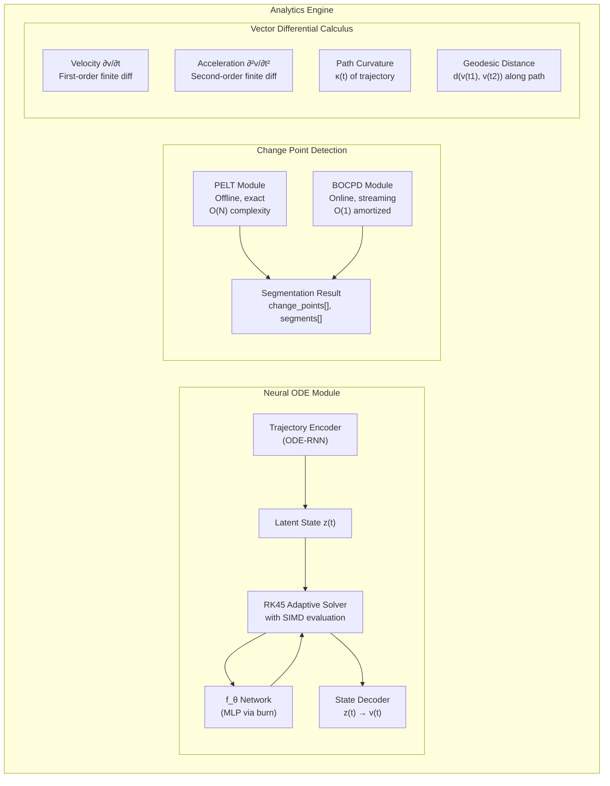
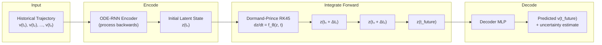
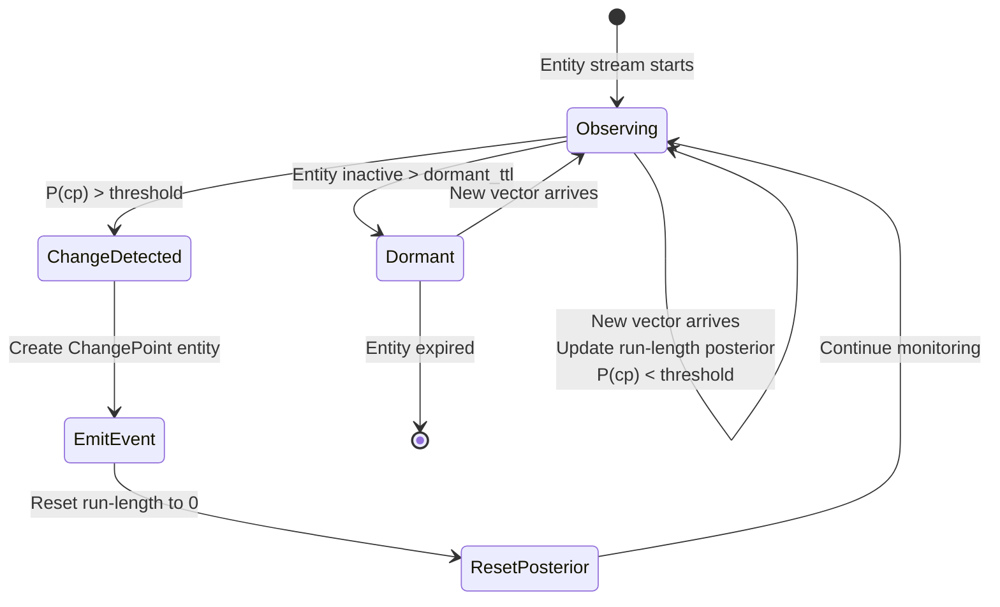

## 10. Analytics Engine

### 10.1 Component Overview

### 10.2 Neural ODE Prediction Flow

### 10.3 BOCPD Online Monitor

Cada entidad monitorizada mantiene su propio estado BOCPD con complejidad O(run_length) por actualización, truncada a un máximo configurable de la ventana de run-length.
