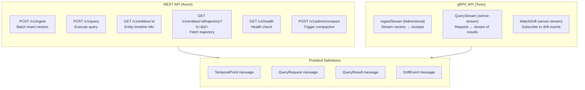

## 11. API Gateway

### 11.1 API Endpoints



### 11.2 Protobuf Schema (Simplified)

```protobuf
// cvx_api.proto

service ChronosVector {
  // Ingestion
  rpc IngestBatch (IngestRequest) returns (IngestResponse);
  rpc IngestStream (stream TemporalPoint) returns (stream WriteReceipt);

  // Queries
  rpc Query (QueryRequest) returns (QueryResponse);
  rpc QueryStream (QueryRequest) returns (stream ScoredResult);

  // Monitoring
  rpc WatchDrift (WatchRequest) returns (stream DriftEvent);
}

message TemporalPoint {
  uint64 entity_id = 1;
  int64  timestamp  = 2;
  repeated float vector = 3;
  map<string, string> metadata = 4;
}

message QueryRequest {
  QueryType type = 1;
  repeated float query_vector = 2;
  TemporalFilter temporal = 3;
  uint32 k = 4;
  float  alpha = 5;           // semantic vs temporal weight
  string metric = 6;          // "cosine" | "l2" | "dot" | "poincare"
  PredictionParams prediction = 7;
}

message TemporalFilter {
  oneof filter {
    int64 at_timestamp = 1;           // snapshot
    TimeRange range = 2;              // range query
    int64 predict_to = 3;             // extrapolation target
  }
}
```
