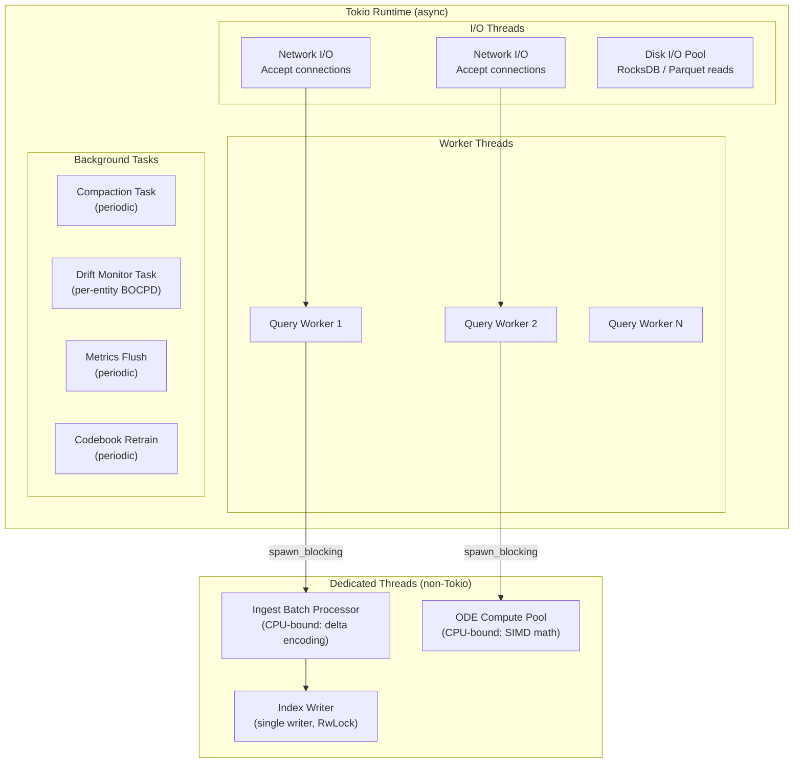
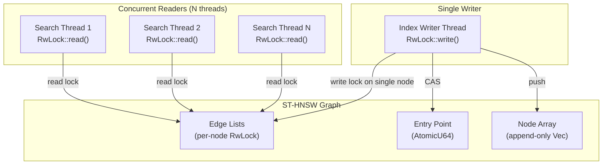

## 12. Concurrency Model

### 12.1 Thread Architecture

### 12.2 Index Concurrency

El índice ST-HNSW usa un esquema de **concurrent readers, single writer**:

**Estrategia:** Las inserciones adquieren write lock solo en las listas de vecinos de los nodos afectados (no del grafo completo), permitiendo que las búsquedas continúen en paralelo sobre el resto del grafo. El entry point se actualiza atómicamente vía CAS (Compare-and-Swap).
