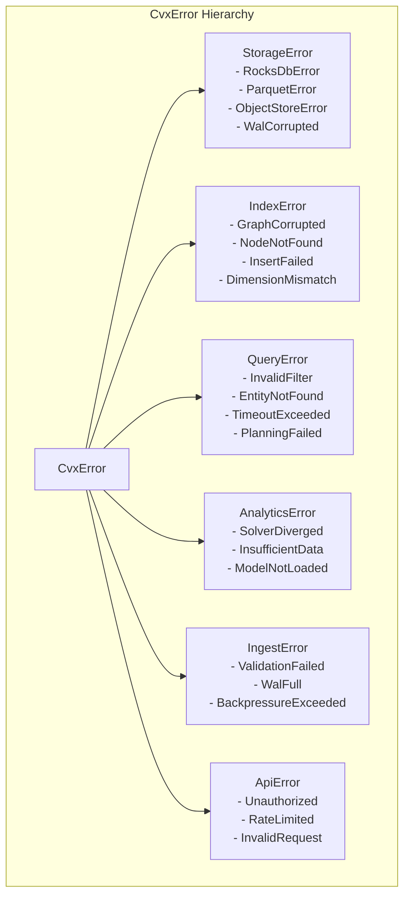
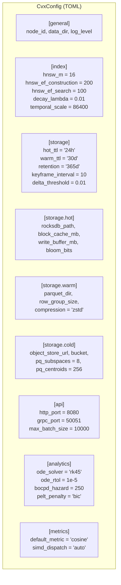
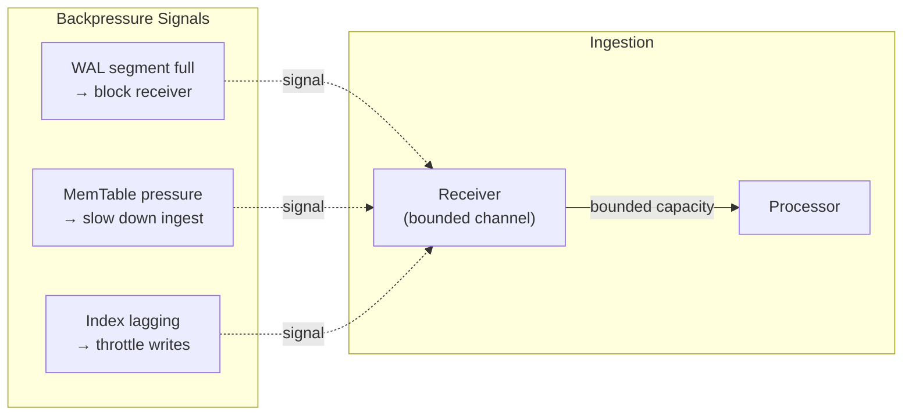
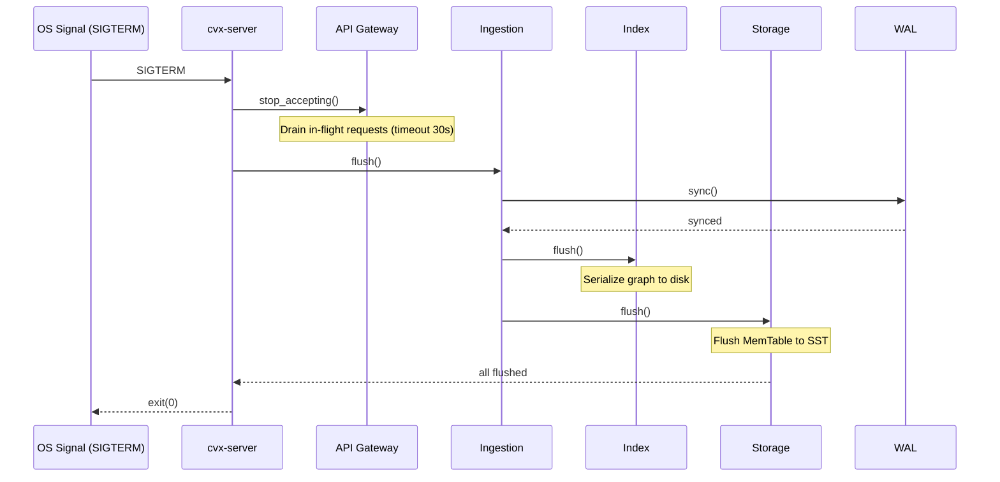
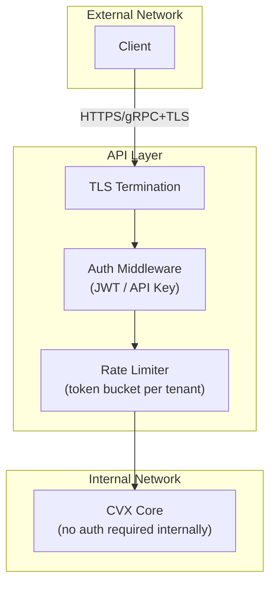

import { Tabs, TabItem } from '@astrojs/starlight/components';

## 14. Crate Structure & Module Layout

```mermaid
graph TB
    subgraph Workspace["CVX Workspace (Cargo.toml)"]
        subgraph Core["cvx-core"]
            TYPES["types/<br/>TemporalPoint, DeltaEntry,<br/>EntityTimeline, ChangePoint"]
            TRAITS["traits/<br/>DistanceMetric, VectorSpace,<br/>TemporalFilter, Storage"]
            CONFIG["config/<br/>CvxConfig, TierConfig,<br/>IndexConfig"]
            ERROR["error/<br/>CvxError, CvxResult"]
        end

        subgraph Index_Crate["cvx-index"]
            HNSW_MOD["hnsw/<br/>ST-HNSW implementation"]
            TSGRAPH_MOD["timestamp_graph/<br/>TANNS structures"]
            BITMAP_MOD["bitmap/<br/>Roaring temporal index"]
            DECAY_MOD["decay/<br/>Edge decay manager"]
            METRICS_MOD["metrics/<br/>SIMD distance kernels"]
        end

        subgraph Storage_Crate["cvx-storage"]
            HOT_MOD["hot/<br/>RocksDB wrapper"]
            WARM_MOD["warm/<br/>Parquet read/write"]
            COLD_MOD["cold/<br/>Object store + PQ"]
            COMPACT_MOD["compactor/<br/>Tier migration logic"]
            WAL_MOD["wal/<br/>Write-ahead log"]
        end

        subgraph Ingest_Crate["cvx-ingest"]
            PIPELINE_MOD["pipeline/<br/>Ingestion orchestrator"]
            DELTA_MOD["delta/<br/>Delta encoder/decoder"]
            VALIDATE_MOD["validate/<br/>Schema validation"]
        end

        subgraph Analytics_Crate["cvx-analytics"]
            ODE_MOD["ode/<br/>Neural ODE solver + f_θ"]
            PELT_MOD2["pelt/<br/>PELT implementation"]
            BOCPD_MOD2["bocpd/<br/>BOCPD implementation"]
            DIFFCALC["diffcalc/<br/>Vector velocity, acceleration"]
        end

        subgraph Query_Crate["cvx-query"]
            PLANNER_MOD["planner/<br/>Query planning & optimization"]
            EXECUTORS["executors/<br/>Snapshot, Range, Trajectory,<br/>Prediction, CPD, Analogy"]
        end

        subgraph API_Crate["cvx-api"]
            REST_MOD["rest/<br/>Axum handlers"]
            GRPC_MOD["grpc/<br/>Tonic service impl"]
            PROTO_MOD["proto/<br/>Generated protobuf code"]
        end

        subgraph Server["cvx-server (binary)"]
            MAIN["main.rs<br/>Bootstrap, config loading,<br/>dependency injection"]
        end
    end

    Server --> API_Crate
    API_Crate --> Query_Crate
    API_Crate --> Ingest_Crate
    Query_Crate --> Index_Crate
    Query_Crate --> Storage_Crate
    Query_Crate --> Analytics_Crate
    Ingest_Crate --> Index_Crate
    Ingest_Crate --> Storage_Crate
    Analytics_Crate --> Storage_Crate
    Index_Crate --> Core
    Storage_Crate --> Core
    Ingest_Crate --> Core
    Analytics_Crate --> Core
    Query_Crate --> Core
    API_Crate --> Core
```



### Dependency Flow Rule

Las dependencias son **estrictamente acíclicas y unidireccionales**:

```
cvx-server → cvx-api → cvx-query → cvx-index
                      ↘ cvx-ingest → cvx-index
                        cvx-query → cvx-analytics → cvx-storage
                        cvx-query → cvx-storage
                                     cvx-index → cvx-core
                                     cvx-storage → cvx-core
                                     cvx-ingest → cvx-core
                                     cvx-analytics → cvx-core
```

`cvx-core` no depende de ningún otro crate del workspace. Todos los demás dependen de `cvx-core`.

---

## 15. Error Handling Strategy



**Principios:**

- `CvxError` implementa `std::error::Error` + `Display` + `Send + Sync + 'static`.
- Cada crate define su propio tipo de error (e.g., `StorageError`) que implementa `Into<CvxError>`.
- En la API, los errores se mapean a códigos HTTP/gRPC apropiados.
- Los errores internos incluyen context (via `thiserror`) pero nunca se exponen al cliente (se logean y se devuelve un error genérico).

---

## 16. Configuration & Feature Flags



### Compile-Time Feature Flags (Cargo features)

```toml
[features]
default = ["rest-api", "grpc-api", "hot-storage", "simd-auto"]

# API
rest-api = ["axum", "tower-http"]
grpc-api = ["tonic", "prost"]

# Storage tiers
hot-storage = ["rocksdb"]
warm-storage = ["parquet", "arrow"]
cold-storage = ["object_store"]

# Compute
simd-auto = []           # Auto-vectorization only
simd-explicit = ["pulp"] # Explicit SIMD via pulp
gpu-compute = ["burn/cuda"]

# Analytics
neural-ode = ["burn"]
pelt = []
bocpd = []

# Metrics
poincare = []  # Hyperbolic distance support

# Distributed
distributed = ["openraft"]
```

---

## 19. Key Trait & Type Hierarchy

```mermaid
classDiagram
    class VectorSpace {
        <<trait>>
        +dim() usize
        +zero() Self
        +add(other: Self) Self
        +scale(factor: f32) Self
        +as_slice() &[f32]
    }

    class DistanceMetric {
        <<trait>>
        +distance(a: &[f32], b: &[f32]) f32
        +name() &str
        +supports_simd() bool
    }

    class TemporalFilter {
        <<enum>>
        Snapshot(i64)
        Range(i64, i64)
        Before(i64)
        After(i64)
        All
    }

    class StorageBackend {
        <<trait>>
        +get(entity_id: u64, ts: i64) Result~Option~TemporalPoint~~
        +put(point: TemporalPoint) Result~()~
        +range(entity_id: u64, t1: i64, t2: i64) Result~Vec~TemporalPoint~~
        +delete(entity_id: u64, ts: i64) Result~()~
    }

    class IndexBackend {
        <<trait>>
        +insert(point_id: u64, vector: &[f32], ts: i64) Result~()~
        +search(query: &[f32], k: u32, filter: TemporalFilter, alpha: f32) Result~Vec~ScoredResult~~
        +remove(point_id: u64) Result~()~
    }

    class AnalyticsBackend {
        <<trait>>
        +predict(trajectory: Vec~TemporalPoint~, t_future: i64) Result~PredictedPoint~
        +detect_changepoints(series: Vec~TemporalPoint~, method: CPDMethod) Result~Vec~ChangePoint~~
        +velocity(entity_id: u64, ts: i64) Result~Vec~f32~~
    }

    class CosineDistance {
        +distance(a, b) f32
    }
    class L2Distance {
        +distance(a, b) f32
    }
    class PoincaréDistance {
        +distance(a, b) f32
    }

    class HotStore {
        +rocksdb: DB
    }
    class WarmStore {
        +parquet_dir: PathBuf
    }
    class ColdStore {
        +object_store: ObjectStore
        +codebook: PQCodebook
    }

    class TieredStorage {
        +hot: HotStore
        +warm: Option~WarmStore~
        +cold: Option~ColdStore~
    }

    DistanceMetric <|.. CosineDistance
    DistanceMetric <|.. L2Distance
    DistanceMetric <|.. PoincaréDistance

    StorageBackend <|.. HotStore
    StorageBackend <|.. WarmStore
    StorageBackend <|.. ColdStore
    StorageBackend <|.. TieredStorage

    TieredStorage *-- HotStore
    TieredStorage *-- WarmStore
    TieredStorage *-- ColdStore
```



---

## 20. Cross-Cutting Concerns

### 20.1 Backpressure



### 20.2 Graceful Shutdown



### 20.3 Idempotency

Cada punto ingestado se identifica por la tupla `(entity_id, timestamp)`. Re-insertar el mismo punto es idempotente: el WAL asigna un sequence number, y si la tupla ya existe en el store, se verifica que el vector sea idéntico (via xxhash). Si difiere, se trata como una corrección y se actualiza atómicamente.

### 20.4 Security Boundaries (Future)


