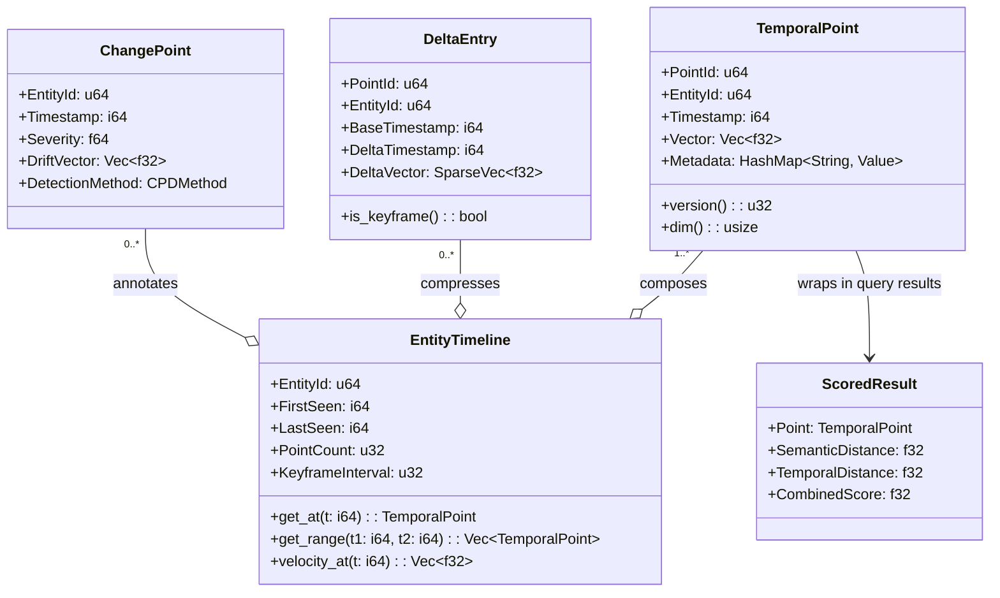
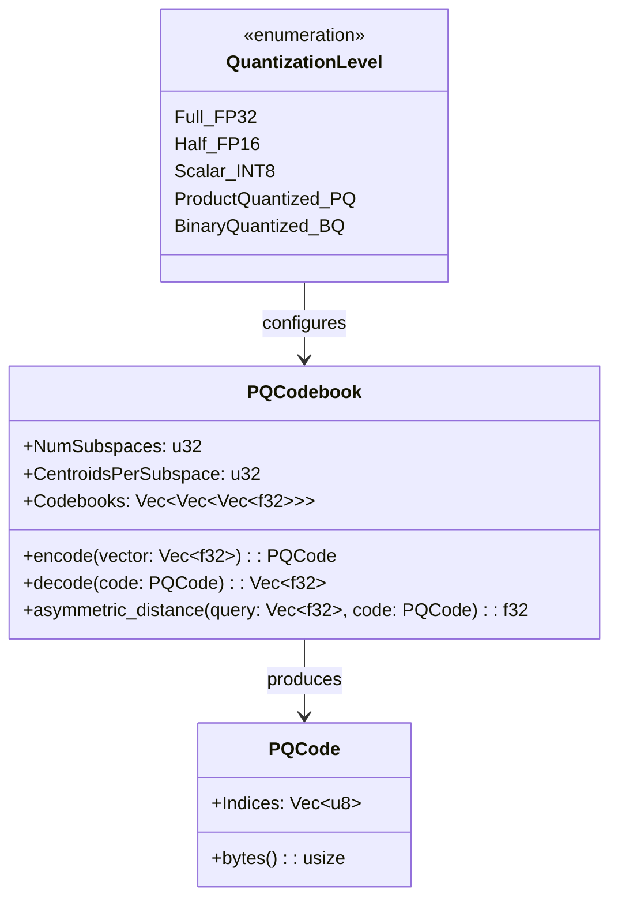

## 5. Data Model

### 5.1 Core Entities



### 5.2 Key Schema

Las claves en RocksDB siguen un esquema compuesto que permite range scans eficientes:

```
Column Family: vectors
  Key:   [entity_id: u64][timestamp: i64 BE]
  Value: [vector_data: [f32; D]] (rkyv serialized)

Column Family: deltas
  Key:   [entity_id: u64][delta_timestamp: i64 BE]
  Value: [base_timestamp: i64][sparse_indices: Vec<u32>][sparse_values: Vec<f32>]

Column Family: metadata
  Key:   [entity_id: u64][timestamp: i64 BE]
  Value: [metadata_map: HashMap<String, Value>] (rkyv serialized)

Column Family: timelines
  Key:   [entity_id: u64]
  Value: [first_seen: i64][last_seen: i64][point_count: u32][keyframe_interval: u32]

Column Family: changepoints
  Key:   [entity_id: u64][timestamp: i64 BE]
  Value: [severity: f64][drift_vector: Vec<f32>][method: u8]
```

Las claves usan Big-Endian para timestamps para que el orden lexicográfico de bytes coincida con el orden temporal (crucial para range scans eficientes en RocksDB).

### 5.3 Quantized Representations


