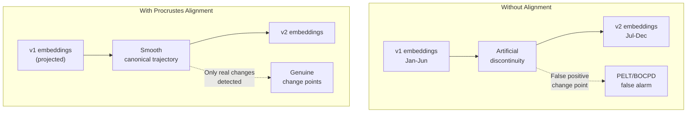

## The Problem: Embeddings Are Scattered

In production, embeddings do not live in one place. They are scattered across model serving APIs (Triton, TorchServe), data lakes (S3/Parquet), streaming platforms (Kafka), relational stores (PostgreSQL + pgvector), and other vector databases. CVX currently requires manual ingestion via `POST /v1/ingest`, which creates friction: fragile sync scripts, lost context, and -- most critically -- no answer to the question "what model produced this embedding?"

Five concrete problems motivate this layer:

| Problem | Impact |
|---------|--------|
| **Manual ingestion** | Fragile sync scripts, onboarding friction |
| **Model retraining** | BERT v1 to v2 creates artificial trajectory discontinuities. Change point detection reports false positives. |
| **Repeated analytics** | Same researcher computes drift, velocity, change points on the same trajectories multiple times during iteration |
| **No provenance** | Cannot answer: "what model produced the embedding that triggered this change point?" |
| **No alerting** | No declarative way to say "notify me when drift exceeds X" |

### Design Principle: Adopt, Do Not Replicate

CVX is **not** a data virtualization platform. We do not compete with Denodo, Dremio, or Trino. We adopt **specific concepts** that solve real problems for temporal embedding analytics:

| DV Concept | CVX Adaptation | Value |
|------------|---------------|-------|
| Source connectors | Declarative ingestion from embedding sources | Eliminate ad-hoc sync scripts |
| Semantic layer | Model version alignment + canonical spaces | Resolve retrain discontinuities |
| Materialized views | Temporal feature cache with invalidation | Eliminate recomputation during iteration |
| Data lineage | Embedding provenance metadata | Root cause analysis of anomalies |
| Data quality monitors | Declarative alerting on temporal metrics | Proactive monitoring without code |

## 1. Source Connectors (Declarative Ingestion)

### Why Ingestion, Not Federation

Traditional data virtualization systems execute queries against remote sources at query time (federation). This **does not work** for temporal analytics because temporal analysis requires the **complete history**. You cannot compute PELT over a partial window fetched at query time -- you need the full trajectory materialized locally.

Therefore, CVX source connectors are **declarative ingestion mechanisms**: they synchronize data from external sources *into* CVX, where it is stored and indexed normally. The difference from manual ingestion is that synchronization is declarative, incremental, and observable.

### Supported Sources

| Source | Protocol | Use Case |
|--------|----------|----------|
| **S3/Parquet** | AWS SDK + Arrow | Batch-produced embeddings archived in data lake |
| **Kafka** | Consumer group | Real-time embedding streams |
| **REST API** | HTTP polling | Model serving APIs (Triton, TorchServe) |
| **gRPC stream** | gRPC client | High-throughput streaming sources |
| **PostgreSQL + pgvector** | SQL client | Embeddings stored with relational metadata |

### Configuration Example

Sources are defined declaratively in `config.toml`:

```toml
[[sources]]
name = "daily-user-embeddings"
type = "s3_parquet"
space = "bert-v2"
schedule = "0 2 * * *"   # daily at 2am
incremental = true

[sources.s3_parquet]
bucket = "ml-embeddings"
prefix = "user-embeddings/bert-v2/"
partition_format = "dt=%Y-%m-%d"
entity_id_column = "user_id"
vector_column = "embedding"
timestamp_column = "produced_at"

[[sources]]
name = "realtime-content-embeddings"
type = "kafka"
space = "content-clip-512"

[sources.kafka]
brokers = ["kafka-1:9092", "kafka-2:9092"]
topic = "content-embeddings"
group_id = "cvx-ingest"
entity_id_field = "content_id"
vector_field = "embedding"
timestamp_field = "created_at"
```

Each source connector supports **incremental sync** (delta fetching since `last_sync`), **push-down filtering** (entity IDs, time ranges), and schedule-based or event-driven polling.

## 2. Model Version Alignment

This is the most valuable concept adopted from data virtualization: different "views" of the same data (different model versions) can and should be aligned into a unified semantic space.

### The Retraining Problem

When an ML team retrains their embedding model (BERT v1 to v2), the new embeddings live in a **different semantic space** even though they have the same dimensionality. The vectors are not directly comparable:

- A user's trajectory shows an **artificial jump** at the v1/v2 boundary
- Change point detection reports a **false positive** at the retrain timestamp
- Drift analytics become **useless** across model boundaries



### How It Works

When a new model version is registered with a `predecessor`, CVX automatically:

1. **Identifies overlap entities** -- entities that have embeddings in *both* spaces (old and new). This occurs naturally during the transition period when both model versions are producing embeddings.
2. **Computes Procrustes alignment** -- using paired embeddings from overlap entities, finds the optimal rotation $R$ and scale $s$ that minimizes:

$$\|V_{\text{old}} \cdot R \cdot s - V_{\text{new}}\|_F^2$$

3. **Stores the transform** as part of the `ModelVersion` record.
4. **Creates a canonical space** (optional) -- a virtual unified space that projects all versions to a common reference frame.

A minimum of 100 overlap entities is required. Below that threshold, the alignment is marked as `low_confidence`.

### Canonical Trajectories

The central abstraction: a **virtual view** that projects all embeddings of an entity -- regardless of which model version produced them -- into a common canonical space:

```json
{
  "entity_id": 42,
  "canonical_space": "user-bert-canonical",
  "points": [
    {
      "timestamp": 1640000000,
      "vector": [0.12, -0.34, "..."],
      "original_space_id": 1,
      "alignment_residual": 0.0
    },
    {
      "timestamp": 1650000000,
      "vector": [0.15, -0.31, "..."],
      "original_space_id": 3,
      "alignment_residual": 0.023
    }
  ]
}
```

Each point carries an `alignment_residual` -- the L2 distance between the original and projected vector. High residuals indicate poor alignment for that specific point.

### Filtering False Positives

With model version alignment, change point classification improves significantly:

| Signal | Classification |
|--------|---------------|
| Change point at model boundary + high alignment residual | **Model artifact** -- false positive from retrain |
| Change point at model boundary + low alignment residual | **Real change** -- coincidence with retrain |
| Change point away from model boundary | **Real change** -- genuine semantic shift |

## 3. Temporal Materialized Views

Computing temporal features (velocity, drift, change points) over full trajectories is expensive. A researcher iterating on a classification model needs to extract features from 100K users, train, evaluate, adjust, and repeat. Without caching, the same trajectories are recomputed every iteration.

### How Views Work

A materialized view is a pre-computed, cached temporal aggregation with automatic invalidation:

```toml
# Define via API or config
POST /v1/views
{
  "name": "user_risk_features",
  "type": "temporal_features",
  "space": "bert-v2",
  "refresh_policy": "on_ingest",
  "config": {
    "features": ["velocity", "acceleration", "drift_entropy", "stability_score"],
    "window": "7d"
  }
}
```

**Built-in view types:**

| View Type | Description | Invalidation |
|-----------|-------------|-------------|
| `drift_summary` | Drift rate and statistics per entity per window | Per entity |
| `temporal_features` | Feature vectors for ML (velocity, acceleration, drift) | Per entity |
| `changepoint_cache` | Cached PELT results | Per entity |
| `cohort_snapshot` | Periodic cohort divergence matrices | Per cohort |

### Invalidation Protocol

When new embeddings arrive for entity X:

1. Look up which views are affected (O(1) hash lookup)
2. Mark those view entries as `Stale`
3. If the view's policy is `OnIngest`, enqueue recomputation for **only the affected entities** -- not the entire view
4. `Scheduled` views wait for their next cycle; `Manual` views wait for an explicit refresh request

**Impact:** Training loop iteration drops from minutes (recompute features) to seconds (cache lookup).

## 4. Provenance & Lineage

Every embedding in CVX should be able to answer: **"Where did you come from?"** -- what model produced it, what version, what input it processed, when it was created, and when it arrived in CVX.

Provenance metadata is stored alongside each embedding:

```json
{
  "timestamp": 1650000000,
  "source_name": "triton-realtime",
  "model_version": "bert-v2",
  "model_hash": "ghi789",
  "input_hash": "jkl012",
  "pipeline_hash": "labchain-exp-42",
  "ingested_at": 1650000005,
  "produced_at": 1650000000
}
```

This enables queries like:
- "Are all embeddings in this trajectory from the same model?" (consistency check before drift analysis)
- "What pipeline produced the embedding that triggered this change point?" (root cause analysis)
- "When was the last embedding from source X?" (freshness monitoring)

Storage overhead is approximately 100-200 bytes per embedding -- acceptable given the diagnostic value.

## 5. Monitors (Declarative Alerting)

Monitors are declarative rules that evaluate conditions on temporal metrics and execute actions when triggered:

```toml
[[monitors]]
name = "high_risk_drift"
description = "Alert when user language shifts toward risk pattern"
condition = { type = "drift_exceeds", threshold = 0.3, window = "7d" }
action = { type = "webhook_post", url = "https://alerts.example.com/cvx" }
check_interval = "1h"
severity = "high"

[[monitors]]
name = "model_silence"
description = "Alert when no embeddings arrive from production model"
condition = { type = "silence_exceeds", duration = "6h" }
action = { type = "emit_event" }
check_interval = "30m"
severity = "critical"
```

**Available conditions:** `drift_exceeds`, `change_point_detected`, `velocity_exceeds`, `silence_exceeds`, and `custom_query`.

**Available actions:** `emit_event` (push to gRPC stream), `webhook_post`, `log`.

Periodic monitors leverage materialized views when available. Event-driven monitors (like `change_point_detected`) hook into BOCPD's real-time stream. Deduplication prevents repeated alerts within a configurable cooldown window.

## What We Explicitly Do NOT Do

| Concept | Status | Reason |
|---------|--------|--------|
| **Query-time federation** | Rejected | Temporal analytics require complete history. PELT over a partial window fetched at query time is meaningless. |
| **SQL interface** | Rejected | Temporal embeddings are not tabular. Drift, alignment, and change point detection do not express naturally in SQL. |
| **Distributed query optimizer** | Rejected | CVX is not a SQL engine. Temporal queries are analytic operations on series, not relational joins. |
| **Data catalog & discovery** | Rejected | Too broad. CVX registers spaces and model versions -- that is sufficient. Full catalogs are separate products (Apache Atlas, DataHub). |
| **Row/column level security** | Rejected | Security is handled at the API Gateway layer, not in the storage engine. |

## Performance Targets

| Component | Operation | Target |
|-----------|-----------|--------|
| Source connectors | Incremental sync (S3, 10K records) | < 30s |
| Source connectors | Kafka throughput | 50K records/s |
| Model alignment | Procrustes (10K entities, $D=768$) | < 30s |
| Model alignment | Canonical projection per point | < 0.1ms |
| Materialized views | Single-entity lookup | < 1ms |
| Materialized views | Invalidation marking | < 0.1ms |
| Provenance | Lookup (single entity, full trajectory) | < 5ms |
| Monitors | Condition evaluation | < 10ms |
