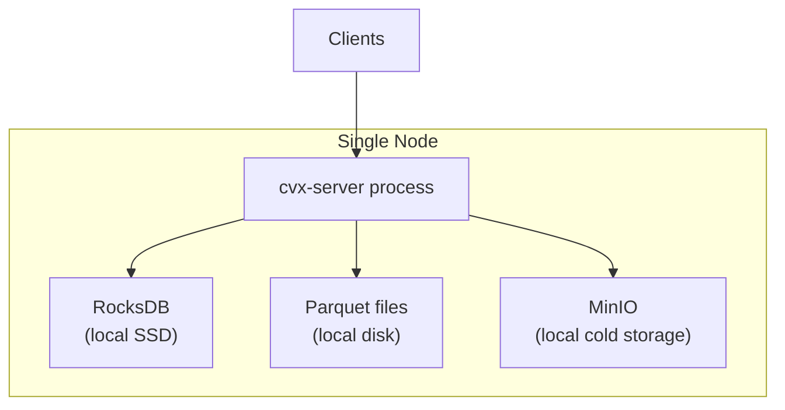
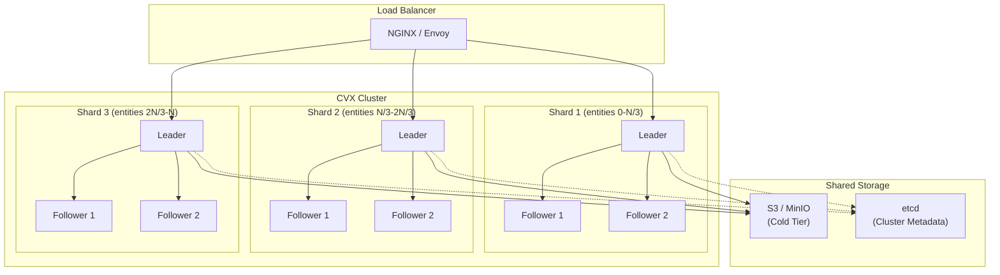

## 18. Deployment Topologies

### 18.1 Single-Node (Development / Small Scale)

### 18.2 Distributed (Production)

**Sharding Strategy:** Por `entity_id` hash (consistent hashing). Cada shard posee un rango de entidades y mantiene su propia instancia de ST-HNSW + tiered storage. Los queries cross-shard (e.g., "global kNN") requieren scatter-gather coordinado por el load balancer.

**Replicación:** Raft (vía `openraft`) dentro de cada shard para durabilidad. Las lecturas se sirven desde followers; las escrituras se routean al leader.
