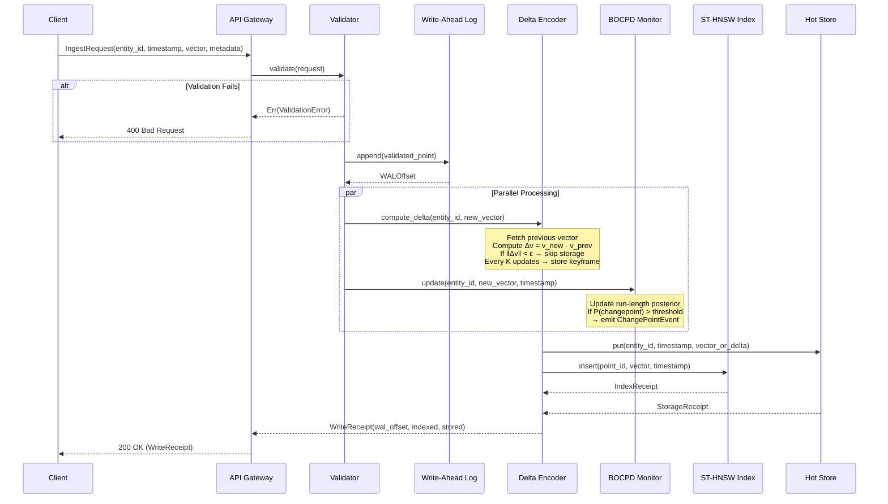
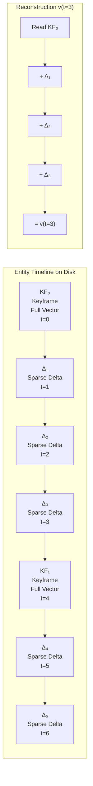
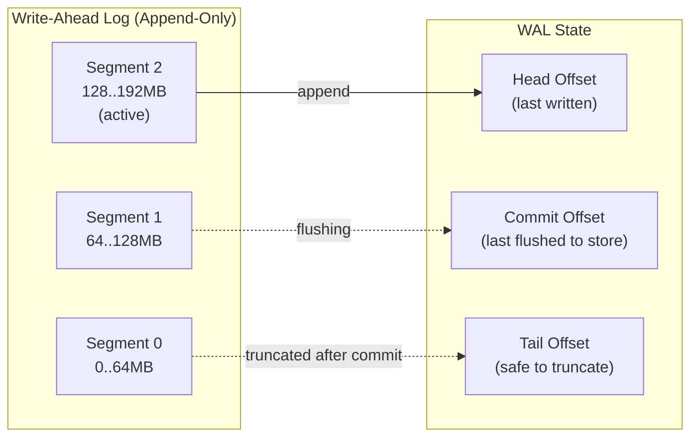

## 6. Ingestion Pipeline

### 6.1 Pipeline Flow

### 6.2 Delta Encoding Strategy

**Reglas del Delta Encoder:**

1. **Threshold ε:** Si `‖Δv‖ < ε`, el punto se descarta (el concepto no ha cambiado significativamente). Configurable por entity o globalmente.
2. **Keyframe Interval K:** Cada K deltas, se almacena el vector completo. Limita la cadena de reconstrucción a máximo K lecturas.
3. **Sparse Encoding:** Los deltas se almacenan como `(indices[], values[])` — solo las dimensiones que cambiaron por encima de un micro-threshold.
4. **Content Hash:** Cada delta se hashea (xxhash) para deduplicación. Si dos entidades producen el mismo delta, se almacena una sola vez.

### 6.3 Write-Ahead Log (WAL)

El WAL garantiza durabilidad: si el proceso se cae entre la escritura al WAL y la actualización del índice/store, el recovery re-aplica las entradas pendientes desde `COMMIT` hasta `HEAD`.
