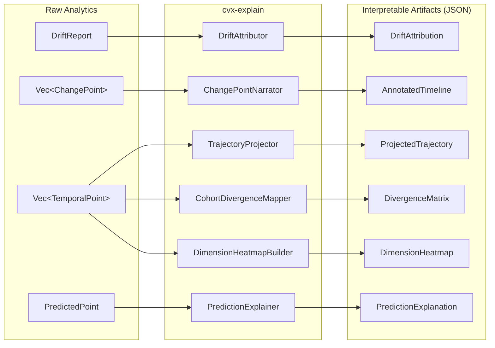

## The Problem: Raw Signals Are Not Insights

ChronosVector produces rich temporal signals -- velocity, acceleration, change points, drift, trajectories, predictions. But these signals are raw data. An ML engineer monitoring drift does not want a 768-dimensional velocity vector; they want to know *which dimensions changed, why those dimensions matter, and what action to take*.

The interpretability layer transforms raw analytics into **structured artifacts that humans can understand**, consumed by any frontend: Grafana, Jupyter, React, Streamlit.

### Design Principle

> **"Data for interpretation, not graphics."** The `cvx-explain` crate does not render SVGs or HTML. It produces structured JSON/protobuf that any frontend can render. CVX's responsibility ends at producing the data; rendering is the consumer's job.

## Architecture

`cvx-explain` is a library crate that transforms outputs from `cvx-analytics` and `cvx-query` into interpretable artifacts. It does not access the index directly -- it consumes query results and transforms them, maintaining clean separation between computation and presentation.



## The 6 Interpretability Artifacts

### 1. DriftAttribution

**Question it answers:** "My entity drifted -- but *which* dimensions drove the change?"

Given a drift between timestamps $t_1$ and $t_2$, this artifact identifies which embedding dimensions contributed most. The algorithm computes the per-dimension absolute delta $|v_{t_2}[d] - v_{t_1}[d]|$ for each dimension $d$, ranks them by contribution to total drift, and calculates a cumulative Pareto distribution.

**Example output:**

```json
{
  "entity_id": 42,
  "from_timestamp": 1640000000,
  "to_timestamp": 1700000000,
  "total_magnitude": 0.47,
  "pareto_80_count": 23,
  "dimension_contributions": [
    { "dimension_index": 42,  "label": "medical",    "contribution_fraction": 0.12, "direction": 0.34  },
    { "dimension_index": 157, "label": "technology", "contribution_fraction": 0.09, "direction": -0.21 },
    { "dimension_index": 384, "label": null,         "contribution_fraction": 0.07, "direction": 0.15  }
  ]
}
```

**Interpretation:** "80% of the drift is concentrated in 23 of 768 dimensions. Dimensions [42, 157, 384] are the largest contributors." When dimension labels are available, this becomes: "Medical dimensions increased by 340%."

**Complexity:** $O(D)$ where $D$ is the embedding dimensionality. Target latency: < 5ms for $D=768$.

### 2. ProjectedTrajectory

**Question it answers:** "What does this entity's evolution *look like*?"

Projects a high-dimensional trajectory to 2D or 3D for visualization. Two methods are available:

- **PCA** -- deterministic, fast, linear. Good default. Variance explained is returned so you know how much information is preserved.
- **UMAP** -- non-linear, preserves local neighborhood structure. Better for discovering clusters but stochastic and slower.

Each projected point retains its timestamp, enabling animated trajectory rendering. Optionally, kNN neighbors at each timestamp can be included to show how the entity's neighborhood evolves.

```json
{
  "entity_id": 42,
  "projection_method": "pca",
  "target_dims": 2,
  "variance_explained": [0.42, 0.18],
  "points": [
    { "timestamp": 1640000000, "coords": [0.12, -0.34] },
    { "timestamp": 1650000000, "coords": [0.45, -0.22] },
    { "timestamp": 1660000000, "coords": [0.78,  0.11] }
  ]
}
```

**Interpretation:** "You can see how 'machine learning' moved from the 'statistics' region toward the 'deep learning' region between 2015 and 2020."

### 3. AnnotatedTimeline

**Question it answers:** "When did this entity change, and what happened at each change point?"

Transforms a raw list of change points into a timeline annotated with interpretive context. For each change point, the artifact includes:

- Severity score and z-score (relative to the entity's historical volatility)
- Top-K dimensions that changed
- kNN neighbors *before* and *after* the change (showing how the entity's context shifted)
- An optional human-readable narrative (when dimension labels are available)

Periods between change points are reported as "stable segments" with summary statistics.

```json
{
  "entity_id": 42,
  "change_points": [
    {
      "timestamp": 1584230400,
      "severity": 0.92,
      "z_score": 3.7,
      "method": "pelt",
      "top_dimensions": [
        { "dimension_index": 42, "label": "health", "absolute_delta": 0.34 }
      ],
      "neighbors_before": [
        { "entity_id": 101, "label": "beer", "distance": 0.12 }
      ],
      "neighbors_after": [
        { "entity_id": 201, "label": "COVID", "distance": 0.08 }
      ],
      "narrative": "Severe change in March 2020. Health-related dimensions increased dramatically. Nearest neighbors shifted from [beer, royal, solar] to [COVID, pandemic, virus]."
    }
  ],
  "stable_segments": [
    { "from_timestamp": 1577836800, "to_timestamp": 1584230400, "mean_drift_rate": 0.02, "volatility": 0.005 }
  ]
}
```

### 4. CohortDivergenceMap

**Question it answers:** "When did these entities start diverging from each other?"

For a set of entities, computes pairwise distance time series and detects divergence/convergence events using PELT on the distance series.

```json
{
  "entity_ids": [101, 102, 103],
  "events": [
    {
      "entity_a": 101, "entity_b": 102,
      "timestamp": 1640000000,
      "event_type": "Divergence",
      "magnitude": 0.35
    }
  ]
}
```

**Interpretation:** "'ML' and 'AI' were converging until 2022, then diverged significantly. 'Deep Learning' and 'Neural Networks' remain stably related."

For large cohorts (>100 entities), representative entities per cluster are computed first to keep costs manageable.

### 5. DimensionHeatmap

**Question it answers:** "Which dimensions are active at which times?"

Produces a matrix (time bins x dimensions) showing the intensity of change per dimension over time. Three variants are available:

| Variant | What it measures |
|---------|-----------------|
| **Absolute change** | Magnitude of delta per dimension per time bin |
| **Relative change** | Delta normalized by that dimension's historical std |
| **Cumulative change** | Running sum of absolute deltas |

The result is a heatmap where "hot bands" reveal which aspects of the embedding are active in each period.

### 6. PredictionExplanation

**Question it answers:** "How confident is this Neural ODE prediction, and *where* is it uncertain?"

Makes the Neural ODE output interpretable by providing:

- **Fan chart data:** historical trajectory + prediction cone with expanding confidence intervals
- **Per-dimension uncertainty:** which dimensions are most/least certain in the prediction
- **Baseline comparison:** Neural ODE vs linear extrapolation vs historical mean
- **Trajectory dynamics:** is the entity accelerating, decelerating, or stable?

**Interpretation:** "The prediction for 'transformer' in 2027 has high confidence in syntactic dimensions ($\pm 0.02$) but low confidence in application dimensions ($\pm 0.15$). The trajectory shows deceleration -- the concept is stabilizing."

## API Endpoints

All endpoints are under the `/v1/explain/` prefix:

| Endpoint | Method | Artifact |
|----------|--------|----------|
| `/v1/explain/entities/{id}/drift-attribution` | GET | DriftAttribution |
| `/v1/explain/entities/{id}/trajectory-projection` | GET | ProjectedTrajectory |
| `/v1/explain/entities/{id}/changepoint-narrative` | GET | AnnotatedTimeline |
| `/v1/explain/entities/{id}/dimension-heatmap` | GET | DimensionHeatmap |
| `/v1/explain/entities/{id}/prediction` | GET | PredictionExplanation |
| `/v1/explain/cohort-divergence` | POST | CohortDivergenceMap |

A gRPC streaming endpoint `WatchDriftExplained` is also available for real-time drift attribution as events are detected.

## Dimension Labels

Several artifacts are enriched with **optional dimension labels** -- semantic names for each embedding dimension (e.g., dim[42] = "medical"). Without them, outputs use numeric indices. With them, narratives become human-readable: "Medical dimensions increased 340%" instead of "dim[42] increased 0.34".

Labels are provided via configuration or entity schema and stored in the `metadata` column family.

## Performance Targets

| Operation | Latency target |
|-----------|---------------|
| Drift attribution ($D=768$) | < 5ms |
| PCA projection (1K points, $D=768$) | < 50ms |
| UMAP projection (1K points, $D=768$) | < 2s |
| Heatmap (365 days, daily, $D=768$) | < 100ms |
| Cohort divergence (10 entities, 365 days) | < 1s |
| Prediction explanation | < 10ms |
