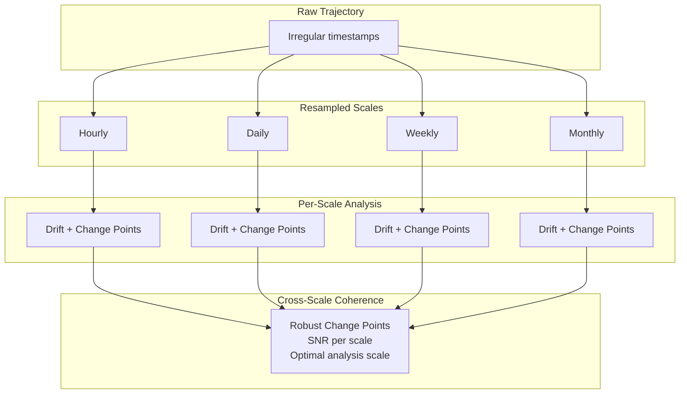

## The Problem: Embeddings Are Not Homogeneous

Real-world embedding systems are not single-model, single-frequency affairs. A production system might need to store and correlate:

- **Text embeddings** ($D=768$, BERT) updated daily
- **Image embeddings** ($D=512$, CLIP) updated hourly
- **User behavior embeddings** ($D=128$, recommendation model) updated in real time
- **Graph embeddings** ($D=64$, TransE) updated weekly

These embeddings live in **different spaces** (different dimensionality, scale, update frequency, distance metric) but represent **the same entities or related entities**. An ML engineer wants to ask: "When did the text and image representations of this product diverge?" A researcher wants to know: "Does textual semantic evolution predict visual evolution?"

ChronosVector, as a **temporal VDB**, is uniquely positioned to solve this: it not only stores multiple representations, but can analyze how they evolve *with respect to each other* over time.

## Core Concepts

### Embedding Space

An `EmbeddingSpace` is a registered vector space in CVX with defined properties:

```rust
pub struct EmbeddingSpace {
    pub space_id: u32,
    pub name: String,                           // e.g., "text-bert-768"
    pub dimensionality: u32,
    pub metric: DistanceMetricType,             // cosine, euclidean, etc.
    pub typical_frequency: Option<TemporalFrequency>,
    pub normalization: Normalization,            // UnitNorm, None, Custom
}
```

Each space gets its own ST-HNSW index (different dimensionalities prevent sharing an index). The storage key extends from `(entity_id, timestamp)` to `(entity_id, space_id, timestamp)`. If no space is specified, `space_id = 0` (default) is used for backward compatibility.

### Multi-Space Entities

An entity can have vectors in **multiple spaces**, each with its own temporal trajectory. The fundamental tuple becomes:

$$(entity\_id, space\_id, timestamp, vector)$$

This enables a product to have simultaneous text, image, and behavioral trajectories, each evolving independently but analyzable together.

## Alignment Methods

An alignment function measures the **coherence** between two spaces for the same entity over time. It does not compare vectors directly (they are in different spaces) -- it compares *behaviors*.

### 1. Structural Alignment (Topology Preservation)

**Question:** "Do the neighbors of entity X in space A match its neighbors in space B?"

The algorithm computes kNN of the entity in each space at each timestamp and measures the Jaccard similarity of the neighbor sets:

$$\text{structural\_alignment}(t) = \frac{|kNN_A(X, t) \cap kNN_B(X, t)|}{|kNN_A(X, t) \cup kNN_B(X, t)|}$$

**Advantages:**
- Works across different dimensionalities (no projection needed)
- Captures whether the entity's "role" is consistent across modalities

**Cost:** $O(k^2 \cdot T)$ where $T$ is the number of timestamps and $k$ is the neighbor count.

### 2. Behavioral Alignment (Drift Correlation)

**Question:** "When entity X changes fast in space A, does it also change fast in space B?"

Computes the per-step drift magnitude in each space, then correlates the two drift time series using Pearson, Spearman, or Kendall-Tau correlation:

$$\text{behavioral\_alignment} = \text{corr}\big(\|v_A(t+1) - v_A(t)\|, \|v_B(t+1) - v_B(t)\|\big)$$

**Result:** A value in $[-1.0, 1.0]$. Positive means the spaces evolve together; negative means one is stable when the other changes.

**Advantages:**
- Scale-invariant -- different dimensionalities and magnitudes do not matter
- Cheap to compute: $O(T \cdot \max(D_A, D_B))$

### 3. Procrustes Alignment (Geometric)

**Question:** "What is the best rotation that aligns these two trajectory shapes?"

When spaces share the same dimensionality (or are projected to a common one), Orthogonal Procrustes finds the rotation matrix $R$ that minimizes the Frobenius norm:

$$\min_R \|A - B \cdot R\|_F^2 \quad \text{subject to} \quad R^T R = I$$

The solution uses SVD: given $B^T A = U \Sigma V^T$, the optimal rotation is $R = U V^T$. The residual error after alignment measures misalignment.

**Cost:** $O(T \cdot D^2)$ for the SVD computation.

This is the same method used for [model version alignment](/chronos-vector/architecture/data-virtualization/#2-model-version-alignment), but applied to cross-modal comparison rather than cross-version comparison.

### 4. Canonical Correlation Analysis (CCA)

**Question:** "What subspaces of A and B are maximally correlated?"

For spaces with different dimensionalities, CCA finds projection matrices $W_A$ and $W_B$ that maximize the correlation between the projected spaces. This produces:

- **Canonical correlations** -- sorted from highest to lowest, showing how many dimensions are shared between the spaces
- **Projection matrices** -- enabling cross-space comparison and kNN
- **Effective alignment dimensionality** -- how many dimensions are meaningfully correlated

**Cost:** $O(T \cdot (D_A + D_B)^2)$

### Choosing an Alignment Method

| Method | Different dims? | What it measures | Best for |
|--------|:-:|---|---|
| Structural | Yes | Neighborhood consistency | "Do the same entities cluster together in both spaces?" |
| Behavioral | Yes | Change correlation | "Do the spaces react to the same events?" |
| Procrustes | No* | Geometric fit | Model version alignment, same-dim cross-modal |
| CCA | Yes | Subspace correlation | Finding shared structure across heterogeneous spaces |

*Requires same dimensionality or prior projection.

## Temporal Resampling

Embeddings from different sources update at different frequencies. Text embeddings might update daily, image embeddings hourly. To analyze cross-space alignment, the timelines need to be brought to a **common temporal scale**.

### Interpolation Methods

| Method | How it works | Best for |
|--------|-------------|----------|
| **LastValue** | Zero-order hold (use the last known value) | Sparse updates, no assumptions |
| **Linear** | Linear interpolation between known points | Short gaps, general purpose |
| **Slerp** | Spherical linear interpolation | Cosine-metric spaces (preserves unit sphere geometry) |
| **NeuralOde** | Use trained Neural ODE for continuous interpolation | Most accurate, but expensive (requires Layer 10) |

For **downsampling** (multiple values in one bin), three aggregation strategies are available: `Last` (most recent value), `Mean` (average), and `MostRecent` (highest confidence).

**Slerp** deserves special attention for unit-normalized embeddings. Unlike linear interpolation, which can produce vectors with $\|v\| \neq 1$, Slerp interpolates along the great circle on the unit sphere:

$$\text{slerp}(v_1, v_2, t) = \frac{\sin((1-t)\Omega)}{\sin \Omega} v_1 + \frac{\sin(t\Omega)}{\sin \Omega} v_2$$

where $\Omega = \arccos(v_1 \cdot v_2)$.

## Multi-Scale Drift Analysis

Drift can appear different at different temporal scales. Daily noise might mask weekly trends, or amplify them. Multi-scale analysis examines drift at multiple granularities simultaneously.

### Analysis Protocol

1. **Resample** the trajectory to each target scale (hourly, daily, weekly, monthly)
2. **Compute** the drift time series at each scale
3. **Detect** change points at each scale
4. **Compare** results across scales



At each scale, a `ScaleDriftReport` provides:

- **Mean drift rate** and variance
- **Trend:** accelerating, decelerating, stable, or oscillating
- **Change points** detected at that scale
- **Signal-to-noise ratio (SNR):** drift signal vs measurement noise

## Cross-Scale Coherence

The key insight: **change points that persist across multiple scales are high-confidence**. Change points that appear only at fine scales are likely noise.

A `RobustChangePoint` is a change point detected at multiple scales:

```json
{
  "timestamp": 1650000000,
  "severity": 0.85,
  "scale_count": 3,
  "scales_detected": ["hourly", "daily", "weekly"]
}
```

Cross-scale coherence also identifies the **optimal analysis scale** -- the temporal granularity where the signal-to-noise ratio is maximized. This tells the user: "For this entity, weekly analysis gives you the clearest signal."

The fine-to-coarse correlation measures whether drift patterns at fine scales predict drift at coarser scales. High correlation suggests a consistent underlying process; low correlation suggests scale-dependent dynamics.

## API Endpoints

### Space Management

| Endpoint | Method | Description |
|----------|--------|-------------|
| `/v1/spaces` | POST | Register a new embedding space |
| `/v1/spaces` | GET | List all registered spaces |
| `/v1/spaces/{name}` | GET | Get space details |

### Cross-Space Alignment

| Endpoint | Method | Description |
|----------|--------|-------------|
| `/v1/alignment/entities/{id}` | GET | Alignment score between two spaces for an entity |
| `/v1/alignment/cohort` | POST | Alignment analysis for multiple entities |
| `/v1/alignment/entities/{id}/cross-prediction` | GET | Predict evolution in one space from another |

Parameters for alignment queries include `space_a`, `space_b`, `method` (structural, behavioral, procrustes, cca), time range, and resampling frequency.

### Multi-Scale Analysis

| Endpoint | Method | Description |
|----------|--------|-------------|
| `/v1/multiscale/entities/{id}/drift` | GET | Drift analysis at multiple temporal scales |
| `/v1/multiscale/entities/{id}/robust-changepoints` | GET | Change points that persist across scales |

The `robust-changepoints` endpoint accepts a `min_scales` parameter (default: 2) that controls the minimum number of scales at which a change point must appear to be considered robust.

## Performance Targets

| Operation | Target |
|-----------|--------|
| Space registration | < 1ms |
| Behavioral alignment (2 spaces, 1K timestamps) | < 50ms |
| Structural alignment (2 spaces, 1K timestamps, $k=10$) | < 500ms |
| Procrustes alignment ($D=768$, 1K timestamps) | < 200ms |
| CCA ($D_A=768$, $D_B=512$, 1K timestamps) | < 1s |
| Temporal resampling (10K to 1K points) | < 10ms |
| Multi-scale drift (3 scales, 10K points) | < 500ms |
