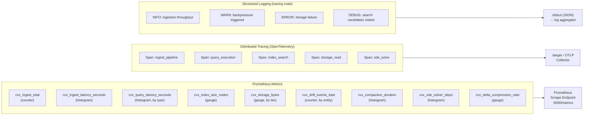

## 17. Observability

```mermaid
graph LR
    subgraph Metrics["Prometheus Metrics"]
        M1["cvx_ingest_total<br/>(counter)"]
        M2["cvx_ingest_latency_seconds<br/>(histogram)"]
        M3["cvx_query_latency_seconds<br/>(histogram, by type)"]
        M4["cvx_index_size_nodes<br/>(gauge)"]
        M5["cvx_storage_bytes<br/>(gauge, by tier)"]
        M6["cvx_drift_events_total<br/>(counter, by entity)"]
        M7["cvx_compaction_duration<br/>(histogram)"]
        M8["cvx_ode_solver_steps<br/>(histogram)"]
        M9["cvx_delta_compression_ratio<br/>(gauge)"]
    end

    subgraph Tracing["Distributed Tracing (OpenTelemetry)"]
        T1["Span: ingest_pipeline"]
        T2["Span: query_execution"]
        T3["Span: index_search"]
        T4["Span: storage_read"]
        T5["Span: ode_solve"]
    end

    subgraph Logging["Structured Logging (tracing crate)"]
        L1["INFO: ingestion throughput"]
        L2["WARN: backpressure triggered"]
        L3["ERROR: storage failure"]
        L4["DEBUG: search candidates visited"]
    end

    Metrics --> PROM["Prometheus<br/>Scrape Endpoint<br/>:9090/metrics"]
    Tracing --> JAEGER["Jaeger / OTLP<br/>Collector"]
    Logging --> STDOUT["stdout (JSON)<br/>→ log aggregator"]
```
