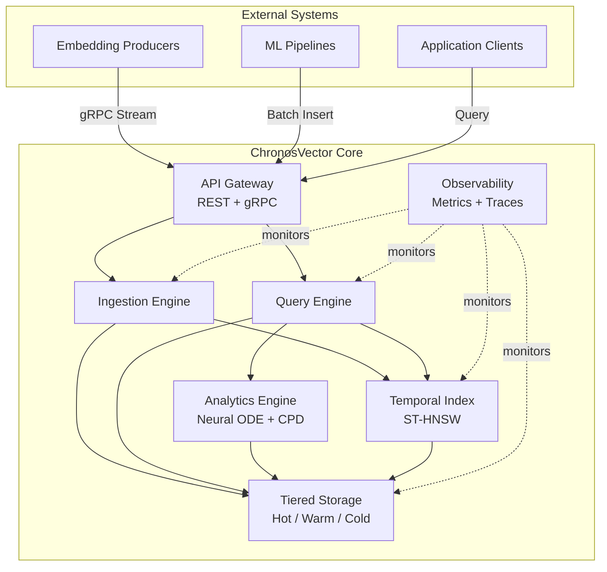
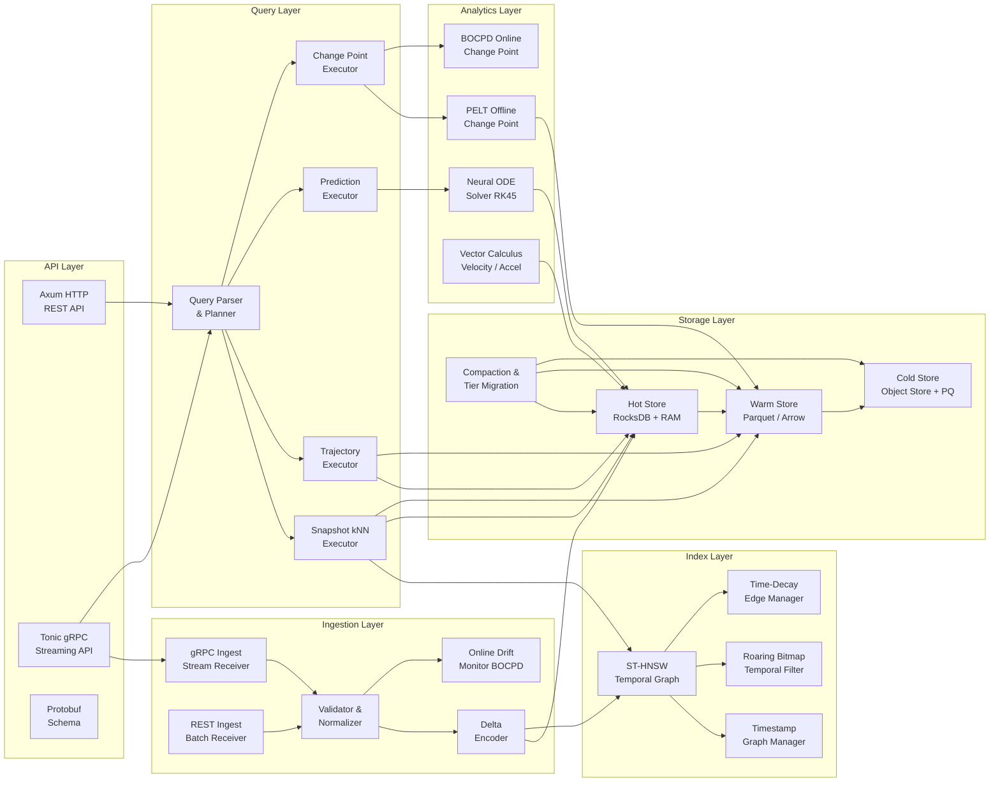

import { Aside } from '@astrojs/starlight/components';

## 1. System Overview

ChronosVector es una plataforma de datos vectoriales donde el tiempo es un ciudadano de primera clase. El sistema recibe streams de embeddings con marca temporal, los indexa en una estructura espacio-temporal, los almacena en capas de temperatura variable, y expone un motor de queries que permite desde búsquedas kNN clásicas hasta predicción de trayectorias futuras y detección de drift semántico.

---

## 2. Architecture Principles

| Principio | Descripción | Impacto en Diseño |
|---|---|---|
| **Time as Geometry** | El tiempo no es un filtro; es una dimensión del espacio de búsqueda | El índice combina distancia semántica y temporal nativamente |
| **Zero-Copy Pipeline** | Los datos atraviesan el sistema con cero copias innecesarias | `rkyv` para serialización zero-copy, `bytes::Bytes` para buffers compartidos |
| **Tiered by Temperature** | Los datos migran automáticamente según su "calor" (recency de acceso) | Hot (RAM+LSM), Warm (Parquet), Cold (Object Store + PQ) |
| **Compute Near Data** | Las operaciones analíticas se ejecutan donde residen los datos | SIMD en hot path, polars en warm, chunked reads en cold |
| **Separation of Index & Storage** | El índice (grafo) y los vectores viven en subsistemas independientes | Permite reindexar sin mover datos y viceversa |
| **Pluggable Metrics** | La métrica de distancia es un trait, no hardcoded | Soporta coseno, L2, dot product, Poincaré hiperbólico |
| **Fail Loud, Recover Gracefully** | Los errores se propagan explícitamente; la recuperación es automática | `Result<T, CvxError>` en todas las interfaces internas |

---

## 3. High-Level System Architecture

