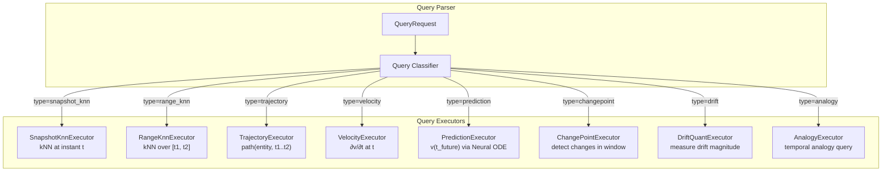
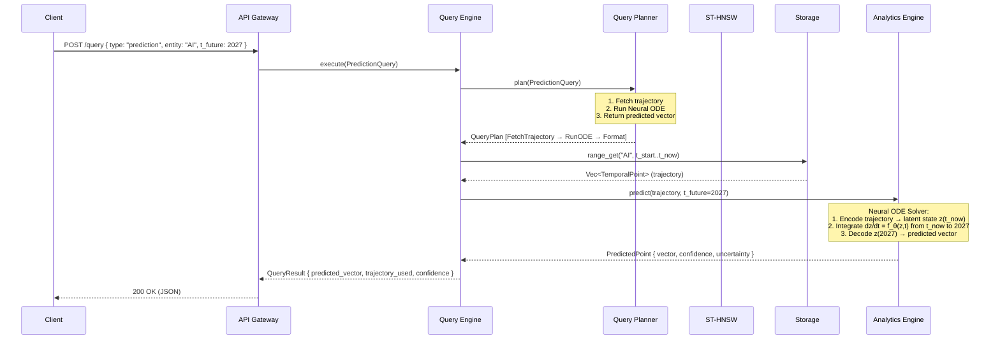
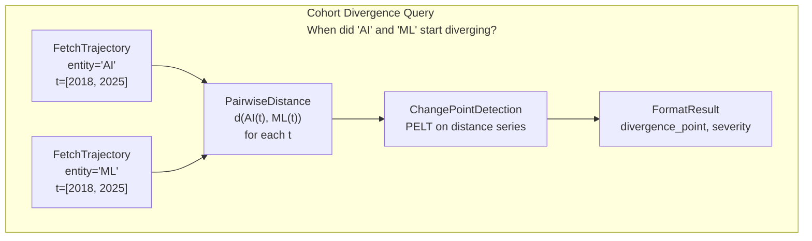

## 9. Query Engine

### 9.1 Query Types & Routing

```mermaid
graph TB
    subgraph QueryParser["Query Parser"]
        INPUT["QueryRequest"]
        CLASSIFY["Query Classifier"]
    end

    subgraph Executors["Query Executors"]
        SNAP_EX["SnapshotKnnExecutor<br/>kNN at instant t"]
        RANGE_EX["RangeKnnExecutor<br/>kNN over [t1, t2]"]
        TRAJ_EX["TrajectoryExecutor<br/>path(entity, t1..t2)"]
        VEL_EX["VelocityExecutor<br/>∂v/∂t at t"]
        PRED_EX["PredictionExecutor<br/>v(t_future) via Neural ODE"]
        CPD_EX["ChangePointExecutor<br/>detect changes in window"]
        DRIFT_EX["DriftQuantExecutor<br/>measure drift magnitude"]
        ANALOG_EX["AnalogyExecutor<br/>temporal analogy query"]
    end

    INPUT --> CLASSIFY
    CLASSIFY -->|"type=snapshot_knn"| SNAP_EX
    CLASSIFY -->|"type=range_knn"| RANGE_EX
    CLASSIFY -->|"type=trajectory"| TRAJ_EX
    CLASSIFY -->|"type=velocity"| VEL_EX
    CLASSIFY -->|"type=prediction"| PRED_EX
    CLASSIFY -->|"type=changepoint"| CPD_EX
    CLASSIFY -->|"type=drift"| DRIFT_EX
    CLASSIFY -->|"type=analogy"| ANALOG_EX
```

### 9.2 Query Plan Execution

```mermaid
sequenceDiagram
    participant Client
    participant API as API Gateway
    participant QE as Query Engine
    participant PLAN as Query Planner
    participant IDX as ST-HNSW
    participant STORE as Storage
    participant AE as Analytics Engine

    Client->>API: POST /query { type: "prediction", entity: "AI", t_future: 2027 }
    API->>QE: execute(PredictionQuery)

    QE->>PLAN: plan(PredictionQuery)
    Note over PLAN: 1. Fetch trajectory<br/>2. Run Neural ODE<br/>3. Return predicted vector
    PLAN-->>QE: QueryPlan [FetchTrajectory → RunODE → Format]

    QE->>STORE: range_get("AI", t_start..t_now)
    STORE-->>QE: Vec<TemporalPoint> (trajectory)

    QE->>AE: predict(trajectory, t_future=2027)
    Note over AE: Neural ODE Solver:<br/>1. Encode trajectory → latent state z(t_now)<br/>2. Integrate dz/dt = f_θ(z,t) from t_now to 2027<br/>3. Decode z(2027) → predicted vector
    AE-->>QE: PredictedPoint { vector, confidence, uncertainty }

    QE-->>API: QueryResult { predicted_vector, trajectory_used, confidence }
    API-->>Client: 200 OK (JSON)
```

### 9.3 Query Composition for Complex Queries

Las queries complejas se componen como grafos de operaciones:

```mermaid
graph TB
    subgraph CohortDivergence["Cohort Divergence Query<br/>When did 'AI' and 'ML' start diverging?"]
        FETCH_A["FetchTrajectory<br/>entity='AI'<br/>t=[2018, 2025]"]
        FETCH_B["FetchTrajectory<br/>entity='ML'<br/>t=[2018, 2025]"]
        PAIRWISE["PairwiseDistance<br/>d(AI(t), ML(t))<br/>for each t"]
        CPD_ANAL["ChangePointDetection<br/>PELT on distance series"]
        FORMAT["FormatResult<br/>divergence_point, severity"]
    end

    FETCH_A --> PAIRWISE
    FETCH_B --> PAIRWISE
    PAIRWISE --> CPD_ANAL
    CPD_ANAL --> FORMAT
```
