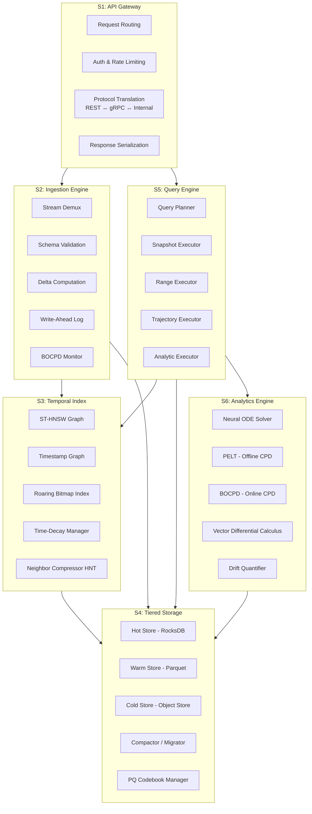

## 4. Subsystem Decomposition

ChronosVector se descompone en 6 subsistemas principales, cada uno con responsabilidades claras y contratos de interfaz definidos.

### Responsabilidades por Subsistema

| Subsistema | Responsabilidad Principal | Interfaces Expuestas |
|---|---|---|
| **S1: API Gateway** | Punto de entrada único. Traduce protocolos externos a comandos internos | `IngestCommand`, `QueryRequest`, `AdminCommand` |
| **S2: Ingestion Engine** | Valida, normaliza, computa deltas, persiste y actualiza el índice de forma atómica | `ingest(batch)` → `WriteReceipt` |
| **S3: Temporal Index** | Estructura de indexación espacio-temporal. Resuelve kNN con constraints temporales | `search(query, temporal_filter)` → `Vec<ScoredResult>` |
| **S4: Tiered Storage** | Almacenamiento multi-temperatura. Gestiona ciclo de vida de datos | `get(id, t)`, `put(id, t, vec)`, `range(id, t1..t2)` |
| **S5: Query Engine** | Planifica y ejecuta queries complejas componiendo operaciones de S3, S4 y S6 | `execute(QueryPlan)` → `QueryResult` |
| **S6: Analytics Engine** | Operaciones analíticas: predicción, CPD, cálculo diferencial vectorial | `predict(id, t_future)`, `detect_changes(id, window)` |
