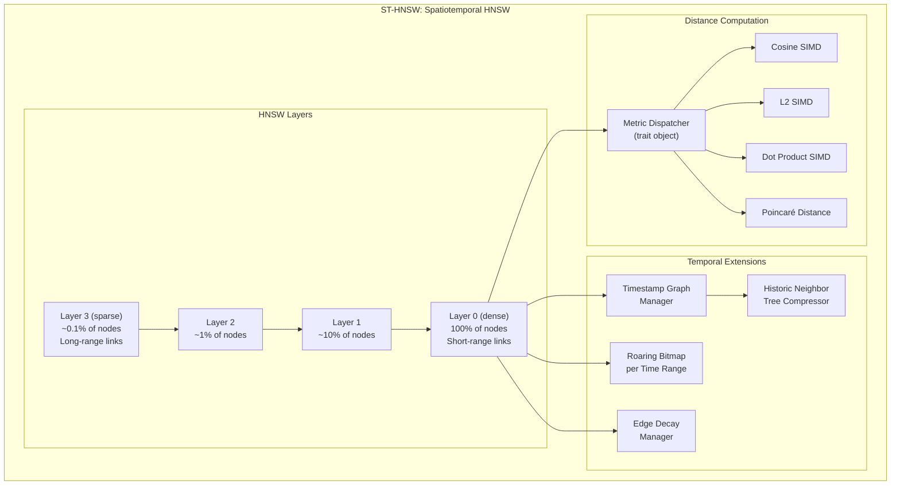
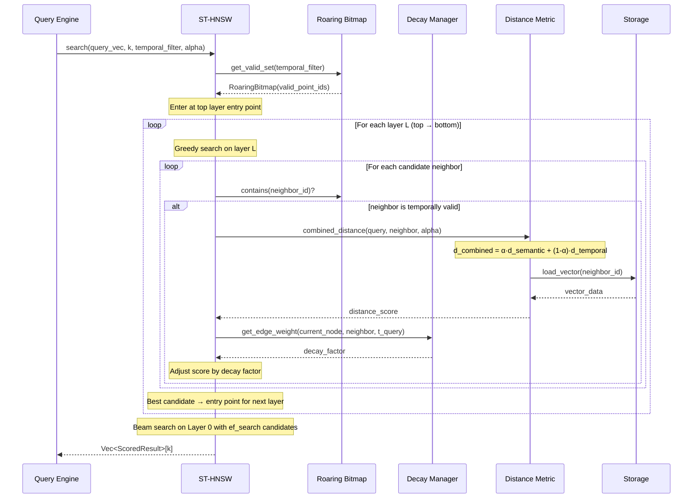
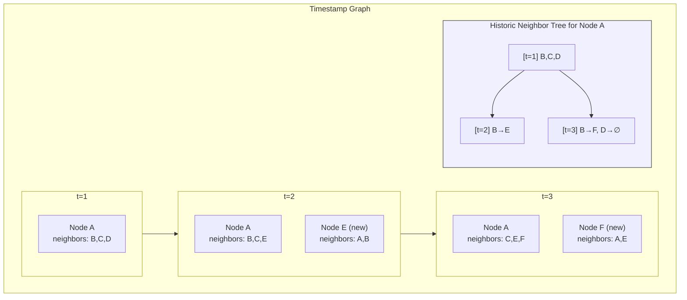

## 7. Temporal Index Engine (ST-HNSW)

### 7.1 Index Architecture



### 7.2 Search Algorithm



### 7.3 Combined Distance Function

La distancia combinada es el corazón de ST-HNSW:

```
d_ST(query, candidate) = α · d_semantic(q.vector, c.vector)
                       + (1 - α) · d_temporal(q.timestamp, c.timestamp)
                       × decay(c.age)
```

Donde:
- `α ∈ [0, 1]` — peso relativo semántico vs temporal (configurable por query)
- `d_semantic` — coseno, L2, dot product o Poincaré según configuración
- `d_temporal` — `|q.timestamp - c.timestamp| / temporal_scale`
- `decay(age) = e^(-λ · age)` — penaliza conexiones antiguas

### 7.4 Timestamp Graph (TANNS Integration)



El HNT almacena los cambios en las listas de vecinos como un árbol binario de diffs, evitando duplicación de vecinos estables.
