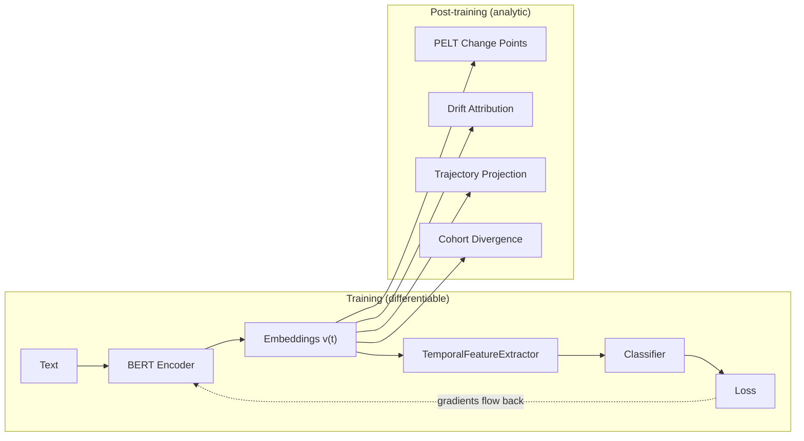

## The Problem: Backpropagation Dies at CVX

CVX extracts rich temporal features from embedding trajectories: velocity, acceleration, drift, change points, volatility. These features are powerful for downstream classification tasks -- for example, early detection of psychological disorders from social media post histories.

But if these features are not **differentiable**, the gradient from the classifier cannot propagate back to the base embedding model (BERT, sentence-transformers). This prevents end-to-end fine-tuning and limits the system's power:

```
Text → Embedding Model → v(t) → CVX features → Classifier → loss
         (BERT)                    ────────────
                                   If this is not differentiable,
                                   the gradient dies here and
                                   BERT cannot adjust
```

## The Solution: Dual-Path Architecture

CVX offers **two paths** for temporal features -- same mathematical computation, different execution context:

| Path | Implementation | Differentiable | Purpose |
|------|---------------|----------------|---------|
| **Analytic** | Rust, SIMD | No | Serving, API, interpretation |
| **ML** | burn / tch-rs with autograd | Yes | End-to-end training, fine-tuning |

Both paths share the same logic via a `TemporalOps` trait and produce numerically identical results. The difference is that the ML path records operations in an autograd graph, enabling gradient flow.

:::note[CVX is not a training framework]
CVX does not replace PyTorch, burn, or any ML framework. It provides **temporal storage** and **differentiable temporal features** that participate in external training loops. The training loop, optimizer, and scheduler are the user's responsibility.
:::

## The `TemporalOps` Trait

The trait abstracts temporal operations over tensors, with three backend implementations:

```rust
pub trait TemporalOps {
    type Tensor;

    fn velocity(embeddings: &Self::Tensor, timestamps: &Self::Tensor) -> Self::Tensor;
    fn acceleration(embeddings: &Self::Tensor, timestamps: &Self::Tensor) -> Self::Tensor;
    fn drift(embeddings: &Self::Tensor) -> Self::Tensor;
    fn volatility(embeddings: &Self::Tensor, timestamps: &Self::Tensor) -> Self::Tensor;
    fn soft_changepoints(embeddings: &Self::Tensor, timestamps: &Self::Tensor, temperature: f64) -> Self::Tensor;
    fn extract_all(embeddings: &Self::Tensor, timestamps: &Self::Tensor, config: &TemporalFeaturesConfig) -> Self::Tensor;
}
```

### Three Backends

| Backend | Type | When to use |
|---------|------|-------------|
| **AnalyticBackend** | `Vec<Vec<f32>>` | API serving, `cvx-explain`, any context that does not need gradients |
| **BurnBackend** | `burn::tensor::Tensor<B, 2>` | Pure-Rust training with CUDA support. Shares backend with Neural ODE. |
| **TorchBackend** | `tch::Tensor` | Python interop -- gradients cross the Rust/Python boundary via PyO3 with zero-copy tensors |

Backends are feature-gated: `temporal-ml-burn` enables BurnBackend, `temporal-ml-torch` enables TorchBackend. The analytic backend is always available.

## Which Features Are Differentiable?

### Naturally Differentiable

These features compute identically across all backends. In the ML backends, they register operations in the autograd graph:

| Feature | Formula | Gradient |
|---------|---------|----------|
| **Velocity** | $(v_{t+1} - v_t) / \Delta t$ | $-1/\Delta t$ and $+1/\Delta t$ (linear) |
| **Acceleration** | $(v_{t+2} - 2v_{t+1} + v_t) / \Delta t^2$ | Linear |
| **Total drift** | $v_{t_{last}} - v_{t_{first}}$ | $\pm 1$ (trivial) |
| **Per-dim delta** | $|v_{t_2}[d] - v_{t_1}[d]|$ | $\text{sign}(\Delta)$ |
| **Volatility** | $\text{std}(\|v_{t+1} - v_t\|)$ | Derivative of std, well-defined |
| **Cosine distance** | $1 - \cos(v_{t_1}, v_{t_2})$ | Standard, differentiable |
| **EMA** | $\sum e^{-\lambda \cdot \text{age}} \cdot v_t$ | Fixed exponential weights |
| **Neural ODE state** | $z(t) = \text{ODESolve}(f_\theta, z_0, t)$ | Adjoint method (Chen 2018) |

### Soft Relaxations (Differentiable Approximations of Discrete Features)

Some features are inherently discrete in the analytic path (PELT, counts) but have continuous differentiable approximations:

| Discrete feature | Differentiable relaxation | Control parameter |
|-----------------|--------------------------|-------------------|
| Number of change points | $\sum \sigma((\text{deviation} - \mu) / \tau)$ -- sum of sigmoids | $\tau$ (temperature) |
| Maximum severity | $\text{softmax}(\text{severity}) \cdot \text{severity}$ -- smooth max | $\tau$ |
| Top-K dimensions | $\text{gumbel\_softmax}(|\Delta|, \tau)$ | $\tau$ |
| Silence count | $\sum \sigma((\text{gap} - \theta) / \tau)$ | $\theta$ (threshold), $\tau$ |

As $\tau \to 0$, the relaxations converge to the discrete versions. During training, $\tau > 0$ allows gradients; at inference time, $\tau \to 0$ recovers exact results.

### Non-Differentiable (Analytic Path Only)

These features exist only for **human interpretation**, not for training:

| Feature | Why not differentiable |
|---------|----------------------|
| PELT (exact segmentation) | Discrete combinatorial optimization |
| BOCPD posterior | Discrete run-length |
| Change point narrative | Produces structure/text, not numeric |
| Drift attribution (Pareto) | Sorting + cumsum with discrete threshold |

## Learnable Components

The `TemporalFeatureExtractor` is not just fixed computations -- it includes **trainable components** that optimize jointly with the classifier:

### DimensionAttention

A linear module that learns **which embedding dimensions matter** for the task:

$$\text{output} = \text{drift} \odot \sigma(W \cdot \text{drift})$$

This lets the model learn, for example, that dimensions associated with "negative affect" are more relevant than "syntax" dimensions for depression detection. It is the learnable equivalent of CVX's analytical drift attribution.

### MultiScaleAggregator

Learnable weights for the relative importance of each temporal scale:

$$\text{output} = \sum_s w_s \cdot \text{features}_s$$

The model learns whether the signal is stronger at the daily, weekly, or monthly scale -- analogous to CVX's multi-scale analysis, but optimized for the specific task.

### SoftChangePointDetector

The temperature $\tau$ itself can be a learnable parameter, so the model discovers the optimal sensitivity to changes for the task.

## Feature Vector Output

For $D = 768$ and $n\_scales = 3$, the `TemporalFeatureExtractor` produces a **fixed-size** feature vector regardless of sequence length:

| Component | Dimensions |
|-----------|-----------|
| Mean velocity | 768 |
| Attended drift | 768 |
| Volatility | 768 |
| Mean acceleration | 768 |
| Scalar features (5) | 5 |
| Scale features | 6 |
| **Total** | **3077** |

This solves the variable-length problem: users with 10 posts and users with 500 posts produce the same-shaped feature vector.

## Concrete Example: Social Media Classification

### Problem Structure

A dataset of $N$ users, each with a variable number of timestamped posts and a binary label. The goal is to classify users based on how their language evolves over time.

### End-to-End Pipeline



**Training path:** Text goes through BERT, produces per-post embeddings, CVX extracts differentiable temporal features, a classifier produces logits, and `loss.backward()` propagates gradients all the way back to BERT.

**Analysis path:** After training, the analytic (non-differentiable) tools provide interpretability -- PELT finds exact change points, drift attribution identifies responsible dimensions, trajectory projection visualizes the evolution.

### Python Interop (tch-rs)

For PyTorch users, the TorchBackend enables gradient flow across the Rust/Python boundary:

```python
import torch
from transformers import AutoModel
import cvx_python  # Rust compiled extension

bert = AutoModel.from_pretrained("bert-base-uncased")
classifier = torch.nn.Linear(3077, 2)

for batch in dataloader:
    embeddings = bert(batch.tokens).last_hidden_state[:, 0]
    features = cvx_python.temporal_features(embeddings, batch.timestamps)  # Rust, autograd OK
    logits = classifier(features)
    loss = F.cross_entropy(logits, batch.label)
    loss.backward()  # gradients reach BERT
```

### Cross-Validation Between Paths

After training, the learned `DimensionAttention` weights can be compared against CVX's analytical drift attribution:

- **High correlation** -- the model learned what CVX's analytics already show. Increases confidence in both.
- **Low correlation** -- the model discovered signals that the analytics do not capture. Worth investigating.

This cross-validation between the differentiable and analytic paths is a unique diagnostic capability.

## Handling Irregular Data

Social media posts are not periodic. The implementation handles:

- **Long gaps:** Velocity is computed with real $\Delta t$, not assuming uniform intervals.
- **Bursts:** Optionally aggregate by time window before computing features.
- **Silence as signal:** The posting pattern itself (gaps, frequency, burstiness) is a differentiable feature via soft silence counting: $\sum \sigma((\text{gap} - \theta) / \tau)$.

## Performance Targets

| Operation | Target |
|-----------|--------|
| Feature extraction (100 posts, $D=768$, burn CPU) | < 1ms |
| Feature extraction (100 posts, $D=768$, CUDA) | < 0.5ms |
| Batch extraction (1000 users x 100 posts, CUDA) | < 100ms |
| Backward pass overhead vs forward-only | < 2x |
| Feature vector size (fixed) | 3077 (for $D=768$, 3 scales) |
