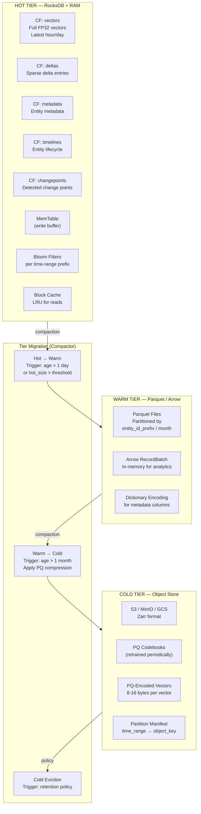
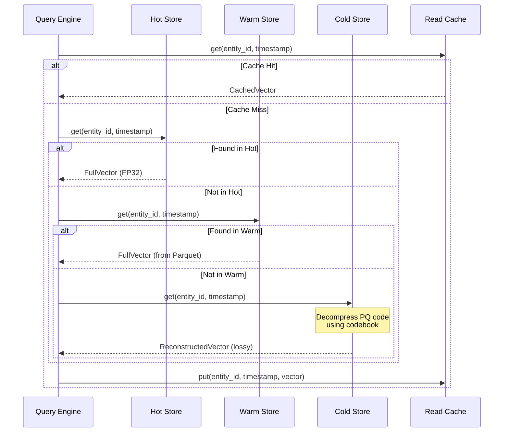
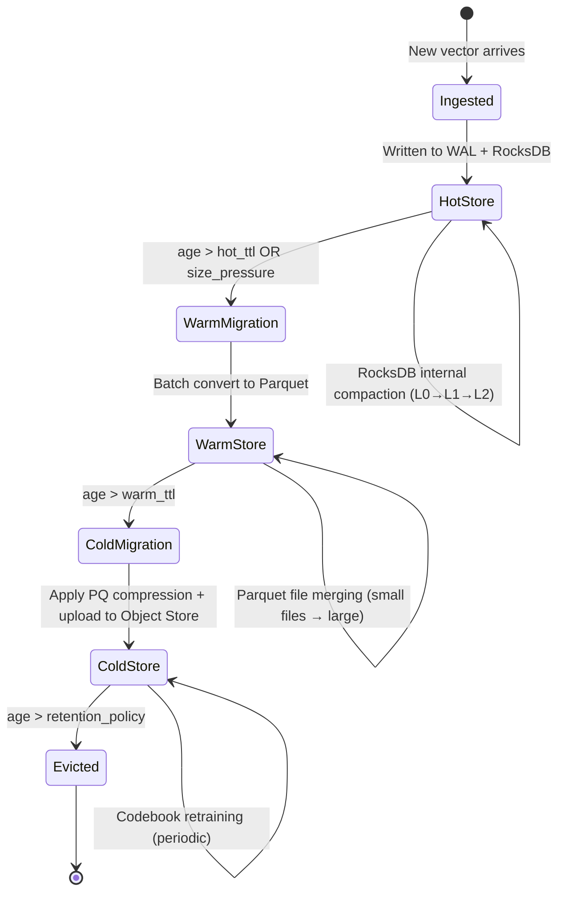

## 8. Tiered Storage Architecture

### 8.1 Storage Tiers Overview

```mermaid
graph TB
    subgraph Hot["HOT TIER — RocksDB + RAM"]
        direction LR
        CF_VEC["CF: vectors<br/>Full FP32 vectors<br/>Latest hour/day"]
        CF_DELTA["CF: deltas<br/>Sparse delta entries"]
        CF_META["CF: metadata<br/>Entity metadata"]
        CF_TL["CF: timelines<br/>Entity lifecycle"]
        CF_CP["CF: changepoints<br/>Detected change points"]
        MEMTABLE["MemTable<br/>(write buffer)"]
        BLOOM["Bloom Filters<br/>per time-range prefix"]
        BLOCK_CACHE["Block Cache<br/>LRU for reads"]
    end

    subgraph Warm["WARM TIER — Parquet / Arrow"]
        direction LR
        PQ_FILES["Parquet Files<br/>Partitioned by<br/>entity_id_prefix / month"]
        ARROW_BUF["Arrow RecordBatch<br/>In-memory for analytics"]
        DICT_ENC["Dictionary Encoding<br/>for metadata columns"]
    end

    subgraph Cold["COLD TIER — Object Store"]
        direction LR
        OBJ_STORE["S3 / MinIO / GCS<br/>Zarr format"]
        PQ_CODEBOOK["PQ Codebooks<br/>(retrained periodically)"]
        PQ_ENCODED["PQ-Encoded Vectors<br/>8-16 bytes per vector"]
        MANIFEST["Partition Manifest<br/>time_range → object_key"]
    end

    subgraph Migration["Tier Migration (Compactor)"]
        direction LR
        HOT_WARM["Hot → Warm<br/>Trigger: age > 1 day<br/>or hot_size > threshold"]
        WARM_COLD["Warm → Cold<br/>Trigger: age > 1 month<br/>Apply PQ compression"]
        COLD_EVICT["Cold Eviction<br/>Trigger: retention policy"]
    end

    Hot -->|compaction| HOT_WARM
    HOT_WARM --> Warm
    Warm -->|compaction| WARM_COLD
    WARM_COLD --> Cold
    Cold -->|policy| COLD_EVICT
```

### 8.2 Storage Access Patterns

```mermaid
sequenceDiagram
    participant QE as Query Engine
    participant HOT as Hot Store
    participant WARM as Warm Store
    participant COLD as Cold Store
    participant CACHE as Read Cache

    QE->>CACHE: get(entity_id, timestamp)

    alt Cache Hit
        CACHE-->>QE: CachedVector
    else Cache Miss
        QE->>HOT: get(entity_id, timestamp)
        alt Found in Hot
            HOT-->>QE: FullVector (FP32)
        else Not in Hot
            QE->>WARM: get(entity_id, timestamp)
            alt Found in Warm
                WARM-->>QE: FullVector (from Parquet)
            else Not in Warm
                QE->>COLD: get(entity_id, timestamp)
                Note over COLD: Decompress PQ code<br/>using codebook
                COLD-->>QE: ReconstructedVector (lossy)
            end
        end
        QE->>CACHE: put(entity_id, timestamp, vector)
    end
```

### 8.3 Compaction & Tier Migration

```mermaid
stateDiagram-v2
    [*] --> Ingested: New vector arrives
    Ingested --> HotStore: Written to WAL + RocksDB

    HotStore --> WarmMigration: age > hot_ttl OR size_pressure
    WarmMigration --> WarmStore: Batch convert to Parquet

    WarmStore --> ColdMigration: age > warm_ttl
    ColdMigration --> ColdStore: Apply PQ compression + upload to Object Store

    ColdStore --> Evicted: age > retention_policy
    Evicted --> [*]

    HotStore --> HotStore: RocksDB internal compaction (L0→L1→L2)
    WarmStore --> WarmStore: Parquet file merging (small files → large)
    ColdStore --> ColdStore: Codebook retraining (periodic)
```
