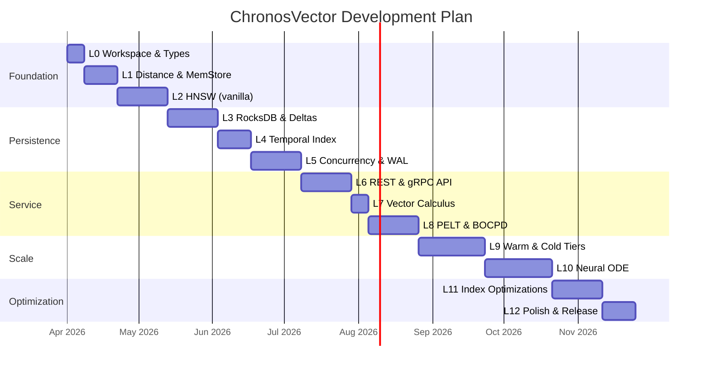
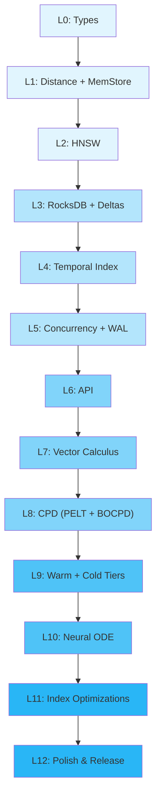

**Version:** 1.0
**Author:** Manuel Couto Pintos
**Date:** March 2026
**Philosophy:** Cada capa añade funcionalidad sobre un core compilable y testable. Nunca hay más de una capa "en progreso". Cada capa termina con un binario que arranca y pasa tests.

---

## Principio Rector

```
Layer 0: Un struct y un test
Layer 1: Un struct que almacena y recupera
Layer 2: Un struct que almacena, indexa y busca
Layer 3: Un struct que hace todo lo anterior detrás de una API
...y así sucesivamente
```

Cada layer tiene:
- **Entry Criteria:** Qué debe estar completo antes de empezar.
- **Scope:** Qué se implementa (y qué NO).
- **Exit Criteria:** Tests específicos que deben pasar para considerar la capa completa.
- **Rust Skills:** Qué conceptos de Rust se practican.
- **Estimated Effort:** En semanas (asumiendo dedicación parcial ~20h/semana).

---

## Layer 0: Workspace Skeleton & Core Types

**Goal:** Workspace de Cargo compilable con los tipos fundamentales y traits definidos. Cero funcionalidad real.

### Scope

- Inicializar workspace con 8 crates vacíos (structure del Architecture doc §14).
- Definir en `cvx-core`:
  - `TemporalPoint`, `DeltaEntry`, `EntityTimeline`, `ChangePoint`, `ScoredResult`
  - Trait `DistanceMetric` con signature completa
  - Trait `VectorSpace` (no implementado, solo signature)
  - `CvxError` enum con variantes para cada subsistema
  - `CvxConfig` struct (deserializable desde TOML via serde)
- Un `config.example.toml` con todos los campos documentados.
- CI pipeline: `cargo build --workspace`, `cargo test --workspace`, `cargo clippy`.

### NOT in scope
- Ninguna implementación de distancia, storage, o index.

### Exit Criteria
```
✅ `cargo build --workspace` compila sin warnings
✅ `cargo test --workspace` pasa (tests unitarios de serialization round-trip para core types)
✅ `cargo clippy --workspace` sin warnings
✅ TemporalPoint se serializa/deserializa con rkyv correctamente
✅ CvxConfig se deserializa desde TOML correctamente
✅ README.md con descripción del proyecto y estructura de crates
```

### Rust Skills
- Workspace management, feature flags, `#[derive]` macros, `thiserror`, `serde`, `rkyv`

### Effort: ~1 week

---

## Layer 1: Distance Kernels & In-Memory Vector Store

**Goal:** Poder insertar vectores en memoria y calcular distancias con SIMD.

### Entry Criteria
- Layer 0 complete.

### Scope

**cvx-index (parcial):**
- `CosineDistance`, `L2Distance`, `DotProductDistance` implementando `DistanceMetric`.
- Auto-vectorización primero. Si benchmark muestra ganancia, añadir `pulp` SIMD.
- Benchmark: distancia coseno sobre 1M pares de vectores D=768.

**cvx-storage (parcial):**
- `InMemoryStore` implementando `StorageBackend` (HashMap en memoria, sin persistencia).
- Operaciones: `put`, `get`, `range`, `delete`.

### NOT in scope
- HNSW, RocksDB, Parquet, API, analytics.

### Exit Criteria
```
✅ Cosine distance matches reference (numpy) output to 1e-6 tolerance
✅ L2 and dot product similarly validated
✅ InMemoryStore: insert 100K points, retrieve by (entity_id, timestamp) correctly
✅ InMemoryStore: range query returns correct ordered subset
✅ Benchmark: cosine distance throughput ≥ 100M pairs/sec on D=768 (single core)
✅ Benchmark report saved as markdown in /benchmarks/
```

### Rust Skills
- SIMD (auto-vectorization, `#[target_feature]`), trait implementations, benchmarking (`criterion`)

### Effort: ~2 weeks

---

## Layer 2: HNSW Index (Vanilla, No Temporal)

**Goal:** HNSW estándar funcional. Snapshot kNN sobre vectores estáticos.

### Entry Criteria
- Layer 1 complete.

### Scope

**cvx-index:**
- Implementación de HNSW: insert, search (greedy + beam search on layer 0).
- Parámetros: M, ef_construction, ef_search.
- Single-threaded (concurrent reads llega en Layer 5).

**Integration:**
- Conectar HNSW con InMemoryStore: el índice referencia point_ids, el store tiene los vectores.

### NOT in scope
- Temporal filtering, Roaring Bitmaps, decay, Timestamp Graph.
- Persistence (index is in-memory only).

### Exit Criteria
```
✅ Insert 100K random vectors D=128, search k=10: recall@10 ≥ 0.95
✅ Insert 1M random vectors D=768, search k=10: recall@10 ≥ 0.92
✅ Search latency p50 < 1ms, p99 < 5ms (1M vectors)
✅ Benchmark comparison output against brute-force kNN (ground truth)
✅ HNSW graph invariants hold: every node reachable from entry point
```

### Rust Skills
- Complex data structures in Rust (Vec-of-Vecs for adjacency), random number generation, heap/priority queue

### Effort: ~3 weeks

---

## Layer 3: RocksDB Persistence & Delta Encoding

**Goal:** Los datos sobreviven a reinicios. Delta encoding reduce storage.

### Entry Criteria
- Layer 2 complete.

### Scope

**cvx-storage:**
- `HotStore` wrapping RocksDB con column families (vectors, deltas, timelines, metadata, changepoints, system).
- Key encoding BE como spec (§4.2 del Storage Layout).
- `RocksDBStorageBackend` implementando `StorageBackend`.

**cvx-ingest (parcial):**
- `DeltaEncoder`: computa Δv, decide si almacenar delta o keyframe.
- `DeltaDecoder`: reconstruye vector completo desde keyframe + cadena de deltas.
- Configurable keyframe interval K y threshold ε.

**Integration:**
- Reemplazar `InMemoryStore` por `HotStore` en los tests de Layer 2.
- HNSW persiste serializado en disco (save/load via rkyv).

### NOT in scope
- Warm/cold tiers, WAL (RocksDB's own WAL suffices for now), compaction inter-tier.

### Exit Criteria
```
✅ Insert 100K vectors, kill process, restart, all vectors recoverable
✅ Delta encoding: for synthetic slowly-drifting data, storage < 30% of full vector storage
✅ Reconstruction: decoded vector matches original to 1e-7 tolerance (floating point)
✅ Range scan: get_range(entity, t1, t2) returns correct sorted subset
✅ HNSW save + load: search after reload produces identical results to before
✅ Timeline record correctly tracks first_seen, last_seen, point_count per entity
```

### Rust Skills
- FFI (rocksdb bindings), byte-level key encoding, file I/O, `#[cfg(test)]` for mock stores

### Effort: ~3 weeks

---

## Layer 4: Temporal Index (ST-HNSW)

**Goal:** El índice entiende el tiempo. Queries con filtrado temporal nativo.

### Entry Criteria
- Layer 3 complete.

### Scope

**cvx-index:**
- Roaring Bitmap index: un bitmap por rango temporal (granularidad configurable).
- Insert actualiza bitmap. Search pre-filtra candidatos por bitmap.
- Composite distance: $d_{ST} = \alpha \cdot d_{sem} + (1-\alpha) \cdot d_{time}$.
- `TemporalFilter` enum: Snapshot, Range, Before, After, All.

**New query types:**
- Snapshot kNN (kNN at exact timestamp).
- Range kNN (kNN over time window).
- Trajectory retrieval (all points for an entity in a range).

### NOT in scope
- Timestamp Graph (TANNS), time-decay edges, HNT compression.
- These are optimizations for Layer 7+.

### Exit Criteria
```
✅ Snapshot kNN at t=T returns only vectors valid at T, recall ≥ 0.90
✅ Range kNN over [T1, T2] returns only vectors in range, recall ≥ 0.90
✅ Alpha=1.0 (pure semantic) matches Layer 2 vanilla HNSW recall
✅ Alpha=0.5 returns temporally closer results than alpha=1.0
✅ Trajectory retrieval for entity with 100 points returns all in correct order
✅ Roaring Bitmap memory usage < 1 byte per vector for typical workloads
```

### Rust Skills
- Bitmap operations, enum-based dispatch for `TemporalFilter`, parameterized testing

### Effort: ~2 weeks

---

## Layer 5: Concurrency & Write-Ahead Log

**Goal:** Concurrent readers + single writer. WAL para crash safety.

### Entry Criteria
- Layer 4 complete.

### Scope

**cvx-storage:**
- WAL implementation (segment files, entry format per Storage Layout spec §3).
- Recovery protocol: replay uncommitted entries on startup.

**cvx-index:**
- `RwLock`-based concurrency: multiple search threads, single insert thread.
- Per-node edge locks (no global lock for inserts).

**Integration:**
- Ingest path: WAL append → index insert → store write → commit.
- Crash test: insert N vectors, kill -9 mid-stream, restart, verify consistency.

### NOT in scope
- API server (still direct function calls in tests). Async (still sync threads).

### Exit Criteria
```
✅ 8 concurrent search threads + 1 writer: no data races (Miri or ThreadSanitizer)
✅ WAL: write 100K entries, kill -9, restart, all committed entries present
✅ WAL: partial write (truncated entry) is detected and truncated on recovery
✅ Insert throughput with concurrency ≥ 30K vectors/sec (D=768, 8 search threads)
✅ Search latency unaffected by concurrent inserts (p99 < 2x single-threaded)
```

### Rust Skills
- `RwLock`, `Arc`, `AtomicU64`, `Condvar`, `thread::spawn`, file locking, fsync

### Effort: ~3 weeks

---

## Layer 6: REST API & gRPC Streaming

**Goal:** CVX es un servicio accesible por red.

### Entry Criteria
- Layer 5 complete.

### Scope

**cvx-api:**
- REST endpoints con `axum`: `/v1/ingest`, `/v1/query`, `/v1/entities/{id}`, `/v1/entities/{id}/trajectory`, `/v1/health`, `/v1/ready`.
- gRPC con `tonic`: `IngestStream`, `Query`, `QueryStream`.
- Protobuf schema per PRD §5.2.
- Error mapping per PRD §5.3.

**cvx-server:**
- `main.rs`: config loading, dependency injection, graceful shutdown.
- Signal handling: SIGTERM → drain → flush → exit.

**cvx-ingest:**
- Validation pipeline: dimension check, timestamp check, norm check.
- Batch ingestion endpoint.

### NOT in scope
- Auth, rate limiting, TLS (Layer 9).
- Analytics engine (prediction, CPD).

### Exit Criteria
```
✅ curl POST /v1/ingest with 1000 vectors → 200 OK with receipts
✅ curl POST /v1/query snapshot kNN → correct results matching direct function call
✅ grpcurl IngestStream: stream 10K vectors → all acknowledged
✅ GET /v1/health returns version and uptime
✅ GET /v1/ready returns 503 during startup, 200 after index loaded
✅ SIGTERM → graceful shutdown within 5s (in-flight requests complete)
✅ Integration test: start server, ingest via REST, query via REST, verify results
```

### Rust Skills
- `axum` (handlers, extractors, middleware), `tonic` (service impl), `tokio` runtime, protobuf codegen, signal handling

### Effort: ~3 weeks

---

## Layer 7: Vector Differential Calculus

**Goal:** Velocity, acceleration, drift quantification.

### Entry Criteria
- Layer 6 complete.

### Scope

**cvx-analytics (parcial):**
- `VectorCalculus` module:
  - `velocity(entity_id, t)` → finite difference using stored deltas.
  - `acceleration(entity_id, t)` → second-order finite difference.
  - `drift_magnitude(entity_id, t1, t2)` → L2/cosine distance between two snapshots.
  - `drift_report(entity_id, t1, t2)` → full report with top affected dimensions.

**cvx-api:**
- New endpoints: `GET /v1/entities/{id}/velocity`, `GET /v1/entities/{id}/drift`.

### NOT in scope
- Neural ODE, change point detection.

### Exit Criteria
```
✅ Velocity of linearly moving entity ≈ constant vector (within numerical tolerance)
✅ Acceleration of linearly moving entity ≈ zero vector
✅ Drift magnitude of stationary entity = 0
✅ Drift report correctly identifies top-N changing dimensions
✅ API endpoints return correct JSON responses
```

### Rust Skills
- Numerical computation, floating point precision handling, structured error reporting

### Effort: ~1 week

---

## Layer 8: Change Point Detection (PELT + BOCPD)

**Goal:** Detectar cuándo un concepto sufre un cambio brusco.

### Entry Criteria
- Layer 7 complete.

### Scope

**cvx-analytics:**
- `PELT` module: offline change point detection on trajectory.
  - Cost function: change in mean (L2 distance).
  - Penalty: BIC (default), configurable.
  - Returns: Vec<ChangePoint> with timestamps and severities.
- `BOCPD` module: online change point detection.
  - Per-entity state machine.
  - Hazard function: constant rate.
  - Prior: Normal-InverseGamma.
  - Emits events when P(changepoint) > threshold.

**cvx-ingest:**
- BOCPD integration in ingestion pipeline (optional, config-gated).

**cvx-api:**
- `GET /v1/entities/{id}/changepoints?method=pelt&t1=&t2=`
- `WatchDrift` gRPC stream.

### NOT in scope
- Neural ODE prediction.

### Exit Criteria
```
✅ PELT on synthetic data with 3 planted change points: detects all 3, F1 ≥ 0.85
✅ PELT on stationary data: detects 0 change points (no false positives)
✅ BOCPD on streaming synthetic data: detects change within 10 observations of true change
✅ BOCPD false positive rate < 5% on stationary stream
✅ WatchDrift gRPC: client receives drift events within 1s of detection
✅ Change points stored in RocksDB changepoints CF, retrievable via API
```

### Rust Skills
- Bayesian inference in Rust, streaming algorithms, event-driven architecture, gRPC server-streaming

### Effort: ~3 weeks

---

## Layer 9: Warm & Cold Tiers

**Goal:** Datos migran automáticamente a tiers más baratos.

### Entry Criteria
- Layer 8 complete.

### Scope

**cvx-storage:**
- `WarmStore`: write/read Parquet files partitioned per Storage Layout spec §5.
- `ColdStore`: PQ encoding, .pqvec file format, object store upload/download.
- `PQCodebook`: k-means training, encode, decode, asymmetric distance.
- `TieredStorage`: composite store that routes reads to the appropriate tier.
- `Compactor`: background task for hot→warm and warm→cold migration.

**Integration:**
- Query engine transparently reads from any tier (hot first, then warm, then cold).
- Compaction triggered by timer or size threshold.

### NOT in scope
- Neural ODE, distributed mode.

### Exit Criteria
```
✅ Insert 1M vectors, wait for hot→warm migration, verify all retrievable from warm
✅ Trigger warm→cold migration, verify PQ-encoded vectors decodable (recall ≥ 0.90 vs original)
✅ TieredStorage: get(entity, t) finds vector regardless of which tier it's in
✅ Storage savings: cold tier uses < 5% of hot tier storage (with PQ M=8, K=256)
✅ Codebook retraining produces valid codebook, new blocks encoded with new version
✅ Cold manifest correctly tracks all blocks and codebook versions
```

### Rust Skills
- `arrow-rs` / `parquet` crate, `object_store` crate, k-means implementation, async background tasks

### Effort: ~4 weeks

---

## Layer 10: Neural ODE Prediction Engine

**Goal:** Predecir posiciones futuras de vectores.

### Entry Criteria
- Layer 9 complete.

### Scope

**cvx-analytics:**
- Dormand-Prince (RK45) adaptive ODE solver in pure Rust.
- $f_\theta$ as small MLP (2-3 hidden layers, ~64-128 units) via `burn`.
- Training loop: given entity trajectories, learn $f_\theta$ that minimizes reconstruction error.
- Inference: integrate from last known state to target timestamp.
- Fallback: linear extrapolation when Neural ODE unavailable.

**cvx-api:**
- `POST /v1/query { type: "prediction", entity_id, target_timestamp }`
- Returns predicted vector + confidence estimate.

### NOT in scope
- Distributed mode, hyperbolic metrics.

### Exit Criteria
```
✅ RK45 solver: on known ODE (e.g., pendulum), matches analytical solution to rtol=1e-5
✅ Neural ODE: on synthetic sinusoidal trajectories, prediction error < linear extrapolation
✅ Neural ODE: on real embedding trajectories, qualitative prediction makes sense
✅ Prediction latency < 50ms (single entity, D=768)
✅ Fallback: when model not trained, linear extrapolation returned automatically
✅ API endpoint returns predicted vector with confidence interval
```

### Rust Skills
- Numerical integration, `burn` training loop, model serialization, adaptive step-size control

### Effort: ~4 weeks

---

## Layer 11: Advanced Index Optimizations

**Goal:** Timestamp Graph, time-decay edges, HNT compression.

### Entry Criteria
- Layer 10 complete.

### Scope

**cvx-index:**
- Timestamp Graph overlay (per TANNS paper): unified neighbor lists across timestamps.
- Backup neighbors for node expiration.
- Historic Neighbor Tree (HNT) for neighbor list compression.
- Time-decay edge weights: $w(e, t) = w_0 \cdot e^{-\lambda \cdot age}$.

### Exit Criteria
```
✅ Timestamp Graph reduces memory vs per-timestamp HNSW by ≥ 3x
✅ HNT compression reduces neighbor storage by ≥ 2x
✅ Search recall unchanged (±1%) compared to pre-optimization Layer 4
✅ Backup neighbors prevent recall degradation when nodes expire
✅ Decay-weighted search returns more recent results when α < 1.0
```

### Rust Skills
- Complex graph algorithms, tree compression, benchmarking optimization impact

### Effort: ~3 weeks

---

## Layer 12: Polish, Docs & Public Release Prep

**Goal:** Listo para portfolio y uso público.

### Entry Criteria
- Layer 11 complete.

### Scope

- Comprehensive README with architecture overview, quick start, benchmarks.
- API documentation (OpenAPI spec + protobuf docs).
- Benchmark suite: automated comparison against Qdrant on temporal queries.
- Docker image: single `docker run` starts CVX with sample data.
- Example notebooks (Python client via requests/grpcio) demonstrating all query types.
- License selection and NOTICE file.
- GitHub Actions CI: build, test, clippy, benchmarks.

### Exit Criteria
```
✅ New user can `docker run cvx` and execute queries within 5 minutes
✅ README explains the project clearly to a hiring manager
✅ Benchmark suite runs in CI and produces comparison charts
✅ All public API endpoints documented with examples
✅ No clippy warnings, no unsafe without safety comments
```

### Effort: ~2 weeks

---

## Summary Timeline



**Total estimado: ~34 semanas (~8.5 meses a 20h/semana)**

---

## Decision Points (Go/No-Go)

En ciertos layers, el progreso determina si continuar o pivotar:

| After Layer | Decision | Criteria |
|---|---|---|
| **L2** | ¿La implementación de HNSW es competitiva? | Si recall < 0.85 a 1M vectors, considerar usar `hnswlib` bindings en vez de implementar from scratch |
| **L4** | ¿La distancia compuesta aporta valor real? | Si α=0.5 no mejora resultados sobre post-filtering, simplificar a pre-filter + vanilla HNSW |
| **L8** | ¿Merece la pena el Neural ODE? | Si PELT + velocity cubren el 90% de use cases, deprioritizar L10 y avanzar a L12 |
| **L10** | ¿La predicción es útil en la práctica? | Si error > linear extrapolation en datos reales, documentar como experimental y no promover |

Estos checkpoints evitan invertir semanas en features que no aportan valor demostrable.

---

## Appendix: Layer Dependency Graph



*Each layer is a shippable increment. If you stop at any layer, you have a working (if incomplete) system.*

---

## Parallel Tracks

Some capabilities develop in parallel with the main layer sequence:

| Track | Depends on | Scope |
|-------|-----------|-------|
| **Provenance & Sources** | Layer 6 (API) | Source connectors, embedding provenance metadata |
| **Materialized Views** | Layer 8 (PELT/BOCPD) | Cached analytics with invalidation-on-ingest |
| **Model Version Alignment** | Layer 7.5 (Multi-Scale) | Procrustes alignment across model retrains |
| **Monitors** | Layer 8 (BOCPD) | Declarative alerting on temporal patterns |
| **Stochastic Analytics** | Layer 7 (Vector Calculus) | GARCH, mean reversion, Hurst, path signatures |
