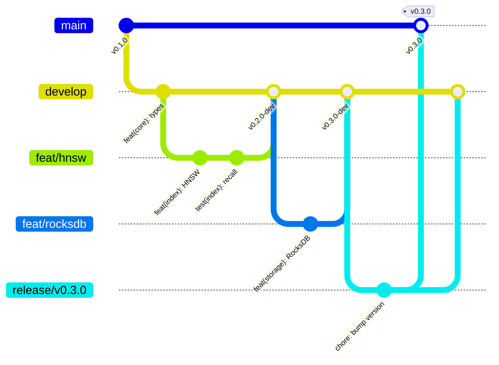
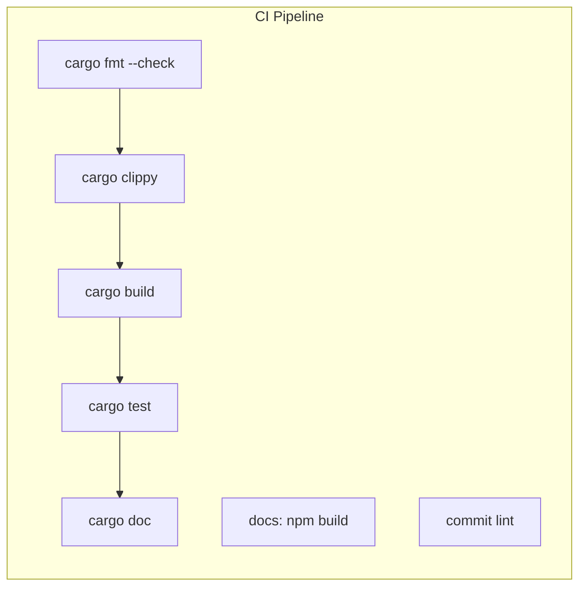
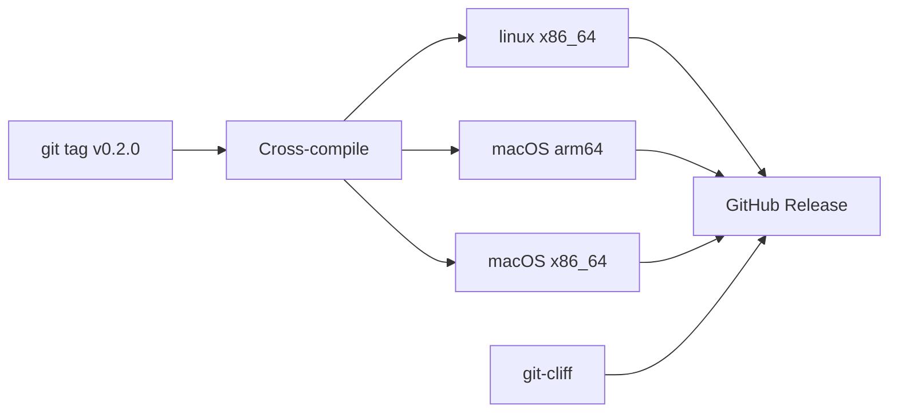
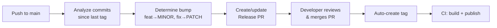

## Branching Model

ChronosVector uses **Git Flow** with two long-lived branches:



### Branch Types

| Branch | From | Merges to | Purpose |
|--------|------|-----------|---------|
| `main` | — | — | Production. Every commit is a tagged release. |
| `develop` | `main` | — | Integration. All features merge here. Always buildable. |
| `feat/<name>` | `develop` | `develop` | New functionality |
| `fix/<name>` | `develop` | `develop` | Bug fixes |
| `docs/<name>` | `develop` | `develop` | Documentation only |
| `refactor/<name>` | `develop` | `develop` | Code restructuring |
| `perf/<name>` | `develop` | `develop` | Performance improvements |
| `test/<name>` | `develop` | `develop` | Test additions |
| `release/vX.Y.Z` | `develop` | `main` + `develop` | Release preparation |
| `hotfix/vX.Y.Z` | `main` | `main` + `develop` | Critical production fix |

### Branch Naming

The prefix matches the conventional commit type:

```
feat/hnsw-temporal-decay
fix/delta-encoding-precision
docs/stochastic-analytics
perf/simd-cosine-avx512
release/v0.2.0
hotfix/v0.1.1
```

---

## Conventional Commits

Every commit follows [Conventional Commits](https://www.conventionalcommits.org/). Enforced by:
- **Local**: `.githooks/commit-msg` hook
- **CI**: `committed` linter on PRs

### Format

```
<type>(<scope>): <description>

[optional body]

[optional footer(s)]
```

### Types and Version Impact

| Type | Description | Version Bump |
|------|-------------|-------------|
| `feat` | New functionality | MINOR |
| `fix` | Bug fix | PATCH |
| `perf` | Performance improvement | PATCH |
| `docs` | Documentation only | — |
| `style` | Formatting | — |
| `refactor` | Code restructuring | — |
| `test` | Test changes | — |
| `build` | Build system, deps | — |
| `ci` | CI configuration | — |
| `chore` | Maintenance | — |
| `revert` | Revert previous commit | — |

### Scopes

Use the crate name without `cvx-` prefix:

```
feat(core): add TemporalPoint serialization
fix(index): correct HNSW entry point selection
perf(index): optimize cosine distance with pulp
test(storage): add proptest for key encoding
docs(api): update REST endpoint documentation
```

### Breaking Changes

```
feat(core)!: change timestamp from i64 to u64

BREAKING CHANGE: TemporalPoint.timestamp is now u64.
```

Breaking changes bump MAJOR (or MINOR during 0.x).

---

## Semantic Versioning

Following [SemVer 2.0.0](https://semver.org/). Currently in `v0.x` (pre-stable).

### Version Milestones

| Version | Layer | Milestone |
|---------|-------|-----------|
| `v0.1.0` | L0-L1 | Core types, distance kernels, in-memory store |
| `v0.2.0` | L2 | HNSW (snapshot kNN works) |
| `v0.3.0` | L3 | RocksDB + delta encoding |
| `v0.4.0` | L4 | Temporal index (ST-HNSW) |
| `v0.5.0` | L5 | Concurrency + WAL |
| `v0.6.0` | L6 | REST + gRPC API |
| `v0.7.0` | L7-L7.5 | Analytics + interpretability + stochastic |
| `v0.8.0` | L8 | PELT + BOCPD + regime detection |
| `v0.9.0` | L9-L10 | Tiered storage + Neural ODE/SDE |
| `v0.10.0` | L10.5-L11 | Temporal ML + index optimizations |
| **`v1.0.0`** | **L12** | **Production-ready, stable API** |

### Post-1.0 Rules

- **MAJOR**: breaking API changes (rare, deprecated first)
- **MINOR**: new features, endpoints, analytics
- **PATCH**: bug fixes, performance

---

## CI/CD Pipeline

### Continuous Integration

Runs on every push to `develop`/`main` and all PRs:



| Job | Trigger | What it checks |
|-----|---------|---------------|
| `check` | All pushes + PRs | `cargo fmt --check` + `cargo clippy` |
| `build` | After `check` passes | `cargo build` + `cargo test` + `cargo doc` |
| `docs-site` | Parallel | Starlight site builds without errors |
| `commits` | PR only | Conventional commit format |

### Release Pipeline

Triggered by pushing a tag `v*`:



1. Cross-compiles `cvx-server` for 3 targets
2. Generates changelog via `git-cliff` from conventional commits
3. Creates GitHub Release with binaries + changelog

### Docs Deployment

On push to `main` when `docs/**` changes — builds Starlight site and deploys to GitHub Pages (when repository is public).

---

## Release Automation (release-plz)

### Current: Manual Releases

The release workflow is manual: create a release branch, bump version in `Cargo.toml`, update changelog, tag, push. This is fine for early development with few releases.

### Future: Automated with release-plz (~v0.3.0+)

[release-plz](https://release-plz.ieni.dev/) will automate the release cycle by analyzing conventional commits:



How it works:

1. On every push to `main`, release-plz creates a **Release PR** with version bumps and changelog
2. The PR accumulates changes until you decide to release
3. **Merge the Release PR** — the only manual step
4. release-plz creates the tag, which triggers the existing release workflow

### Why release-plz

| Tool | Rust workspace support | CI-first | crates.io publish |
|------|----------------------|----------|-------------------|
| **release-plz** | Yes (dependency order) | Yes | Yes |
| release-please (Google) | No | Yes | No |
| semantic-release | No | Yes | No (Node.js) |
| cargo-release | Yes | No (CLI tool) | Yes |

### Activation Timeline

| When | What |
|------|------|
| v0.1.0–v0.2.0 | Manual releases (learning the workflow) |
| ~v0.3.0 | Add release-plz: automated Release PRs, version bumps, tags |
| ~v1.0.0 | Enable crates.io publishing via release-plz |
| Post-v1.0.0 | Add maturin publish for PyPI |

---

## Publishing Plan

### Current: GitHub Releases

Binary releases only. Users download pre-built `cvx-server`.

### Future Phases

| Phase | Channel | What | When |
|-------|---------|------|------|
| **2** | Docker (`ghcr.io`) | Container image with `cvx-server` | After v0.6.0 (API ready) |
| **3** | crates.io | Rust crates (cvx-core → cvx-server, published leaf-first) | After v1.0.0 |
| **4** | PyPI | `chronos-vector` Python package (PyO3 + maturin) | After v1.0.0 |
| **5** | conda-forge | Conda package from PyPI sdist | After PyPI publication |

### crates.io Publishing Order

Dependencies must be published before dependents:

```
1. cvx-core        (no workspace deps)
2. cvx-index       (depends on cvx-core)
3. cvx-storage     (depends on cvx-core)
4. cvx-analytics   (depends on cvx-core, cvx-storage)
5. cvx-ingest      (depends on cvx-core, cvx-index, cvx-storage)
6. cvx-query       (depends on cvx-core, cvx-index, cvx-storage, cvx-analytics)
7. cvx-explain     (depends on cvx-core, cvx-analytics, cvx-query, cvx-storage)
8. cvx-api         (depends on cvx-core, cvx-query, cvx-ingest, cvx-explain)
9. cvx-server      (depends on cvx-api)
```

Automated via `cargo-release` or `release-plz` in CI.

### PyPI Package

```bash
pip install chronos-vector
```

Provides:
- `CvxClient` — REST/gRPC client
- `cvx.temporal_features()` — differentiable features via tch-rs (PyTorch-compatible autograd)

Built with `maturin`, published on release tags.

---

## Development Setup

```bash
# Clone and setup
git clone https://github.com/manucouto1/chronos-vector.git
cd chronos-vector
git checkout develop

# Enable commit hooks
git config core.hooksPath .githooks

# Verify everything works
cargo build --workspace
cargo test --workspace
cargo fmt --all --check
cargo clippy --workspace

# Docs site
cd docs && npm ci && npm run build
```
